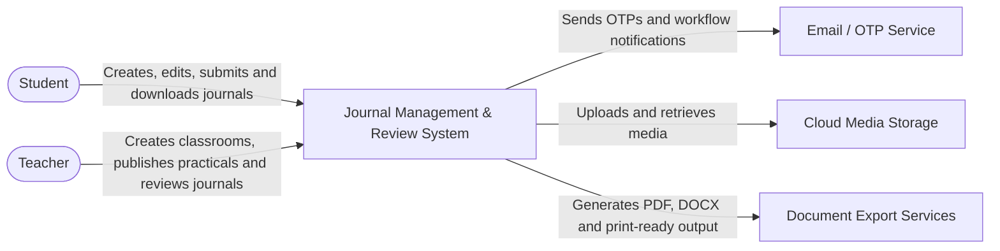
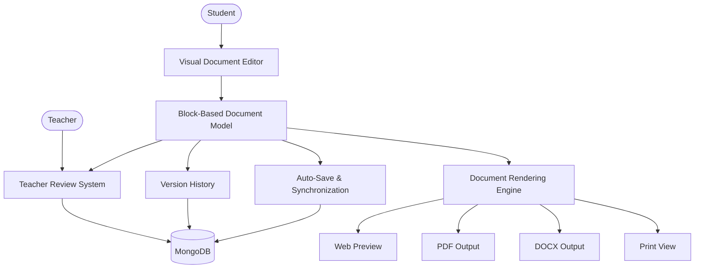
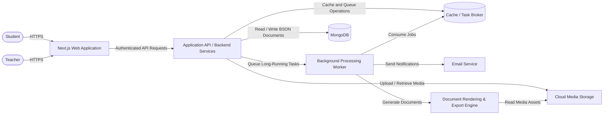

# Journal Management & Review System
### A Modern Block-Based Academic Document Platform

> A unified Next.js application for creating, reviewing, managing, and evaluating academic practical journals using a visual block-based document editor, intelligent mathematical writing tools, automated document rendering, and a structured review workflow.

---

# Table of Contents

1. Project Overview
2. Vision
3. Objectives
4. Functional Requirements
5. Non-Functional Requirements
6. Assumptions & Constraints
7. Core Design Philosophy
8. C4 Level 1 — System Context Diagram
9. High-Level System Architecture
10. C4 Level 2 — Container Diagram
11. Database & Media Storage Strategy
12. Why Block-Based Documents?

---

# 1. Project Overview

The Journal Management & Review System is a modern academic platform that digitizes the complete lifecycle of practical journals—from creation to submission, review, approval, and archival.

Traditional journal systems usually rely on plain text editors, uploaded Word documents, or PDF files. These approaches create several problems:

- Students repeatedly format documents manually.
- Mathematical equations are difficult to write.
- Teachers cannot annotate individual sections precisely.
- Version history is unavailable.
- Exported PDFs often differ from what students see while editing.
- Rich academic content such as tables, equations, diagrams, and figures becomes difficult to manage.

This system solves these problems by treating every journal as a structured document composed of independent blocks instead of one large text document.

Each paragraph, heading, equation, image, table, observation, and result becomes its own document component.

This approach enables:

- Professional document editing
- Intelligent mathematical writing
- Reliable auto-save
- Block-level commenting
- Version history
- Identical rendering across Web, PDF, DOCX, and Print
- Future collaborative editing

The result is an academic writing experience comparable to modern document editors while remaining simple enough for students who have never used LaTeX or professional publishing software.

---

# 2. Vision

The vision of this project is to replace traditional handwritten practical journals and basic rich-text editors with a professional academic document platform that enables students to create high-quality journals through an intuitive visual interface.

Instead of asking students to learn document formatting or LaTeX syntax, the system should provide intelligent tools that allow them to focus entirely on the academic content.

At the same time, teachers should receive a structured review environment where every section of the document can be reviewed, commented on, and evaluated independently.

The long-term vision extends beyond practical journals.

The underlying document architecture should support additional academic document types such as:

- Laboratory Reports
- Assignments
- Research Papers
- Mini Projects
- Capstone Reports
- Thesis Documents
- Technical Documentation
- Academic Portfolios

Rather than building a journal editor, this project builds a reusable academic document platform where journals are simply one document type.

---

# 3. Objectives

The primary objectives of the system are:

## Student Objectives

- Create journals using an intuitive visual editor.
- Write mathematical expressions without learning LaTeX.
- Insert tables, diagrams, images, code blocks, and scientific content easily.
- Save work automatically.
- Recover drafts after accidental browser closure.
- Generate university-ready PDF documents.
- Submit journals digitally.
- Track review progress.

---

## Teacher Objectives

- Publish practical assignments.
- Review journals directly inside the browser.
- Annotate specific document blocks.
- Add remarks.
- Assign marks.
- Approve submissions.
- Export reports and gradebooks.

---

## System Objectives

- Reduce manual paperwork.
- Eliminate repetitive formatting.
- Maintain document consistency.
- Support structured academic writing.
- Produce identical rendering across multiple export formats.
- Enable future collaborative editing.
- Maintain complete revision history.
- Scale efficiently for large educational institutions.

---

# 4. Functional Requirements

The functional requirements define the capabilities that the Journal Management & Review System must provide to students, teachers, and the platform itself.

The requirements are intentionally written independently of a specific UI implementation so that the architecture can evolve without changing the expected system behavior.

## 4.1 Authentication & Profile Requirements

- **FR-01:** The system shall allow students and teachers to register using a valid email address.
- **FR-02:** The system shall verify newly registered email addresses using OTP verification.
- **FR-03:** The system shall allow verified users to authenticate securely.
- **FR-04:** The system shall maintain authenticated sessions securely.
- **FR-05:** The system shall enforce role-based access control for students and teachers.
- **FR-06:** The system shall require users to complete mandatory academic profile information before accessing protected academic features.
- **FR-07:** Student profile information shall support automatic generation of journal metadata and cover-page information.
- **FR-08:** Teacher profile information shall be associated with classrooms, practicals, reviews, and approvals.

## 4.2 Classroom & Practical Requirements

- **FR-09:** Teachers shall be able to create and manage classrooms.
- **FR-10:** The system shall generate a unique join code for each classroom.
- **FR-11:** Students shall be able to join classrooms using valid join codes.
- **FR-12:** The system shall prevent invalid or unauthorized classroom enrollment.
- **FR-13:** Teachers shall be able to publish practical assignments to classrooms.
- **FR-14:** A practical assignment shall support a practical number, title, aim, instructions, deadline, maximum marks, references, and additional notes.
- **FR-15:** Students shall be able to view practical assignments published to classrooms in which they are enrolled.
- **FR-16:** The system shall associate every student journal with its student, classroom, teacher, and practical assignment.

## 4.3 Journal Creation & Visual Editor Requirements

- **FR-17:** Students shall be able to create a journal from a published practical assignment.
- **FR-18:** The system shall automatically generate journal cover information using verified student, classroom, subject, teacher, and practical metadata.
- **FR-19:** Students shall be able to create documents using a visual block-based editor.
- **FR-20:** Students shall be able to insert new document blocks.
- **FR-21:** Students shall be able to edit, duplicate, delete, and rearrange document blocks.
- **FR-22:** Students shall be able to drag and drop blocks to change document order.
- **FR-23:** The editor shall support headings and section titles.
- **FR-24:** The editor shall support rich-text paragraphs and text highlighting.
- **FR-25:** The editor shall support ordered and unordered lists.
- **FR-26:** The editor shall support tables with configurable rows and columns.
- **FR-27:** The editor shall support image upload, captions, alignment, and resizing.
- **FR-28:** The editor shall support mathematical equations and calculations.
- **FR-29:** The editor shall support code blocks for programming practicals.
- **FR-30:** The editor shall support observation, result, reference, divider, and page-break blocks.
- **FR-31:** Where required by a practical template, the editor architecture shall support structured interactive components such as selectable options or radio-button-style inputs without coupling them to the final static PDF representation.
- **FR-32:** The editor shall provide a live representation of the structured journal while the student is writing.

## 4.4 Mathematical Writing Requirements

- **FR-33:** Students shall be able to write mathematical calculations and formulas without requiring knowledge of LaTeX.
- **FR-34:** The system shall provide a visual equation builder.
- **FR-35:** The mathematical editor shall provide common formula templates such as fractions, roots, powers, subscripts, integrals, summations, limits, matrices, vectors, and piecewise expressions.
- **FR-36:** The mathematical editor shall provide a scientific symbol library.
- **FR-37:** The mathematical editor shall support inline mathematics inside paragraphs.
- **FR-38:** The mathematical editor shall support standalone display equations.
- **FR-39:** The system should support assisted mathematical input and recognition for common expressions.
- **FR-40:** The system shall internally preserve a standardized mathematical representation suitable for deterministic rendering.
- **FR-41:** Students shall not be required to directly edit internal LaTeX syntax.
- **FR-42:** Mathematical expressions shall preserve their structure during editing, review, versioning, preview, and export.

## 4.5 Structured Document Storage Requirements

- **FR-43:** Journal content shall be stored as structured block-based JSON rather than as one large HTML string.
- **FR-44:** Every document block shall have a stable unique identifier.
- **FR-45:** Every document block shall store its block type, content, position, and required metadata.
- **FR-46:** The document model shall separate content from presentation-specific rendering logic.
- **FR-47:** The document model shall support future block types without requiring a complete document-schema redesign.
- **FR-48:** Media blocks shall store references to externally stored binary assets instead of embedding large binary data directly in the structured document.

## 4.6 Auto-Save, Recovery & Version Requirements

- **FR-49:** The editor shall automatically save student work while the document is being edited.
- **FR-50:** Auto-save shall operate without requiring students to manually press a Save button after every change.
- **FR-51:** The system shall support incremental synchronization of modified document blocks.
- **FR-52:** The system shall provide a visible save or synchronization status.
- **FR-53:** The system shall support local recovery mechanisms for unsynchronized draft changes where technically feasible.
- **FR-54:** The system shall maintain document revision history.
- **FR-55:** Revisions shall record relevant metadata including author, timestamp, and modified content.
- **FR-56:** Authorized users shall be able to inspect previous revisions.
- **FR-57:** The system shall support comparison between relevant document revisions.
- **FR-58:** Restoring an older revision shall create a new revision rather than deleting or rewriting existing history.

## 4.7 Submission, Review & Approval Requirements

- **FR-59:** Students shall be able to preview a journal before submission.
- **FR-60:** Students shall be able to submit completed journals digitally.
- **FR-61:** Submitted journals shall become read-only unless changes are requested or the journal is reopened through the defined workflow.
- **FR-62:** Teachers shall be able to view journals submitted to their classrooms.
- **FR-63:** Teachers shall be able to review submitted journals inside the browser.
- **FR-64:** Teachers shall be able to attach comments to specific document blocks.
- **FR-65:** Teachers shall be able to highlight or annotate relevant content without directly overwriting the student's original work.
- **FR-66:** Teachers shall be able to create suggestions and request corrections.
- **FR-67:** Teachers shall be able to approve journals.
- **FR-68:** Teachers shall be able to assign marks and final remarks.
- **FR-69:** Students shall be able to view teacher feedback.
- **FR-70:** Students shall be able to revise journals when changes are requested.
- **FR-71:** Review and approval actions shall remain traceable through the journal lifecycle.

## 4.8 Rendering & Export Requirements

- **FR-72:** The system shall render structured journal documents for web preview.
- **FR-73:** The system shall generate professionally formatted PDF documents.
- **FR-74:** Mathematical expressions shall preserve correct formatting during PDF generation.
- **FR-75:** Tables, images, headings, captions, page breaks, headers, footers, and academic formatting shall be preserved during export.
- **FR-76:** The PDF output shall follow configured academic or institutional formatting rules.
- **FR-77:** The rendering architecture shall support DOCX output.
- **FR-78:** The rendering architecture shall support print-oriented output.
- **FR-79:** Exported output should remain visually consistent with the approved document preview.
- **FR-80:** The rendering system shall consume the same structured document model used by the editor rather than relying on separately maintained document content.

## 4.9 Notification & Reporting Requirements

- **FR-81:** The system shall notify relevant users when important workflow events occur.
- **FR-82:** Students shall be notified when teachers add review feedback or request changes.
- **FR-83:** Students shall be notified when a journal is approved or marks are published.
- **FR-84:** Teachers shall be notified of relevant new submissions.
- **FR-85:** Teachers shall be able to view submission and review progress for their classrooms.
- **FR-86:** Teachers shall be able to export marks, gradebooks, or academic reports where applicable.

---

# 5. Non-Functional Requirements

Non-functional requirements define the expected quality attributes of the platform.

## 5.1 Usability

- The editor should be usable by students who have no knowledge of LaTeX, HTML, or professional publishing software.
- Common document operations should be discoverable through visual controls, toolbars, menus, slash commands, or keyboard shortcuts.
- Mathematical writing should prioritize visual interaction and natural input.
- Drag-and-drop reordering should provide immediate visual feedback.
- Save, synchronization, submission, review, and approval states should be clearly visible.
- The platform should minimize repetitive academic formatting work.

## 5.2 Performance

- Normal editor interactions should provide near-immediate visual feedback.
- Auto-save operations should execute in the background without interrupting typing.
- Frequently accessed document and classroom data should be retrieved efficiently through appropriate indexing and caching.
- Only changed document content should be synchronized when incremental updates are possible.
- Long-running operations such as complex PDF generation should execute outside the normal interactive request path where appropriate.

## 5.3 Reliability & Data Integrity

- Student work should be protected against accidental browser closure through local recovery and server-side synchronization strategies.
- Failed synchronization attempts should be safely retryable.
- Submitted and approved document states must not be silently overwritten.
- Revision history should preserve recoverable document states.
- Restoring an older revision must not destroy existing history.
- Critical workflow operations should be auditable.

## 5.4 Security

- Authentication credentials and sensitive information must be transmitted over HTTPS.
- Passwords must never be stored in plaintext.
- Protected resources must enforce authentication and role-based authorization.
- Students must not be able to modify another student's journal.
- Teachers must only access classrooms and submissions for which they have authorization.
- Application secrets must be stored through environment-based configuration rather than committed to source control.
- Uploaded content must be validated according to supported file type and size policies.

## 5.5 Scalability

- Stateless application services should support horizontal scaling.
- Structured document storage should support incremental block updates.
- Binary media should remain separated from primary structured application data.
- Background processing should be scalable independently from interactive application services.
- The architecture should support future institutional growth without redesigning the document model.

## 5.6 Maintainability

- Editing, storage, review, versioning, rendering, and export concerns should remain separated.
- New document block types should be addable without redesigning the entire document schema.
- New export targets should be implementable through dedicated renderer adapters.
- Business logic should remain independent of presentation components.
- Internal document representation should remain independent of one specific visual editor library.

## 5.7 Compatibility

- The web application should support current versions of major modern browsers.
- Exported PDF documents should render consistently across common PDF readers and operating systems.
- The document model should remain independent of a single browser rendering engine where possible.
- Mathematical content should use standardized internal representations suitable for multiple output targets.

## 5.8 Accessibility

- Interactive controls should support keyboard navigation where practical.
- Form fields and editor controls should expose accessible labels.
- Color should not be the only mechanism used to communicate review or workflow status.
- Important editor actions should have understandable textual labels or accessible descriptions.

## 5.9 Availability & Recovery

- The system should degrade gracefully when non-critical services are temporarily unavailable.
- Temporary media, email, or notification failures should not cause journal content loss.
- Database and media backup strategies should support disaster recovery.
- Background operations should support retry mechanisms where appropriate.

## 5.10 Rendering Consistency

- The same structured document model should drive editor preview and export rendering.
- Mathematical expressions must preserve semantic structure across supported output formats.
- Institutional layout rules should be configurable rather than hardcoded into student-authored content.
- Export failures should return meaningful diagnostics rather than silently generating corrupted documents.

---

# 6. Assumptions & Constraints

## 6.1 Assumptions

- Users have access to a modern web browser.
- Users have internet access for server synchronization, classroom operations, submission, review, and server-side exports.
- Students and teachers have valid email addresses for account verification.
- Teachers are responsible for publishing accurate practical assignment information.
- Student academic profile information is verified or entered accurately enough to generate document metadata.
- Institution-specific journal formatting rules can be represented through configurable templates and rendering rules.
- Uploaded images and media use supported file formats and comply with configured size restrictions.
- The initial system primarily targets structured academic journals and practical reports.

## 6.2 Constraints

- Initial deployment may operate within free-tier or low-cost cloud service limits.
- Large binary assets must not be stored directly inside the primary structured database.
- Mathematical input must remain simple enough for students who do not know LaTeX.
- PDF generation must preserve academic formatting and mathematical notation.
- Submitted documents must maintain revision and review integrity.
- Teacher review must not directly and silently overwrite student-authored content.
- Real-time multi-user collaboration is considered a future capability and is not required for the initial release.
- Offline editing may initially be limited to local draft recovery and later expanded into full synchronization.
- Final implementation technologies may evolve, but the structured document model and separation of editing, storage, review, and rendering must remain architectural invariants.

---

# 7. Core Design Philosophy

The entire platform is designed around one fundamental principle:

> **A journal is not plain text. A journal is a structured academic document.**

This philosophy changes the architecture of the entire application.

Instead of storing documents as large HTML strings or fixed database fields, every document is composed of independent reusable blocks.

Example:

Instead of storing

```
Journal

Aim

Theory

Observation

Conclusion

Images

Tables
```

the system stores

```
Document

↓

Heading Block

↓

Paragraph Block

↓

Equation Block

↓

Table Block

↓

Image Block

↓

Observation Block

↓

Result Block

↓

Reference Block
```

Each block knows:

- what it represents,
- how it should be edited,
- how it should be rendered,
- how it should be exported,
- and how it should be reviewed.

This architecture significantly improves maintainability while making future feature development considerably easier.

---

# 8. C4 Level 1 — System Context Diagram

The System Context view defines the platform boundary and shows how the primary human actors and external services interact with the system. It intentionally hides internal implementation details.



The context view treats the platform as one system and identifies its primary users and external dependencies.

---

# 9. High-Level System Architecture



The structured document model is the single source of truth for editing, review, versioning, rendering, and export.

---

# 10. C4 Level 2 — Container Diagram

The Container view expands the system boundary into the major runtime responsibilities required to deliver the platform. These containers represent architectural responsibilities; exact hosting choices may change without altering the overall design.



The container architecture separates interactive requests from long-running document generation and notification processing.

---

# 11. Database & Media Storage Strategy


To remain efficient while operating within free-tier cloud services, the system separates structured document data from binary media.

## MongoDB

MongoDB is the primary persistent document database for structured application data.

MongoDB stores:

- Users
- Profiles
- Classrooms
- Classroom memberships
- Practical templates and assignments
- Document metadata
- Current structured journal documents
- Block-based journal content
- Version history
- Teacher comments and review anchors
- Approval information
- Notifications
- Audit information

The journal's canonical block-based JSON representation maps naturally to MongoDB's BSON document model.

A journal can preserve its metadata and ordered block structure as a structured document while high-growth or independently queried information—such as revision history, comments, notifications, and audit events—can be maintained in dedicated collections.

Conceptually:

```text
MongoDB

├── users
├── profiles
├── classrooms
├── classroom_memberships
├── assignments
├── journals
│   └── document
│       ├── schemaVersion
│       ├── metadata
│       └── blocks[]
├── journal_versions
├── comments
├── approvals
├── notifications
└── audit_logs
```

Each structured journal should maintain an explicit `schemaVersion` so future changes to the block model can be migrated safely.

MongoDB's flexible document model does not mean the application is schema-less. The platform maintains predictable structures through application-level models, validation rules, explicit schema versions, and controlled migration logic.

Binary media is not stored directly inside MongoDB. Journal blocks store references to externally managed media assets.

This separation keeps MongoDB focused on structured application data while allowing media storage and delivery to scale independently.

---

## Cloudinary

Images are never stored directly inside the database.

Instead,

Student Upload

↓

Next.js Upload API

↓

Cloudinary

↓

Secure URL

↓

Stored inside Document Block

This approach provides:

- Reduced database size
- Faster image delivery
- CDN optimization
- Better scalability
- Simplified backups

---

## Why JSON Instead of HTML?

Many editors store documents as HTML.

This project intentionally avoids that approach.

Reasons include:

- HTML is difficult to version.
- HTML is difficult to review block-by-block.
- HTML is difficult to render consistently into PDF.
- HTML mixes content with presentation.
- HTML makes future editor upgrades more difficult.

Instead, every document is represented as structured JSON at the application boundary and persisted as JSON-like BSON in MongoDB. The structure describes the document rather than its visual appearance.

Rendering becomes the responsibility of the document engine rather than the database.

This separation dramatically improves flexibility and long-term maintainability.

---

# 12. Why Block-Based Documents?

Modern editors such as Notion, Editor.js, and BlockNote have demonstrated that treating documents as collections of reusable blocks provides significant architectural advantages.

Each document block is an independent component.

Examples include:

- Heading
- Paragraph
- Mathematical Equation
- Image
- Table
- Code Block
- Observation
- Result
- Reference
- Page Break

Each block can be:

- inserted,
- moved,
- duplicated,
- deleted,
- collapsed,
- rendered,
- exported,
- commented on,
- versioned,
- and reused independently.

Because every block is isolated, the editor becomes significantly easier to extend.

Adding a new block type generally does not require a traditional relational database schema migration. The document schema version and validation rules may evolve, and a corresponding editor and renderer can be registered for the new block type.

Instead, developers simply register a new renderer and editor component for that block type.

This makes the platform highly modular and future-proof.

---