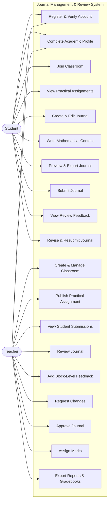
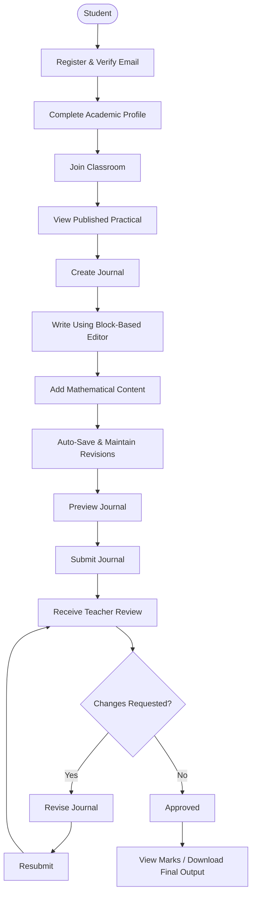
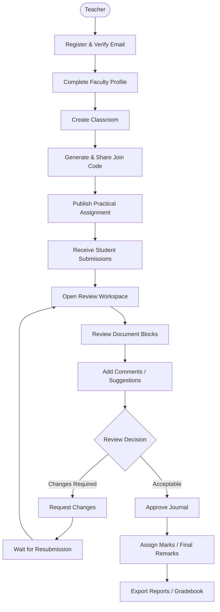
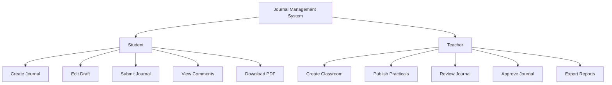
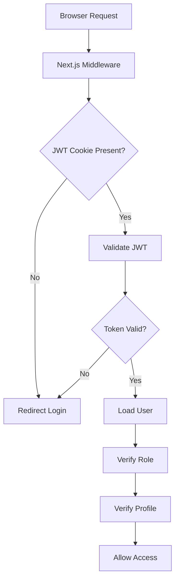
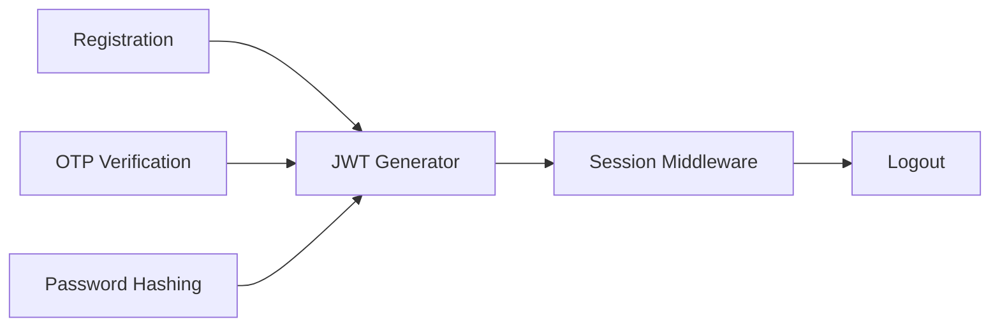
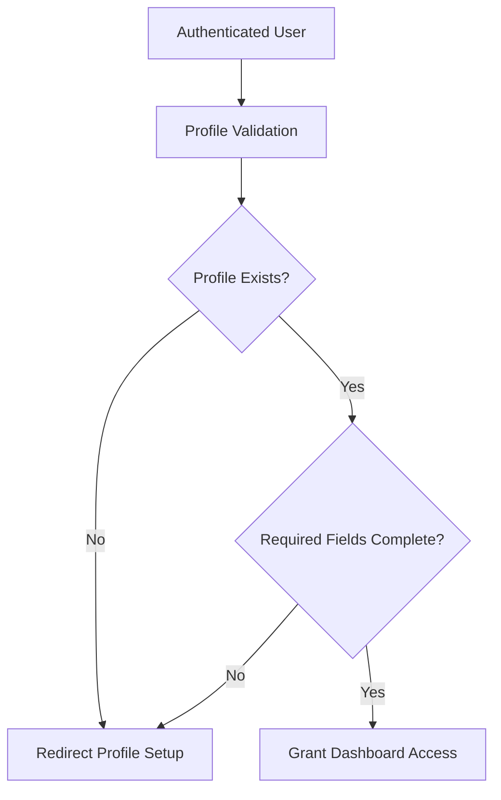
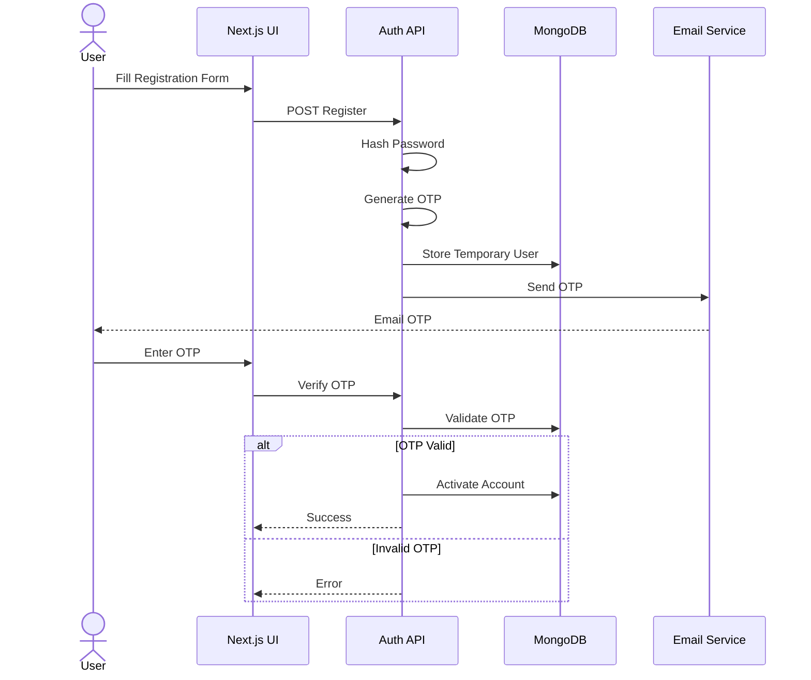
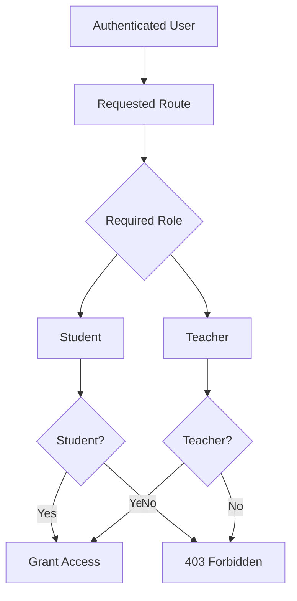

# 7. Use Case Architecture

The Use Case Architecture defines how the primary actors interact with the Journal Management & Review System before the document moves into the detailed authentication and authorization architecture.

The initial platform has two primary actors:

- **Student**
- **Teacher**

Future versions may introduce additional actors such as Administrator, Department Coordinator, External Examiner, and Lab Assistant.

---

## 7.1 High-Level Use Case Diagram

The use case model establishes clear boundaries between student and teacher responsibilities while allowing both actors to share common authentication and profile workflows.

---

## 7.2 Student Use Case Flow

This workflow represents the complete student journey from account creation to final journal approval.

---

## 7.3 Teacher Use Case Flow

The teacher workflow is intentionally non-destructive. Teachers review and annotate student work but do not directly overwrite student-authored journal content.

---

## 7.4 Use Case Access Matrix

| Use Case | Student | Teacher |
|---|:---:|:---:|
| Register & Verify Account | ✓ | ✓ |
| Complete Profile | ✓ | ✓ |
| Join Classroom | ✓ | — |
| Create Classroom | — | ✓ |
| View Practical Assignments | ✓ | ✓ |
| Publish Practical Assignment | — | ✓ |
| Create & Edit Journal | ✓ | — |
| Write Mathematical Content | ✓ | — |
| Preview Journal | ✓ | ✓ |
| Export Own Journal | ✓ | — |
| Submit Journal | ✓ | — |
| Review Journal | — | ✓ |
| Add Block-Level Comments | — | ✓ |
| Request Changes | — | ✓ |
| Revise After Changes Requested | ✓ | — |
| Approve Journal | — | ✓ |
| Assign Marks | — | ✓ |
| View Feedback & Marks | ✓ | ✓ |
| Export Classroom Reports | — | ✓ |

This matrix provides a high-level authorization reference. Detailed permission enforcement is defined later in the Role-Based Access Control and Authorization Architecture sections.

---

# 8. User Roles & Access Control

The Journal Management & Review System follows a **Role-Based Access Control (RBAC)** architecture. Every authenticated user belongs to a predefined role, and each role is granted only the permissions required to perform its responsibilities.

The first version of the platform supports two primary roles:

- **Student**
- **Teacher**

The architecture is intentionally extensible so future roles (Administrator, Department Coordinator, External Examiner, Lab Assistant, etc.) can be added without changing the core document system.

---

## 8.1 Role Hierarchy

Every action performed inside the application is validated against the authenticated user's role before execution.

---

# 8.2 Student Responsibilities

Students are responsible for creating, editing, and submitting practical journals.

A student can:

- Register an account
- Verify email using OTP
- Complete profile
- Join classrooms
- View practical assignments
- Create journals
- Edit draft journals
- Insert mathematical equations
- Insert tables
- Upload diagrams
- Generate PDF
- Generate DOCX
- Submit journals
- Track submission status
- Read teacher comments
- View obtained marks

Students **cannot**

- Modify submitted journals
- Publish practicals
- Review journals
- Access teacher dashboards
- Export classroom reports

---

# 8.3 Teacher Responsibilities

Teachers manage classrooms and evaluate submitted journals.

Teachers can:

- Register account
- Complete profile
- Create classrooms
- Generate classroom codes
- Publish practical assignments
- View student submissions
- Review journals
- Add remarks
- Comment on individual document blocks
- Assign marks
- Approve journals
- Export gradebooks
- Generate reports

Teachers **cannot**

- Edit student journal content
- Submit journals as students

Instead, teachers interact through the **Review System**, preserving document integrity.

---

# 9. Authentication Architecture

Authentication protects every page, API route, and resource inside the application.

Instead of protecting pages individually, the platform uses a centralized authentication pipeline.

---

## Authentication Pipeline

This architecture ensures every request is validated before any application code executes.

---

## Authentication Components

The authentication subsystem consists of several independent services.

Separating these responsibilities improves maintainability while keeping authentication modular.

---

# 9.1 Why Middleware?

Instead of checking authentication inside every page,

the application performs authentication once inside **Next.js Middleware**.

Advantages

- Single authentication point
- Faster request rejection
- Cleaner page components
- Secure API protection
- Consistent authorization

---

# 10. Profile Lock Architecture

Authentication alone does not guarantee that required academic information has been provided.

For example,

a student may log in successfully but still have an incomplete profile.

Without a profile,

the system cannot generate

- Cover Pages
- Student Information
- Department
- Semester
- College Details

Therefore every authenticated request passes through a **Profile Validation Layer**.

---

## Profile Validation Flow

Only after profile completion can users access dashboards and create journals.

---

## Required Student Profile

Students must complete

- Full Name
- Enrollment Number
- Department
- Semester
- Division
- College
- University
- Profile Picture (Optional)

---

## Required Teacher Profile

Teachers must complete

- Full Name
- Faculty ID
- Department
- Designation
- College
- University
- Profile Picture (Optional)

---

# 11. Registration & OTP Verification

Every account must verify ownership of the registered email address before activation.

The verification process uses a One-Time Password (OTP).

---

## Registration Sequence

---

## Why OTP Verification?

OTP verification provides multiple advantages.

- Prevents fake registrations
- Confirms email ownership
- Reduces spam accounts
- Improves account security
- Enables password recovery

---

# 12. Authorization Architecture

After authentication,

every request must pass authorization.

Authentication answers

> "Who are you?"

Authorization answers

> "What are you allowed to do?"

---

## Authorization Flow

This layered architecture ensures the system remains secure, modular, and scalable as new user roles and features are introduced.

---

**End of Part 1B-A**