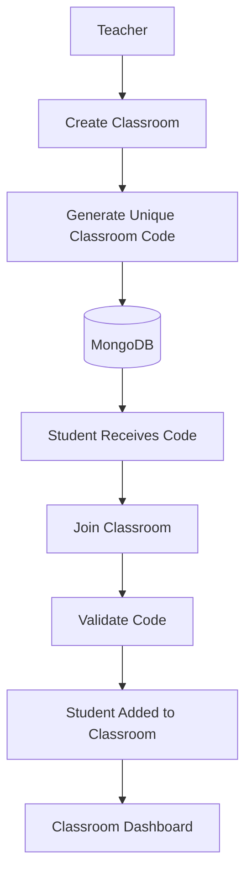
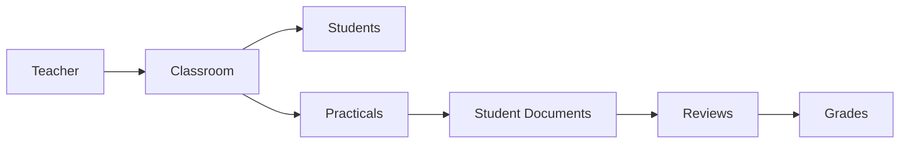
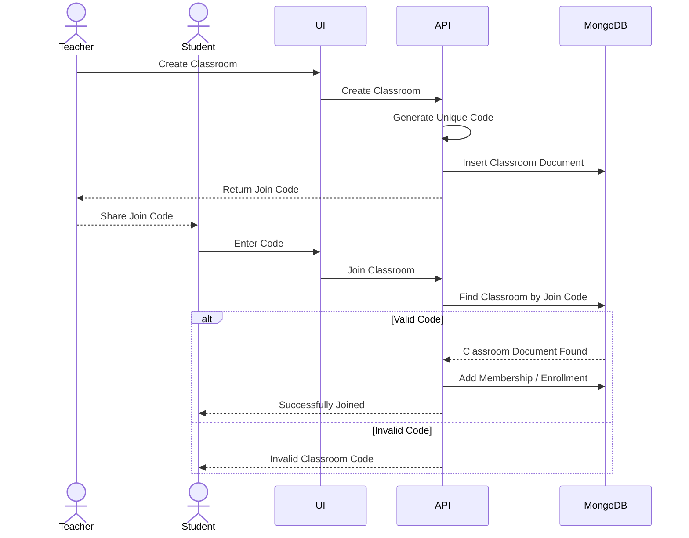
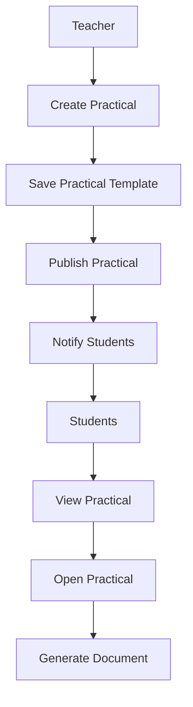
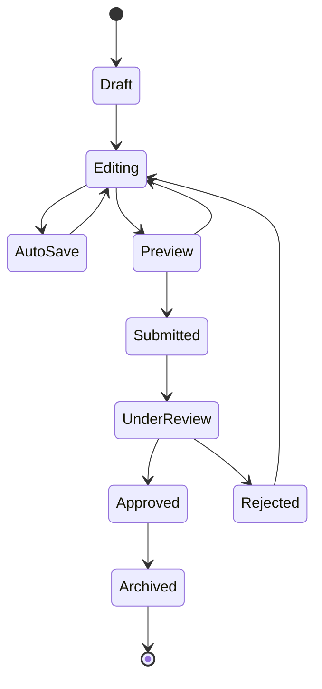
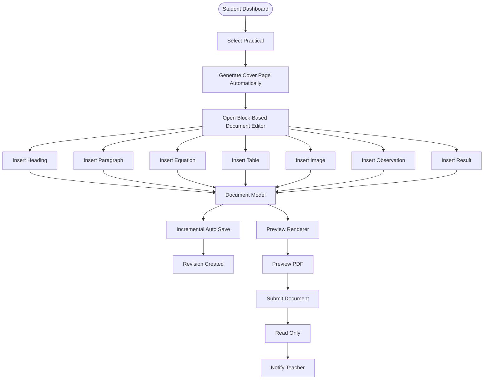
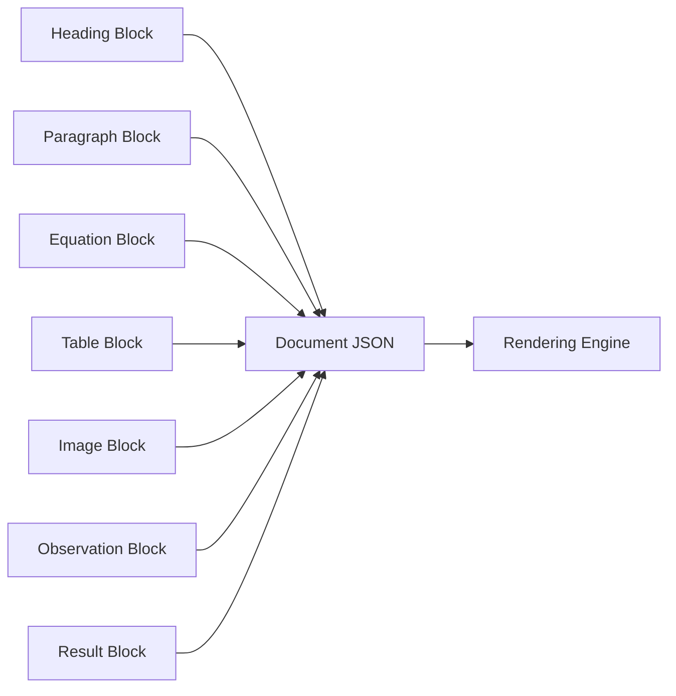

# 13. Classroom Management Architecture

A classroom acts as the primary collaboration space between teachers and students.

Instead of manually distributing practical assignments through messaging applications or printed sheets, every practical is published inside a classroom where enrolled students automatically receive access.

Each classroom maintains:

- Subject Information
- Department
- Semester
- Teacher Information
- Student Roster
- Practical Assignments
- Submission Progress
- Review Progress
- Marks
- Notifications

A classroom becomes the parent entity for every journal created by its students.

---

## Classroom Architecture



Classroom data is persisted in MongoDB. Classroom membership may be represented through a dedicated `classroom_memberships` collection so enrollment records can be queried independently without creating an indefinitely growing embedded student array inside a classroom document.

Conceptually:

```text
classrooms
    └── classroom document

classroom_memberships
    ├── classroomId
    ├── studentId
    ├── joinedAt
    └── status
```

A unique index on the classroom join code prevents duplicate classroom codes, while a compound unique index on `classroomId + studentId` prevents duplicate enrollment.

---

## Classroom Entity Relationship



This hierarchy keeps every journal linked to its classroom, practical assignment, and teacher.

---

# 14. Classroom Join Workflow

Instead of manually adding students,

teachers simply share the generated classroom code.

Example

```
CS401-7F2A
```

The workflow remains extremely simple for students.

---

## Classroom Join Sequence



---

# 15. Practical Assignment Architecture

Every practical is published as a reusable template.

Instead of creating journals from scratch,

students create a journal directly from the published practical.

This guarantees consistent formatting across the classroom.

Each Practical Template contains

- Practical Number
- Practical Title
- Aim
- Instructions
- Maximum Marks
- Submission Deadline
- References
- Additional Notes

Practical assignments are stored as structured MongoDB documents and reference their parent classroom. Student journals reference the assignment from which they were created rather than duplicating the complete assignment record unnecessarily.

A practical template may provide initial structured blocks that are copied into the student's journal document at creation time when editable student-specific content is required.

---

## Practical Publishing Flow



---

# 16. Student Academic Document Lifecycle

The journal follows a structured lifecycle.

Unlike traditional systems,

the document continuously evolves through multiple stages.



Every transition is recorded inside the revision history.

---

# 17. Student Document Creation Workflow

The document creation process is significantly different from conventional journal systems.

Students never write raw HTML.

Students never manually format PDF pages.

Students never manually create cover pages.

Instead,

the editor automatically constructs the document using reusable blocks.

---

## Document Creation Workflow



---

## Why Automatic Cover Pages?

Students frequently make mistakes while writing

- Name
- Enrollment Number
- Semester
- Subject
- Department
- College

To eliminate these errors,

the cover page is generated automatically from the student's verified profile and classroom information.

Benefits

- No duplicate typing
- No spelling mistakes
- Consistent formatting
- University-compliant layout
- Faster journal creation

---

# 18. Why Replace Traditional Rich Text Editors?

Traditional editors store the document as HTML.

```
Entire HTML Document

↓

Save Entire HTML

↓

Render Entire HTML
```

This creates several problems.

- Large save payloads
- Difficult version tracking
- Difficult PDF generation
- Hard to review specific sections
- Poor scalability

---

## Proposed Architecture

Instead of HTML,

the platform stores the document as structured blocks.



Every block becomes independently editable, renderable, reviewable, and versionable.

At the application boundary, the canonical journal is represented as structured JSON. When persisted in MongoDB, the same JSON-like structure is stored as BSON.

The current journal state may therefore be represented conceptually as:

```json
{
  "schemaVersion": 1,
  "journalId": "journal_123",
  "classroomId": "classroom_123",
  "assignmentId": "assignment_123",
  "studentId": "student_123",
  "status": "draft",
  "blocks": [
    {
      "id": "block_001",
      "type": "heading",
      "content": {
        "text": "Experiment"
      }
    }
  ]
}
```

Large binary media is not embedded inside the MongoDB journal document. Image blocks store references to files in object storage.

High-growth information such as immutable revisions, teacher comments, notifications, and audit events can remain in dedicated MongoDB collections while referencing the journal and stable block IDs.

---

# 19. Advantages of the Proposed Architecture

The block-based architecture provides significant improvements over conventional editors.

| Traditional Editor | Proposed Document Architecture |
|--------------------|--------------------------------|
| Entire document saved | Only modified blocks saved |
| HTML storage | Structured JSON / MongoDB BSON persistence |
| Difficult PDF generation | Shared rendering engine |
| Limited commenting | Block-level comments |
| Weak version history | Immutable revisions |
| Poor scalability | Modular block system |
| Difficult extensions | New block registration |
| DOM-dependent | Renderer-driven architecture |

---

# 20. Transition to Document Editor Architecture

At this point, the reader understands:

- How users authenticate.
- How classrooms are managed.
- How practical assignments are published.
- How students create journals.
- Why the platform uses block-based documents instead of traditional editors.

The next section introduces the **Visual Block-Based Document Editor**, which is the core of the entire platform.

In the following chapter we will explore:

- Document Editor Architecture
- Rich Text Engine
- Block System
- Visual Mathematical Writing
- Equation Builder
- Scientific Keyboard
- Formula Templates
- Inline vs Display Equations
- Smart Formula Recognition
- Block Metadata
- Document JSON Model
- Rendering Pipeline

These components collectively transform the platform from a simple journal management system into a modern academic document platform.

---

**End of Part 1B-B**

**Next:** **Part 2A – Visual Block-Based Document Editor & Mathematical Writing System**, which is arguably the most important section of the entire architecture document.