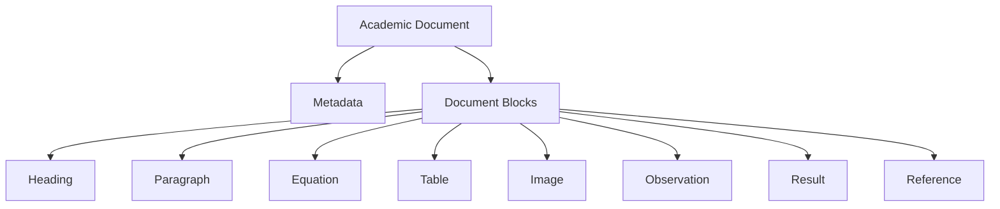
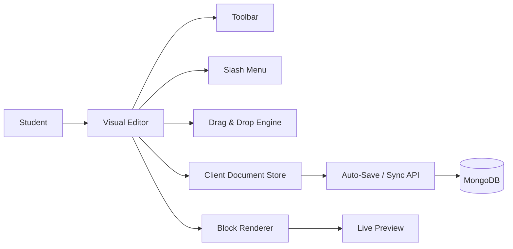
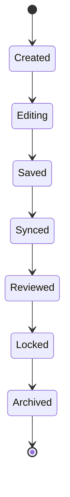
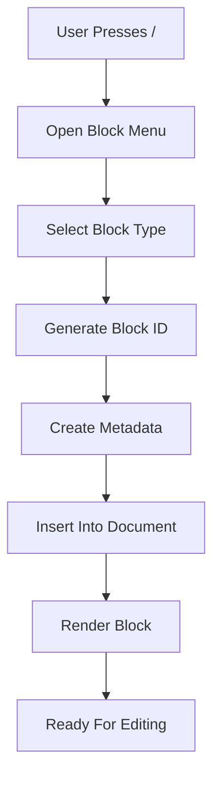
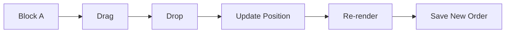
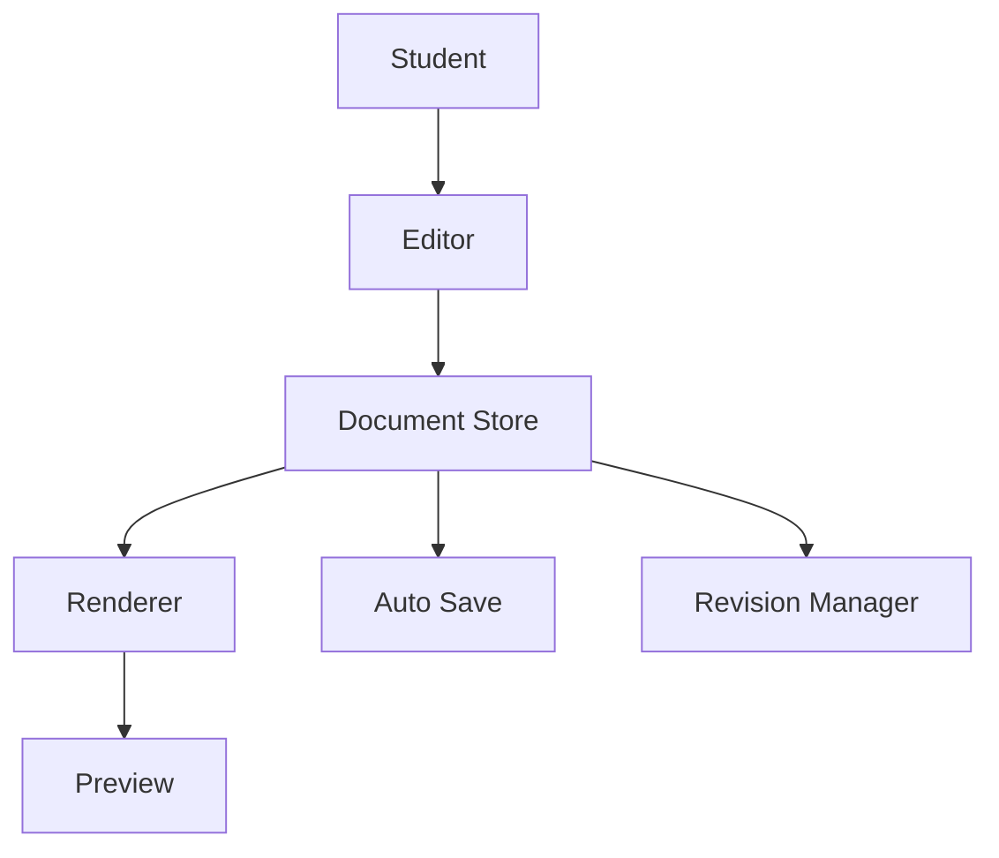
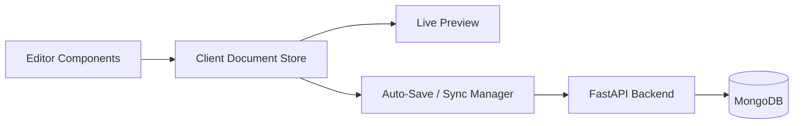
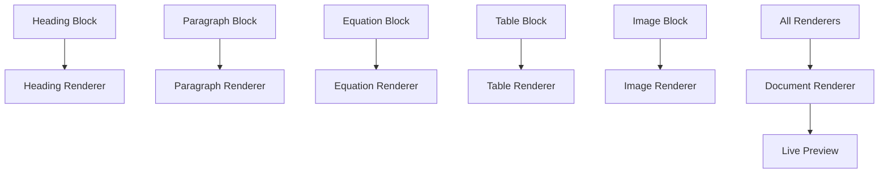
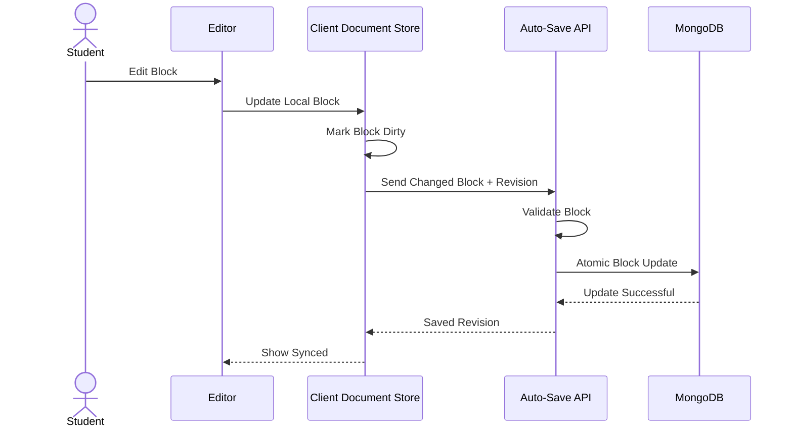

# 21. Visual Block-Based Document Editor

## 21.1 Overview

The Visual Block-Based Document Editor is the core component of the Journal Management & Review System.

Unlike traditional rich-text editors that store the entire document as HTML, this editor represents every section of the journal as an independent, self-contained document block.

A journal is therefore not considered a single text document but a collection of reusable components that together form a structured academic document.

This design provides several architectural advantages:

- Modular document construction
- Independent block rendering
- Incremental auto-save
- Block-level version history
- Teacher annotations on individual blocks
- Consistent rendering across Web, PDF, DOCX and Print
- Future collaborative editing support

---

# 21.2 Why Not Use a Traditional Rich Text Editor?

Traditional editors such as Quill or TinyMCE serialize the entire document into HTML.

```
Entire HTML Document

↓

Save HTML

↓

Load HTML

↓

Modify HTML

↓

Render HTML
```

While suitable for blogs or articles, HTML becomes difficult to manage for structured academic documents.

Problems include:

- Entire document must be synchronized after every edit.
- Difficult to compare revisions.
- Hard to attach comments to specific sections.
- PDF generation depends heavily on browser rendering.
- HTML mixes content with presentation.
- Difficult to introduce new academic components.

Instead, this project adopts a structured document architecture.

---

# 21.3 Document Architecture



Every document block is an independent component responsible for storing its own content and rendering logic.

---

# 21.4 Editor Architecture

The editor consists of multiple independent modules.



Every module is responsible for a single task.

The browser-side Document Store is an in-memory client state layer and does not connect directly to MongoDB. Changes are synchronized through authenticated backend APIs. The backend validates document updates and persists the canonical structured journal as BSON in MongoDB.

This separation keeps the editor maintainable and scalable while preserving security and preventing direct database access from the browser.

---

# 21.5 Main Editor Layout

```
+-------------------------------------------------------------+

 File     Edit     Insert     View     Export

--------------------------------------------------------------

 Title

--------------------------------------------------------------

 Rich Toolbar

--------------------------------------------------------------

|

|

 Heading Block

|

 Paragraph Block

|

 Equation Block

|

 Table Block

|

 Image Block

|

 Observation Block

|

 Result Block

|

+

--------------------------------------------------------------

 Block Controls

[+]

[Duplicate]

[Delete]

[Move]

--------------------------------------------------------------

 Status

Saved • Revision 15 • Synced

+-------------------------------------------------------------+
```

The layout is intentionally minimal to avoid distracting students while writing.

---

# 21.6 Editor Components

The editor consists of the following major components.

| Component | Responsibility |
|------------|----------------|
| Toolbar | Formatting operations |
| Slash Menu | Insert new blocks |
| Block Renderer | Display blocks |
| Block Editor | Edit block content |
| Drag Engine | Rearranging blocks |
| Preview Renderer | Live preview |
| Auto Save Manager | Incremental synchronization |
| Version Manager | Create revisions |
| Comment Layer | Teacher annotations |

---

# 21.7 Document Block Lifecycle

Every document block follows the same lifecycle.



This standardized lifecycle simplifies synchronization and version management.

---

# 21.8 Creating a New Block

Students can insert a new block using either the toolbar or a slash command.

Example:

```
/

↓

Heading

↓

Paragraph

↓

Equation

↓

Table

↓

Image

↓

Observation

↓

Result
```

Every inserted block immediately receives:

- Unique ID
- Block Type
- Position
- Metadata
- Creation Timestamp

---

## Block Creation Workflow



---

# 21.9 Supported Block Types

The first version of the editor supports:

| Block | Purpose |
|--------|----------|
| Heading | Section Titles |
| Paragraph | Rich Text |
| Equation | Mathematical Expressions |
| Table | Experimental Data |
| Image | Diagrams |
| Observation | Experimental Observations |
| Result | Results |
| Reference | Citations |
| Code | Programming Practical |
| Divider | Section Separator |
| Page Break | PDF Formatting |

The architecture allows unlimited future block types.

---

# 21.10 Drag & Drop Architecture

Students frequently reorganize document sections while writing.

Instead of copying and pasting content,

blocks can simply be moved.



Only the block positions change.

The content remains untouched.

---

# 21.11 Block Reordering

Instead of rewriting the document,

the editor simply updates the order.

Before

```
1 Heading

2 Paragraph

3 Table
```

After

```
1 Heading

2 Table

3 Paragraph
```

The reordering operation updates the document's canonical block order.

Depending on the implementation, ordering may be represented by the order of block IDs in the journal document or by sortable rank values. The client sends the new ordering information through the synchronization API, and MongoDB persists the updated order atomically where possible.

The block content itself remains unchanged, making drag-and-drop operations efficient.

---

# 21.12 Document State Management

The editor maintains a centralized document state.



Every editor component reads from the same document state.

This eliminates inconsistencies between editing and rendering.

The client document state remains the immediate source of truth during an active editing session. The persisted MongoDB journal document is the durable server-side source of truth after successful synchronization.



The backend never trusts arbitrary client document structures without validation. Incoming block updates are validated against the current document schema before persistence.

---

# 21.13 Live Preview

Every modification immediately updates the preview.

```
Student Types

↓

Update Block

↓

Update Document Store

↓

Renderer

↓

Preview Updated
```

The preview always reflects the latest document state.

---

# 21.14 Block Rendering Strategy

Each block has its own renderer.



This modular rendering strategy enables independent development of new block types.

---

# 21.15 MongoDB Persistence Model for the Editor

The editor works with structured JSON in the browser. The backend persists the validated JSON-like structure as BSON in MongoDB.

A simplified journal document may look like:

```json
{
  "schemaVersion": 1,
  "journalId": "journal_123",
  "status": "draft",
  "blockOrder": [
    "block_001",
    "block_002"
  ],
  "blocks": [
    {
      "id": "block_001",
      "type": "heading",
      "content": {
        "text": "Experiment"
      },
      "metadata": {
        "createdAt": "2026-07-19T10:00:00Z"
      }
    },
    {
      "id": "block_002",
      "type": "paragraph",
      "content": {
        "text": "Objective of the experiment"
      },
      "metadata": {
        "createdAt": "2026-07-19T10:01:00Z"
      }
    }
  ]
}
```

This structure allows the journal to be loaded efficiently as one document for editing and rendering.

The system should monitor MongoDB's document-size limit as journals grow. Large binary assets are never embedded directly in the journal document. Images and generated files remain in object storage, while image blocks store only metadata and asset references.

High-growth information such as immutable revision history and teacher comments can remain in dedicated MongoDB collections rather than causing the current journal document to grow indefinitely.

---

## 21.15.1 Incremental Block Synchronization

Although MongoDB stores the current journal as a structured document, the client does not need to send the entire journal after every keystroke.



Updates should use stable block IDs so a specific block can be targeted without relying only on its visual position.

Optimistic concurrency or revision numbers should be used to prevent stale auto-save requests from silently overwriting newer changes.

---

## 21.15.2 MongoDB Block Update Strategy

The persistence layer may use MongoDB update operators to modify targeted parts of the journal document.

The exact query implementation belongs to the backend repository layer, not the editor.

Typical operations include:

- Updating one block's content
- Inserting a new block
- Removing a block
- Updating block ordering
- Updating document metadata
- Updating the current document revision number

This preserves the simple editor experience while keeping database-specific logic outside the frontend.

---

# 21.16 Advantages of the Editor Architecture

Compared with conventional editors, the proposed architecture provides:

- Independent document components
- Better maintainability
- Incremental synchronization
- Efficient drag-and-drop
- Reliable PDF rendering
- Modular renderer architecture
- Future collaborative editing support
- Better version history
- Simplified teacher review
- Cleaner codebase

---

# 21.17 Transition to Mathematical Writing System

The document editor solves the problem of structured academic writing.

However, engineering and science journals require extensive mathematical notation.

The next section introduces the **Intelligent Mathematical Writing System**, which allows students to write complex equations visually without learning LaTeX while still generating publication-quality mathematical documents.
