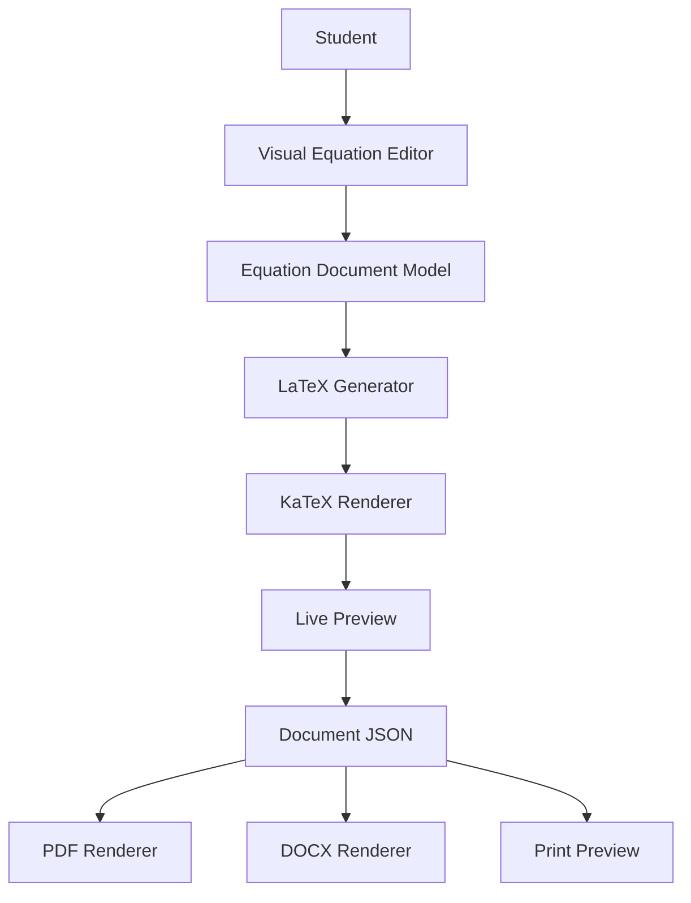
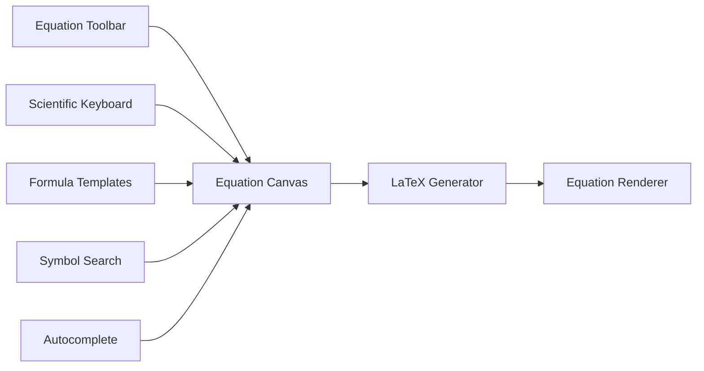
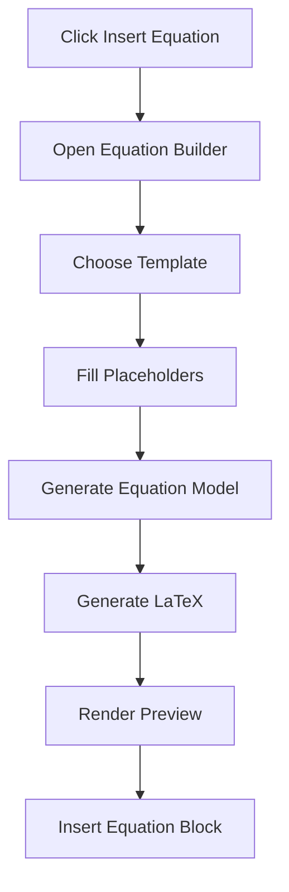

# 22. Intelligent Mathematical Writing System

## 22.1 Overview

One of the biggest challenges faced by students while preparing practical journals is writing mathematical equations and scientific notation.

Traditional approaches generally fall into one of two categories:

- Plain Rich Text Editors
- LaTeX Editors

Both approaches have significant limitations.

A normal rich-text editor provides almost no support for mathematical notation, while LaTeX editors require students to memorize complex syntax before they can write even simple equations.

For example, to write

\[
\frac{a+b}{\sqrt{x}}
\]

a student would need to know

```latex
\frac{a+b}{\sqrt{x}}
```

Expecting first- or second-year students to learn LaTeX only to complete practical journals creates an unnecessary learning barrier.

The goal of this platform is **not to teach LaTeX.**

The goal is to help students write mathematics as naturally as they write text.

Therefore, the Journal Management & Review System introduces an **Intelligent Mathematical Writing System**, which provides a visual equation editor while internally generating LaTeX and MathML for rendering and document generation.

Students interact only with visual components.

The system handles all mathematical syntax automatically.

---

# 22.2 Design Philosophy

The mathematical editor follows four core principles.

### Principle 1 — Zero LaTeX Knowledge Required

Students should never be forced to learn LaTeX syntax.

Instead of writing

```latex
\int_a^b x^2dx
```

students simply insert an Integral template and fill the placeholders.

---

### Principle 2 — Visual Before Syntax

Every equation is created visually.

The editor converts the visual representation into LaTeX internally.

```
Visual Formula

↓

Document Model

↓

LaTeX

↓

KaTeX Renderer

↓

PDF Renderer
```

---

### Principle 3 — Identical Rendering Everywhere

The equation displayed inside the editor must look exactly the same in

- Web Editor
- Print Preview
- PDF
- DOCX

No separate rendering logic should exist.

Every renderer receives the same mathematical document model.

---

### Principle 4 — Fast Academic Writing

Students should spend time solving problems rather than searching for symbols.

The editor therefore provides

- Templates
- Auto-completion
- Symbol Search
- Keyboard Shortcuts
- Scientific Toolbar

---

# 22.3 Mathematical Writing Architecture



The student never interacts with LaTeX directly.

---

# 22.4 Mathematical Editor Components

The mathematical writing subsystem consists of multiple independent modules.



Each module performs a single responsibility.

---

# 22.5 Visual Equation Builder

Instead of typing syntax,

students click

```
Insert

↓

Equation
```

The editor opens a dedicated mathematical workspace.

```
+-------------------------------------------------------+

            Equation Builder

---------------------------------------------------------

 Fraction

 Root

 Power

 Matrix

 Integral

 Sigma

 Greek

 Vector

 Logic

---------------------------------------------------------

                 Equation Canvas

---------------------------------------------------------

                  Live Preview

---------------------------------------------------------

             Cancel      Insert

+-------------------------------------------------------+
```

Students create equations by selecting templates and filling placeholders.

No syntax is required.

---

# 22.6 Scientific Toolbar

The editor provides quick access to frequently used scientific symbols.

```
α

β

γ

δ

θ

π

μ

σ

Ω

∞

±

×

÷

≈

≠

≤

≥

√

∫

∑

∂

∇

°

→

←

⇌
```

Instead of searching Unicode tables,

students insert symbols with a single click.

---

# 22.7 Formula Templates

Most mathematical expressions follow common patterns.

Rather than constructing every equation from scratch,

students begin with predefined templates.

Examples include

| Template | Purpose |
|-----------|----------|
| Fraction | a/b |
| Root | √x |
| Power | x² |
| Subscript | xi |
| Integral | ∫ |
| Sigma | Σ |
| Matrix | Matrix Notation |
| Limit | lim |
| Vector | Vector Notation |
| Piecewise | Conditional Functions |
| Determinant | Matrix Determinant |

Templates dramatically reduce typing effort.

---

# 22.8 Formula Creation Workflow



---

# 22.9 Fraction Template Example

Instead of writing

```latex
\frac{a+b}{c+d}
```

students see

```
□
──────
□
```

They simply replace the placeholders.

```
a+b
──────
c+d
```

The editor automatically generates

```latex
\frac{a+b}{c+d}
```

internally.

---

# 22.10 Root Template

Instead of typing

```latex
\sqrt{x+y}
```

students insert

```
√ □
```

and enter

```
x+y
```

The editor handles formatting automatically.

---

# 22.11 Integral Template

Students insert

```
∫ □ dx
```

and then fill

- Integrand
- Variable
- Upper Limit
- Lower Limit

The system constructs the final mathematical representation.

---

# 22.12 Matrix Builder

Engineering practicals frequently require matrices.

The editor includes a dedicated matrix constructor.

```
| □ □ |

| □ □ |
```

Rows and columns can be added dynamically.

---

# 22.13 Greek Symbol Library

Frequently used symbols include

- Alpha
- Beta
- Gamma
- Delta
- Lambda
- Mu
- Pi
- Sigma
- Omega

Students insert them directly from the toolbar instead of memorizing Unicode values.

---

# 22.14 Why Templates?

Templates provide several advantages.

- Faster writing
- Fewer syntax mistakes
- Consistent formatting
- Easier learning
- Better accessibility
- Higher productivity

Students focus on solving equations rather than formatting them.

---

# 22.15 Summary

The Intelligent Mathematical Writing System transforms mathematical editing from a syntax-heavy task into a visual authoring experience.

Instead of expecting students to learn LaTeX,

the platform provides:

- Visual Equation Builder
- Scientific Toolbar
- Formula Templates
- Automatic LaTeX Generation
- Live Rendering
- Consistent PDF Output

This makes the editor suitable for engineering, science, mathematics, and technical practical journals while remaining approachable for beginners.


**End of Part 2B-A**

**Next:** **Part 2B-B – Smart Formula Recognition, Inline Mathematics, Equation JSON Model, Rendering Pipeline, PDF Integration, and Internal Architecture.**