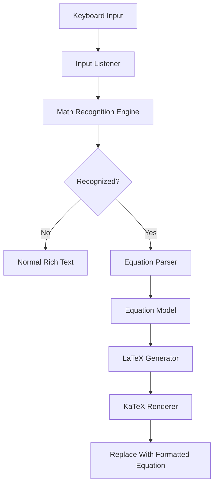
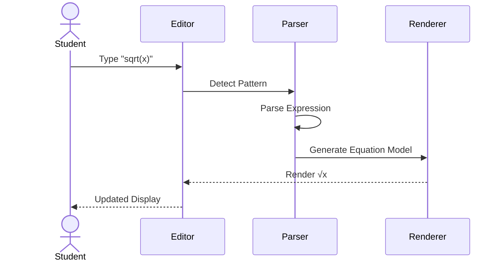
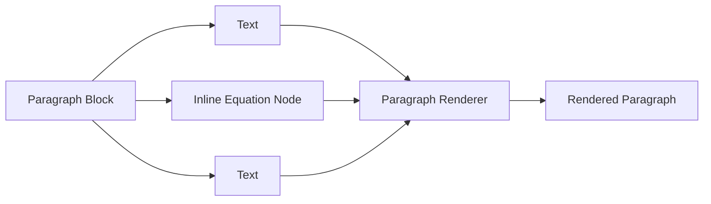
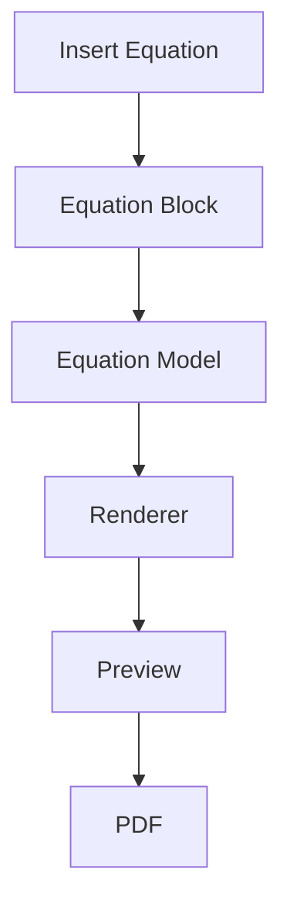
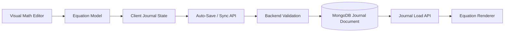
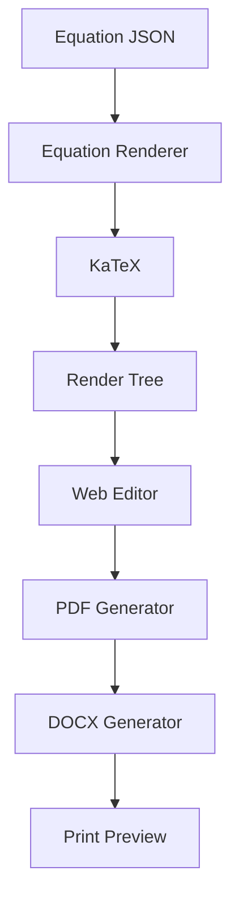
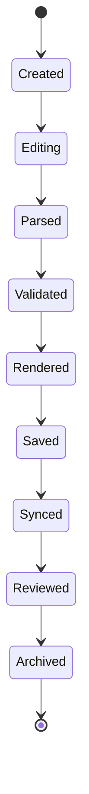
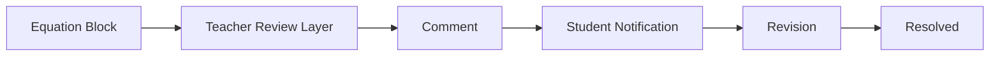
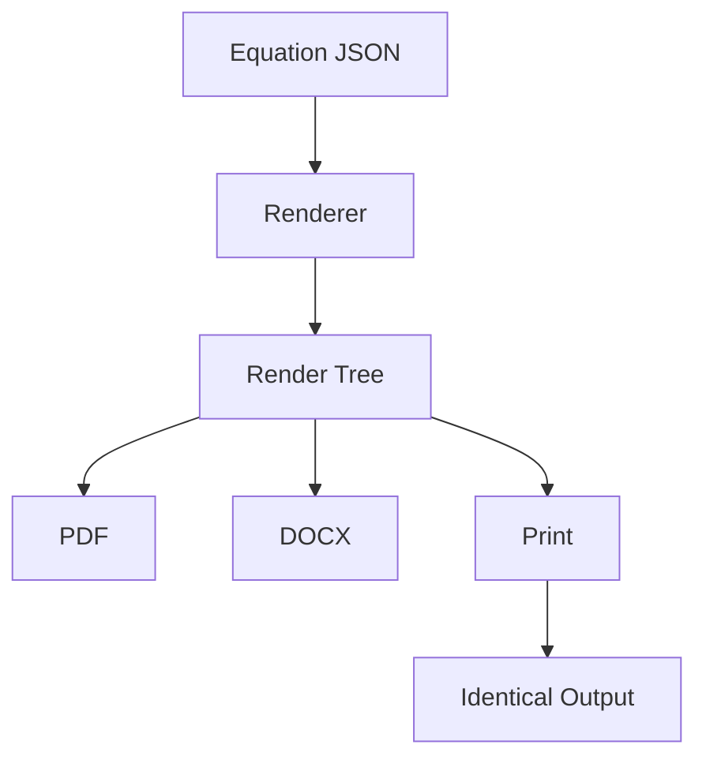
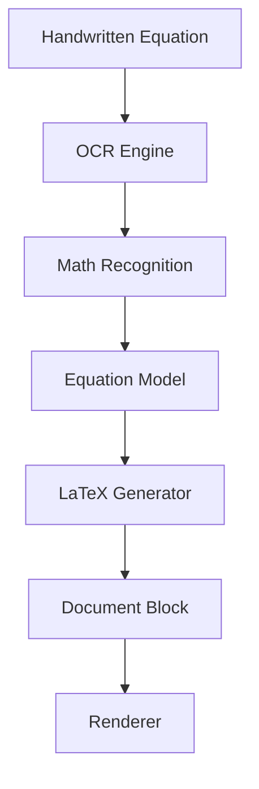

# 23. Smart Mathematical Recognition Engine

## 23.1 Overview

While the Visual Equation Builder significantly simplifies mathematical writing, constantly opening the equation editor for every small expression can interrupt a student's writing flow.

To create an experience similar to modern editors such as Microsoft Word, Google Docs, Notion, and scientific writing software, the platform introduces a **Smart Mathematical Recognition Engine**.

Instead of requiring students to manually construct every equation, the editor continuously analyzes the text being typed and intelligently converts recognizable mathematical expressions into properly formatted mathematical notation.

This allows students to write naturally while the system performs automatic formatting in the background.


## 23.2 Architecture



---

# 23.3 Recognition Examples

Students can type naturally.

Example 1

```
sqrt(x)
```

Automatically becomes

```
√x
```

---

Example 2

```
x^2
```

becomes

```
x²
```

---

Example 3

```
x_1
```

becomes

```
x₁
```

---

Example 4

```
1/2
```

suggests

```
½
```

or

```
Fraction Template
```

---

Example 5

```
sum
```

suggests

```
Σ
```

---

Example 6

```
int
```

suggests

```
∫
```

---

Example 7

```
pi
```

suggests

```
π
```

---

Example 8

```
theta
```

suggests

```
θ
```

---

Example 9

```
alpha
```

suggests

```
α
```

---

Example 10

```
<=
```

becomes

```
≤
```

---

# 23.4 Auto Completion Pipeline



---

# 23.5 Inline Mathematics

Not every equation should occupy an entire line.

Students often write explanations such as

```
The velocity is v=u+at where
u represents the initial velocity.
```

Instead of splitting text into multiple blocks, the editor supports **Inline Equation Nodes**.

Example

```
The velocity is

[v=u+at]

where u is the initial velocity.
```

The equation behaves like a character inside the paragraph while maintaining its mathematical formatting.

---

## Inline Equation Architecture



Inline equations simplify technical writing without interrupting paragraph flow.

---

# 23.6 Display Equations

Large derivations require standalone equations.

Display equations are implemented as independent document blocks.

Example

```
Heading

↓

Paragraph

↓

Display Equation

↓

Paragraph

↓

Observation
```

Because they are blocks,

they can be

- Moved
- Commented
- Reviewed
- Versioned
- Exported independently.

---

## Display Equation Workflow



---

# 23.7 Equation Document Model

Unlike HTML,

equations are stored as structured JSON.

Example

```json
{
  "id": "eq_001",
  "type": "equation",
  "displayMode": true,
  "data": {
    "latex": "\\frac{a+b}{\\sqrt{x}}",
    "mathml": "<math>...</math>"
  }
}
```

This structured representation becomes the canonical mathematical representation used by the document model.

At the application boundary, equation data is represented as JSON. When the parent journal document is persisted, the equation block is stored as nested BSON inside MongoDB.

A persisted equation block may conceptually look like:

```json
{
  "id": "block_eq_001",
  "type": "equation",
  "displayMode": true,
  "data": {
    "latex": "\\frac{a+b}{\\sqrt{x}}",
    "mathml": "<math>...</math>"
  },
  "metadata": {
    "createdAt": "2026-07-19T10:00:00Z",
    "updatedAt": "2026-07-19T10:05:00Z"
  }
}
```

The equation block remains part of the journal's structured block array and is persisted through the backend synchronization API rather than connecting directly from the editor to MongoDB.

Stable block IDs allow equation-specific comments, revisions, and review anchors to reference the mathematical block reliably even when surrounding blocks are reordered.

---

# 23.8 Why Store LaTeX?

Students never write LaTeX.

However,

internally storing a normalized mathematical representation with generated LaTeX provides

- Standardized representation
- Fast rendering
- PDF compatibility
- DOCX interoperability
- Scientific interoperability
- Stable persistence inside the MongoDB journal document

The visual editor generates LaTeX automatically.

Students never interact with it.

---

# 23.9 Mathematical Persistence Architecture

Mathematical content follows the same persistence boundary as every other document block.



The browser does not write directly to MongoDB.

The backend validates:

- Equation block structure
- Supported equation representation
- Block identifier
- Document schema version
- User authorization
- Journal workflow state
- Revision/concurrency metadata

before persisting the update.

For incremental auto-save, only the changed equation block needs to be synchronized when possible.

MongoDB can then update the targeted block in the current journal document while immutable journal revisions remain in the separate version-history architecture defined later in the SDD.

---

# 23.10 Rendering Pipeline

Every equation follows the same rendering process.



Because every renderer consumes the same Equation Model,

every exported document remains visually identical.

---

# 23.11 Equation Rendering Lifecycle



---

# 23.12 Teacher Review Integration

Teachers review mathematical expressions exactly like any other document block.

They can

- Highlight equations
- Add comments
- Suggest corrections
- Mark mistakes
- Approve derivations

Comments remain logically attached to the equation block through its stable block ID.

The comment itself should generally be stored in the dedicated MongoDB comments collection rather than embedded indefinitely inside the equation block. A comment record references the journal ID and equation block ID, allowing review history to grow independently from the current journal document.

---

## Review Architecture



---

# 23.13 Export Pipeline

Mathematics should never change during export.



This guarantees that the PDF exactly matches the editor preview.

---

# 23.14 Future OCR Support

Future versions of the platform may allow students to draw equations by hand.

Workflow



This feature would be particularly useful for tablets and touch-screen devices.

---

# 23.15 Future AI Assistance

The mathematical editor can later integrate AI to provide intelligent assistance.

Examples include

- Formula completion
- Step-by-step derivation suggestions
- Error detection
- Unit consistency checking
- Symbol recommendations
- Scientific notation suggestions

These capabilities can be added without changing the document architecture because the editor already separates **editing**, **representation**, and **rendering**.

---

# 23.16 Design Advantages

The proposed Mathematical Writing System provides several advantages over traditional editors.

| Traditional Editors | Proposed Architecture |
|---------------------|----------------------|
| Manual equation formatting | Visual Equation Builder |
| Requires LaTeX knowledge | Zero LaTeX learning |
| Limited symbols | Scientific Toolbar |
| No smart recognition | Live Math Recognition |
| HTML-based storage | Structured Equation Model persisted as MongoDB BSON |
| Separate PDF formatting | Shared Rendering Engine |
| Difficult review | Block-level comments |
| Limited extensibility | Modular architecture |

---

# 23.17 Transition to Document Model

At this stage, the architecture now defines:

- Visual Document Editor
- Intelligent Mathematical Writing
- Smart Recognition Engine
- Equation Rendering
- Inline Mathematics
- Display Equations
- Teacher Review Integration

The next chapter introduces the **Document Model**, explaining how every heading, paragraph, equation, table, image, and annotation is stored as structured JSON with metadata, versioning information, and rendering instructions. This document model serves as the single source of truth for editing, synchronization, review, and export across the entire platform.

---

**End of Part 2B-B**