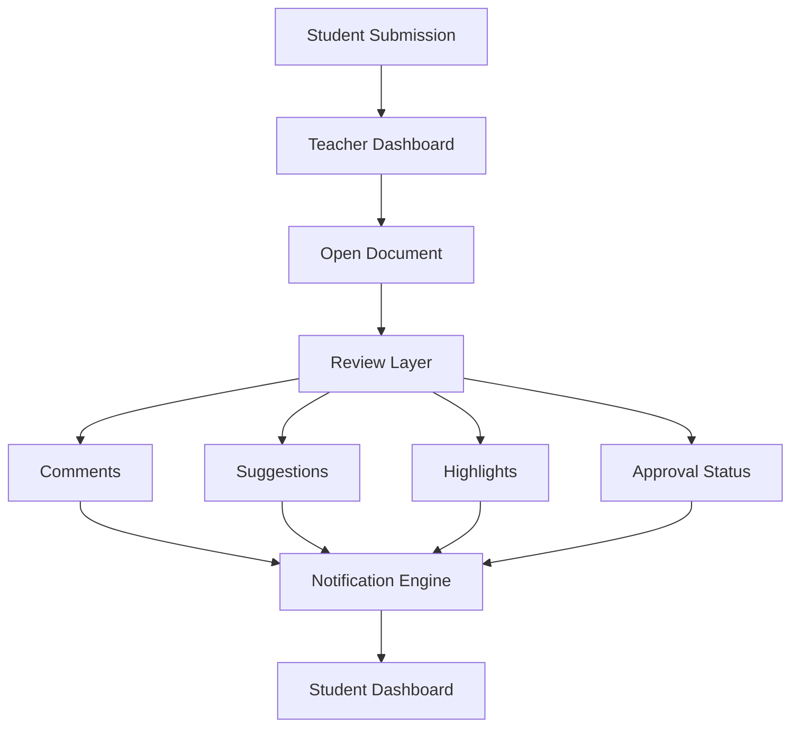
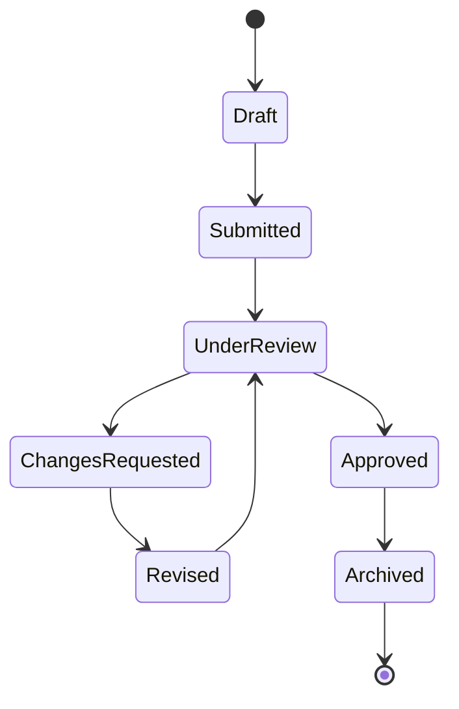
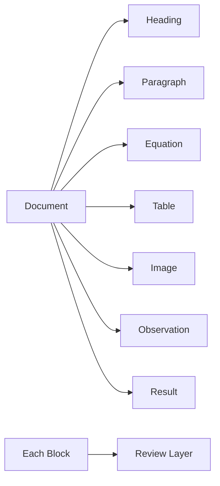
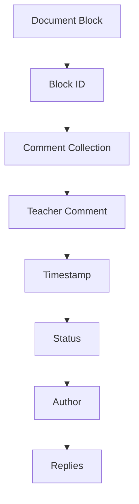
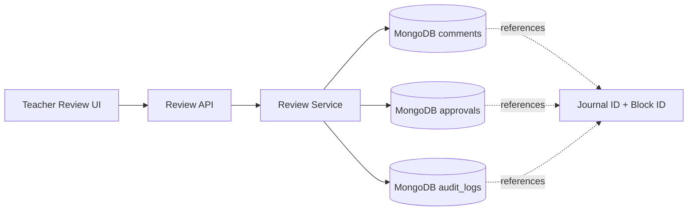
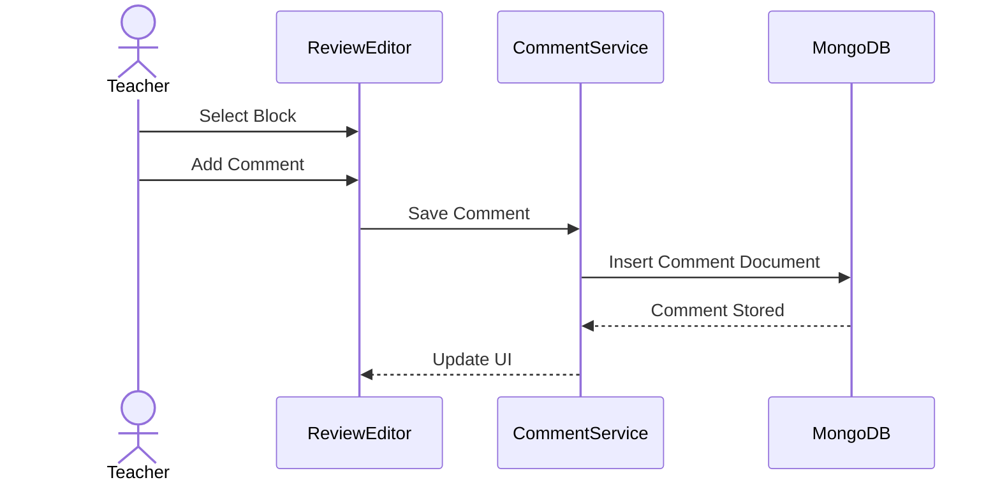
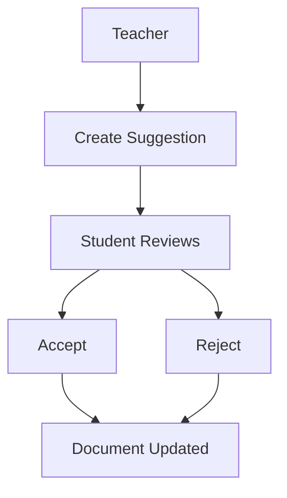
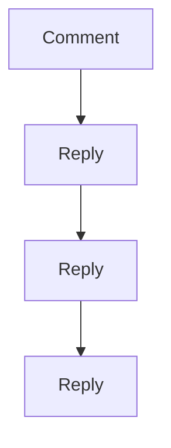
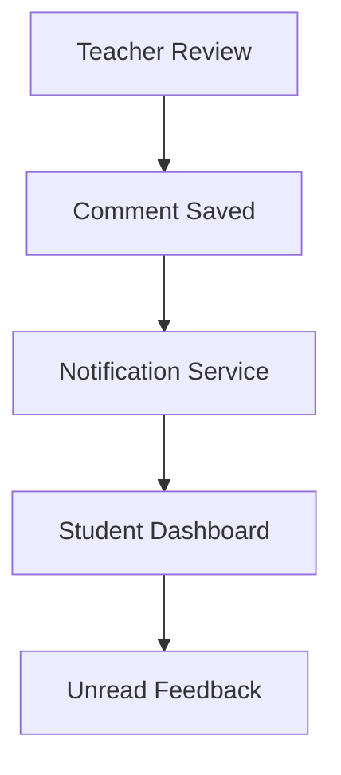

# 24. Teacher Review & Annotation Architecture

## 24.1 Overview

Writing a practical journal is only one half of the academic workflow. The second half is the **review process**, where teachers evaluate submissions, provide feedback, request corrections, and approve the final document.

In traditional systems, this review process is inefficient:

- Teachers write comments on printed journals.
- Students must manually search for mistakes.
- Feedback can be unclear or illegible.
- Revision history is lost after corrections.
- Multiple review rounds become difficult to manage.

The Journal Management & Review System replaces this with a **block-level digital review architecture**.

Instead of reviewing an entire document as one large file, teachers review individual document blocks such as paragraphs, equations, tables, images, observations, and results.

This approach makes feedback more precise, traceable, and easier for students to resolve.

---

# 24.2 Review Philosophy

The review system is built around four principles.

### Principle 1 — Contextual Feedback

Feedback should always be attached to the exact content it refers to.

Instead of writing:

> "Equation is wrong."

The teacher comments directly on the equation block.

---

### Principle 2 — Non-Destructive Review

Teachers should never modify the student's original work.

Instead, they provide:

- Suggestions
- Comments
- Highlights
- Approval status

The student decides whether to accept and apply the feedback.

---

### Principle 3 — Traceable Revisions

Every review and every revision should remain available in the document history.

Nothing is permanently lost.

---

### Principle 4 — Faster Iteration

Students should immediately know:

- What changed
- Where it changed
- Who requested the change
- Whether the issue has been resolved

---

# 24.3 Review System Architecture



The review layer exists independently of the document itself, ensuring that comments never alter the original content.

---

# 24.4 Review Lifecycle

Every submitted journal follows a defined review lifecycle.



This workflow ensures that every document has a clear academic status.

---

# 24.5 Teacher Review Dashboard

The teacher dashboard provides a centralized interface for managing student submissions.

```
+-------------------------------------------------------------+

                 Teacher Review Dashboard

--------------------------------------------------------------

 Pending Reviews : 18

 Approved : 42

 Changes Requested : 7

--------------------------------------------------------------

 Student Name

 Practical Number

 Subject

 Submitted At

 Current Status

--------------------------------------------------------------

 [Open Review]

+-------------------------------------------------------------+
```

Teachers can quickly identify journals that require attention.

---

# 24.6 Review Workspace

When a teacher opens a journal, the editor switches to **Review Mode**.

```
+-------------------------------------------------------------+

 Practical Title

--------------------------------------------------------------

 Paragraph Block

 Equation Block

 Image Block

 Observation Block

--------------------------------------------------------------

 Comment Panel

 Suggestions

 Approval Controls

--------------------------------------------------------------

 Save Review

+-------------------------------------------------------------+
```

Unlike student mode, review mode includes additional annotation tools.

---

# 24.7 Block-Level Review

Every document block can be reviewed independently.



Because each block has its own unique identifier, comments remain attached even if blocks are reordered.

---

# 24.8 Comment Architecture

Comments are stored separately from document content.



This separation keeps review data independent from the student's journal content while enabling rich discussions.

Comments are stored in a dedicated MongoDB `comments` collection rather than embedded indefinitely inside the current journal document.

A comment document may conceptually contain:

```json
{
  "id": "comment_123",
  "journalId": "journal_123",
  "blockId": "block_456",
  "authorId": "teacher_123",
  "type": "comment",
  "message": "Please verify this calculation.",
  "status": "open",
  "createdAt": "2026-07-19T10:30:00Z",
  "resolvedAt": null
}
```

Stable `journalId` and `blockId` references allow feedback to remain associated with the correct content even when blocks are reordered.

Appropriate compound indexes should support common review queries, such as retrieving comments by `journalId + blockId`, `journalId + status`, or author where required.

---

# 24.9 MongoDB Review Persistence Architecture

The review layer is persisted independently from the canonical journal document.



This separation prevents teacher feedback from rewriting student-authored blocks and allows review history to grow independently from the current journal document.

The backend validates teacher authorization before creating, updating, resolving, or deleting review annotations.

---

# 24.10 Comment Workflow



Students immediately see the new comment when they open the journal.

---

# 24.11 Types of Review Annotations

The platform supports multiple annotation types.

| Annotation | Purpose |
|------------|---------|
| Comment | General feedback |
| Suggestion | Proposed improvement |
| Highlight | Draw attention to content |
| Warning | Indicates an issue |
| Approval | Marks content as correct |
| Question | Requests clarification |

This flexibility allows teachers to communicate more effectively.

---

# 24.12 Highlighting Content

Teachers can highlight specific portions of a block without modifying the original content.

Example:

```
The calculated resistance is 15 Ω.

                ↑

Teacher Highlight
```

Highlights provide visual emphasis while preserving the student's work.

---

# 24.13 Suggestion Workflow

Suggestions allow teachers to recommend changes rather than directly editing content.



This keeps students in control of their submissions.

Suggestions are stored as review-layer data in MongoDB. Accepting a suggestion triggers a normal student-authorized document update through the journal service, which creates or contributes to the next document revision according to the version-history architecture.

Rejecting a suggestion changes the suggestion state but does not modify the journal content.

---

# 24.14 Threaded Discussions

Comments support replies, enabling conversations between students and teachers.



Each discussion remains associated with its corresponding document block.

Replies may reference a parent comment or thread identifier in the MongoDB comments model. This allows threaded discussions to grow independently without embedding an unbounded reply tree inside the journal document itself.

---

# 24.15 Student Notification Flow

Whenever new feedback is added, the student receives a notification.



This ensures students are promptly informed of required revisions.

---

# 24.16 Review Status Indicators

Each block displays its current review status.

| Status | Meaning |
|--------|---------|
| Pending | Awaiting review |
| Reviewed | Teacher has examined the block |
| Changes Requested | Student must revise |
| Approved | No further changes required |
| Resolved | Feedback addressed |

These indicators help students quickly identify outstanding issues.

---

# 24.17 Advantages of Block-Level Review

Compared with reviewing an entire document, the proposed architecture offers:

- Precise feedback linked to specific content.
- Clear communication between teachers and students.
- Independent review of equations, images, tables, and text.
- Persistent comment history.
- Easier revision tracking.
- Reduced ambiguity.
- Better scalability for large journals.
- Foundation for future collaborative review workflows.

---

# 24.18 Transition to Version History & Approval Workflow

The review system captures comments and suggestions, but academic documents often go through multiple revision cycles before final approval.

The next chapter introduces the **Version History & Approval Workflow**, explaining how every revision is recorded, how approvals are managed, and how the platform maintains a complete audit trail of the journal from its first draft to its final approved version.

---

**End of Part 3A**