---

# 25. Version History & Approval Workflow

## 25.1 Overview

Academic journals rarely reach their final form in a single attempt. A document typically goes through multiple cycles of writing, review, correction, and approval before it is considered complete.

Traditional paper-based workflows provide no reliable mechanism to track these revisions. Once a student rewrites a page, the previous version is permanently lost, making it impossible to review the evolution of the document or restore earlier work.

To solve this problem, the Journal Management & Review System implements a comprehensive **Version History & Approval Workflow**.

Every meaningful modification creates a new revision, enabling students and teachers to review the complete evolution of the document from the first draft to the final approved submission.

---

# 25.2 Design Philosophy

The version management system follows five principles.

### Principle 1 — Never Lose Work

Every saved revision should remain recoverable.

---

### Principle 2 — Immutable History

Previous versions should never be modified after they are created.

---

### Principle 3 — Incremental Storage

Only the changed blocks should be stored instead of duplicating the entire journal.

---

### Principle 4 — Complete Audit Trail

Every revision records:

- Author
- Timestamp
- Modified Blocks
- Review Status
- Approval State

---

### Principle 5 — Safe Recovery

Students should be able to restore earlier versions without risking data loss.

---

# 25.3 Version Management Architecture

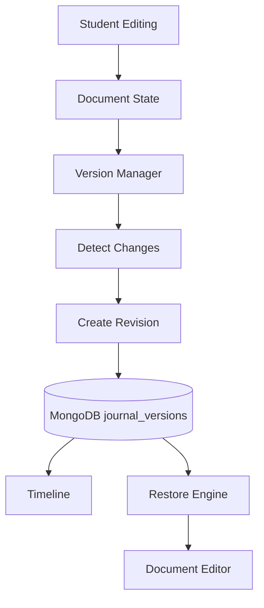

The Version Manager continuously monitors the document and records meaningful revisions.

---

# 25.4 Document Revision Lifecycle

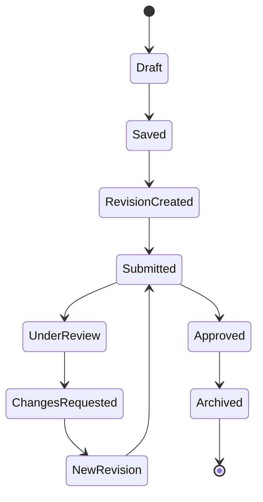

Each revision represents a distinct milestone in the journal's lifecycle.

---

# 25.5 Revision Timeline

The system presents revisions in chronological order.

```
Version 1

↓

Version 2

↓

Version 3

↓

Version 4

↓

Submitted

↓

Teacher Review

↓

Revision 5

↓

Approved
```

Students and teachers can navigate this timeline to inspect previous work.

---

# 25.6 Revision Metadata

Every revision stores descriptive metadata.

| Field | Description |
|--------|-------------|
| Revision ID | Unique identifier |
| Document ID | Parent journal |
| Author | Student or Teacher |
| Created At | Timestamp |
| Modified Blocks | List of changed blocks |
| Status | Draft, Submitted, Approved |
| Review Notes | Optional summary |

This metadata enables efficient searching, auditing, and recovery.

Revisions are stored in a dedicated MongoDB `journal_versions` collection rather than embedded indefinitely inside the current journal document.

A revision document may conceptually contain:

```json
{
  "id": "revision_005",
  "journalId": "journal_123",
  "revisionNumber": 5,
  "parentRevisionId": "revision_004",
  "authorId": "student_123",
  "createdAt": "2026-07-19T10:30:00Z",
  "status": "submitted",
  "schemaVersion": 1,
  "changes": [
    {
      "blockId": "block_eq_001",
      "operation": "update",
      "beforeHash": "hash_a",
      "after": {
        "type": "equation",
        "data": {
          "latex": "V = IR"
        }
      }
    }
  ]
}
```

Useful indexes include:

- Unique `journalId + revisionNumber`
- `journalId + createdAt`
- `journalId + status`
- `authorId + createdAt`

The current editable journal remains in the `journals` collection, while immutable historical revisions remain in `journal_versions`.

---

# 25.7 MongoDB Version Persistence Architecture

MongoDB separates the current editable journal state from immutable revision history.

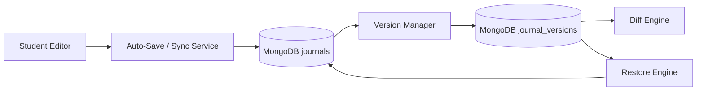

The `journals` collection stores the latest canonical state required for fast editing and rendering.

The `journal_versions` collection stores immutable historical revision records.

This prevents the current journal document from growing indefinitely while preserving a complete recoverable history.

---

## 25.7.1 Revision Creation Strategy

Not every keystroke should create a permanent historical revision.

Auto-save and version history serve different purposes:

- **Auto-save** protects active work and synchronizes the latest journal state.
- **Revision history** records meaningful recoverable milestones.

A revision may be created when:

- The student explicitly creates a checkpoint.
- A defined inactivity interval is reached.
- The journal is submitted.
- The student resubmits after requested changes.
- A restore operation occurs.
- A significant grouped edit threshold is reached.

This prevents thousands of meaningless revisions from being created during normal typing.

---

## 25.7.2 Snapshot and Delta Strategy

Pure delta-only history minimizes storage but can make reconstruction expensive and fragile when revision chains become long.

The recommended architecture uses a **hybrid snapshot + delta strategy**.

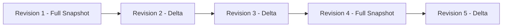

Full snapshots may be created:

- At initial journal creation
- At submission
- At approval
- Every configured number of revisions
- Before or after major migration boundaries

Intermediate revisions may store changed blocks or operations.

This balances storage efficiency with reliable reconstruction performance.

---

# 25.8 Incremental Versioning

Instead of saving the complete document after every edit, the platform stores only the modified blocks.

Example:

Initial Document

```
Heading

Paragraph

Equation

Table

Image
```

Student edits only the equation.

Traditional Storage

```
Store Entire Document Again
```

Proposed Architecture

```
Store Only Updated Equation Block
```

This significantly reduces storage requirements compared with storing a complete copy for every minor revision.

However, the platform does not rely on an unlimited delta chain. Periodic full snapshots are stored so older versions can be reconstructed efficiently and safely.

Revision persistence is handled by the backend Version Manager. The browser never writes revision records directly to MongoDB.

---

## Incremental Version Workflow

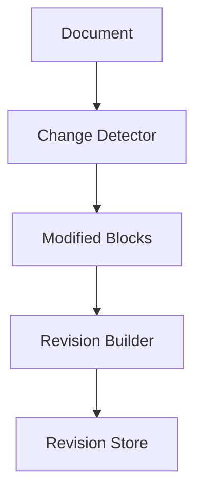

---

# 25.9 Change Detection

The Version Manager compares the current document state with the previous revision.

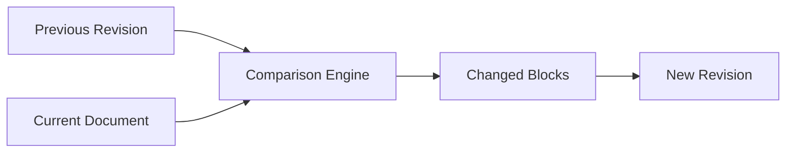

Only meaningful differences create a new revision.

---

# 25.10 Revision Reconstruction

When a historical revision is requested, the Version Manager reconstructs the required state from the nearest preceding full snapshot and applies subsequent deltas in order.

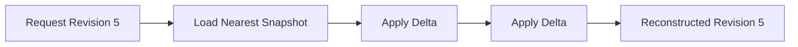

Frequently requested reconstructed revisions may be cached temporarily, but MongoDB revision records remain the durable historical source.

The reconstruction process must validate document schema versions. If an older revision uses an earlier document schema, the document migration layer converts it into a representation that the current renderer can safely interpret without modifying the immutable stored historical record.

---

# 25.11 Version Comparison

Students and teachers can compare two revisions to understand what changed.

```
Revision 4

↓

Compare

↓

Revision 5

↓

Highlighted Differences
```

Comparison includes:

- Added blocks
- Removed blocks
- Modified text
- Updated equations
- Changed images
- Reordered sections

---

# 25.12 Comparison Workflow

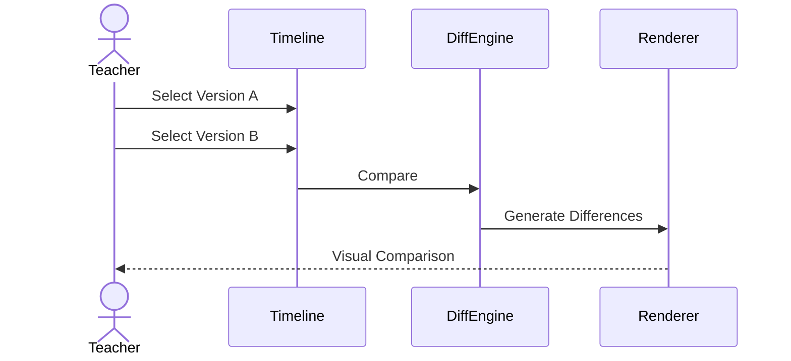

---

# 25.13 Restore Previous Version

Any revision can be restored.

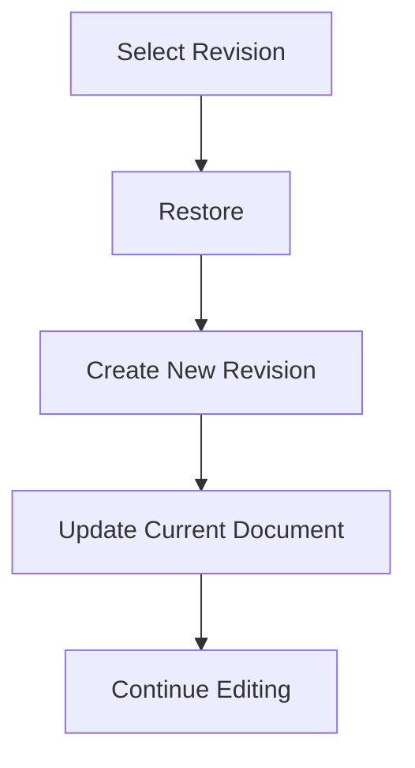

The original revision remains unchanged.

Restoring creates a new revision rather than overwriting history.

The restore workflow reconstructs the selected historical revision, validates it against the current document schema, and writes it as the new current journal state.

A new immutable revision is then created to record the restore operation.

Where the current journal update and revision creation must succeed together, the backend may use a MongoDB transaction. The operation must also create an audit event identifying the actor and restored source revision.

---

# 25.14 Approval Workflow

After completing the review, the teacher assigns an approval state.

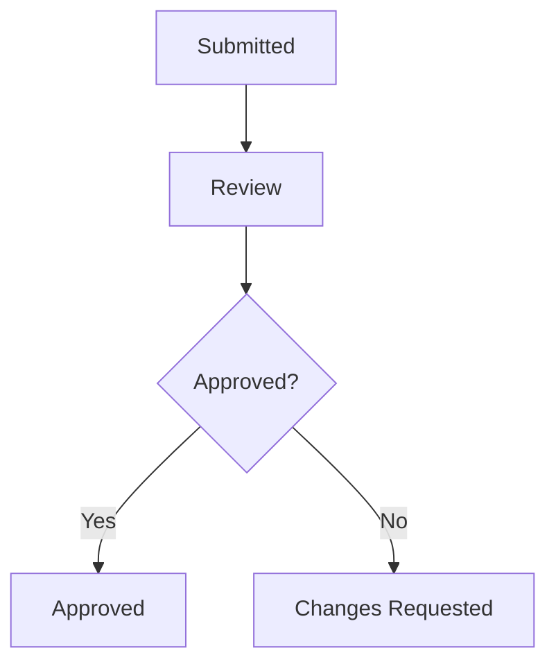

Approval is always associated with a specific immutable revision.

Approval records should be stored independently in MongoDB and reference both the journal ID and approved revision ID. This prevents later edits from making an old approval appear to apply to newer content.

Conceptually:

```json
{
  "journalId": "journal_123",
  "revisionId": "revision_005",
  "teacherId": "teacher_123",
  "status": "approved",
  "marks": 18,
  "remarks": "Approved",
  "approvedAt": "2026-07-19T11:00:00Z"
}
```

After approval, any workflow that permits further editing must create a newer revision and require a new approval state rather than silently carrying forward the previous approval.

---

# 25.15 Approval States

| Status | Description |
|--------|-------------|
| Draft | Student is editing |
| Submitted | Awaiting review |
| Under Review | Teacher reviewing |
| Changes Requested | Student must revise |
| Resubmitted | Updated after corrections |
| Approved | Final acceptance |
| Archived | Completed journal |

These states provide clear visibility into the progress of each submission.

---

# 25.16 Review History

Every review action is preserved.

```
Revision 3

↓

Teacher Comment

↓

Revision 4

↓

Teacher Approval

↓

Revision 5

↓

Final Approval
```

This creates a complete academic audit trail.

---

# 25.17 Notification Workflow

Whenever a revision is submitted or reviewed, notifications are generated.

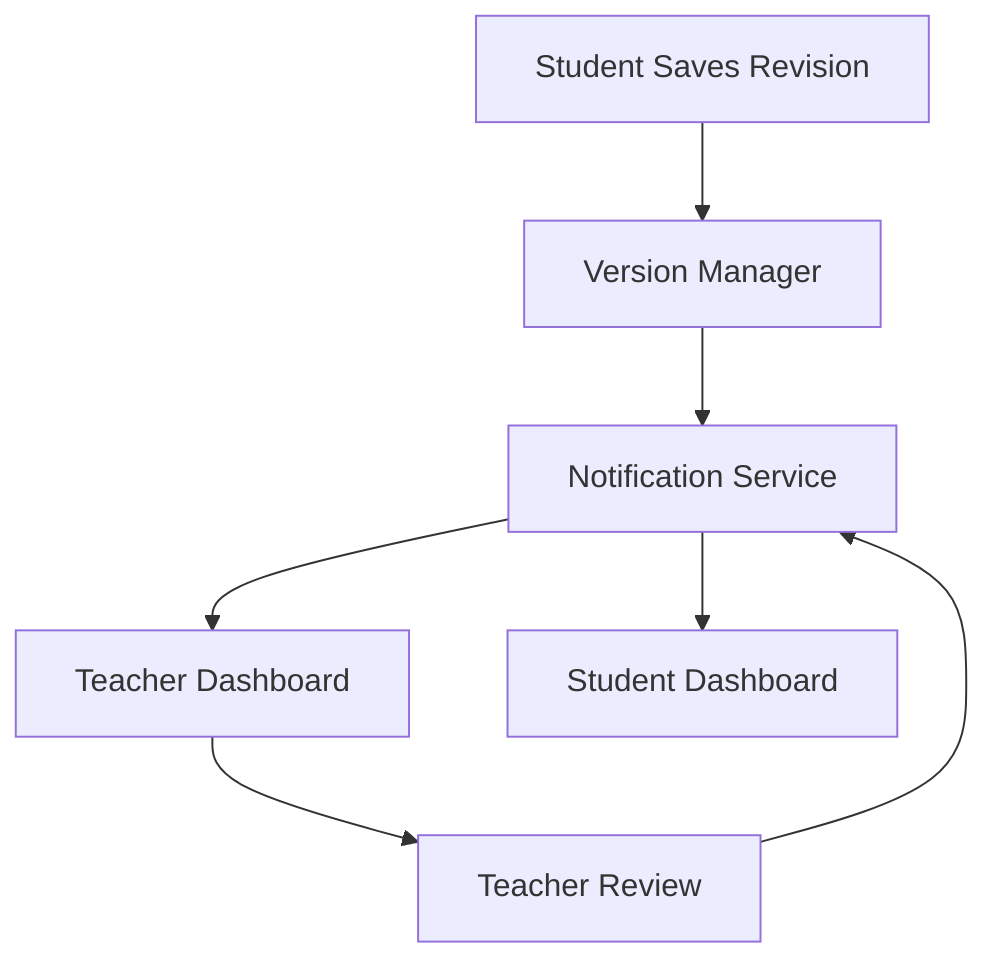

This keeps both parties informed throughout the review process.

---

# 25.18 Audit Trail

Every important event is recorded.

| Event | Recorded |
|--------|----------|
| Journal Created | ✓ |
| Revision Saved | ✓ |
| Submitted | ✓ |
| Teacher Review | ✓ |
| Comment Added | ✓ |
| Suggestion Added | ✓ |
| Approval | ✓ |
| Restore | ✓ |
| Archive | ✓ |

The audit trail improves accountability and transparency.

Audit events are stored in a dedicated append-oriented MongoDB `audit_logs` collection. Audit records reference the relevant journal, revision, actor, event type, and timestamp.

Audit history should not be embedded inside the current journal document because it grows continuously and has an independent retention and query lifecycle.

---

# 25.19 Advantages of the Version Architecture

Compared with traditional document editing, the proposed version management system offers:

- Complete revision history.
- Safe document recovery.
- Efficient incremental storage.
- Clear comparison between revisions.
- Transparent approval workflow.
- Reliable audit trail.
- Better collaboration between students and teachers.
- Foundation for future real-time collaborative editing.

---

# 25.20 Transition to Rendering & Export Engine

At this stage, the platform defines how journals are created, edited, reviewed, revised, and approved.

The final step is transforming the structured document into professionally formatted outputs.

The next chapter introduces the **Rendering & Export Engine**, describing how the system converts the block-based document model into consistent **Web Preview, PDF, DOCX, and Print** outputs while ensuring identical formatting across all platforms.

---

**End of Part 3B**
