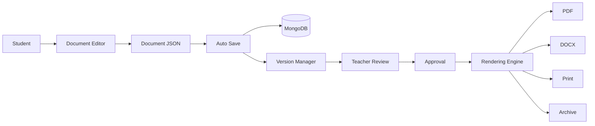
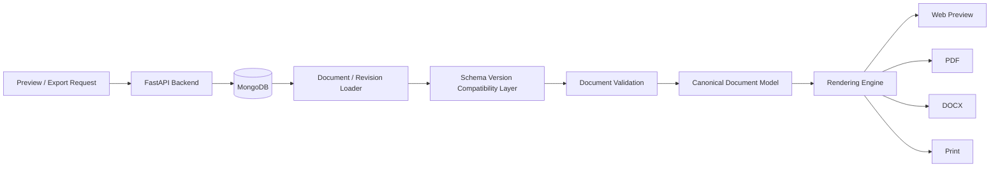
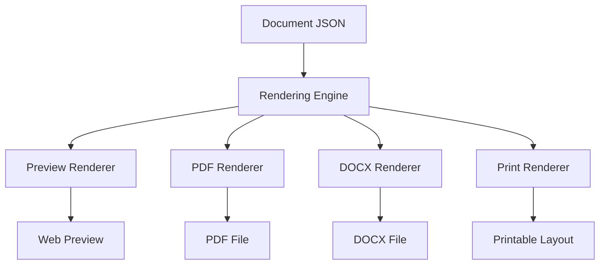
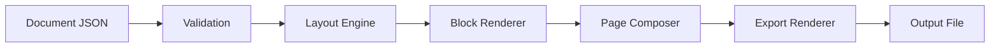
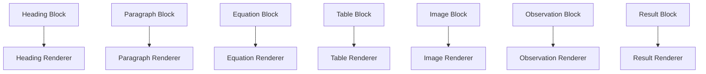
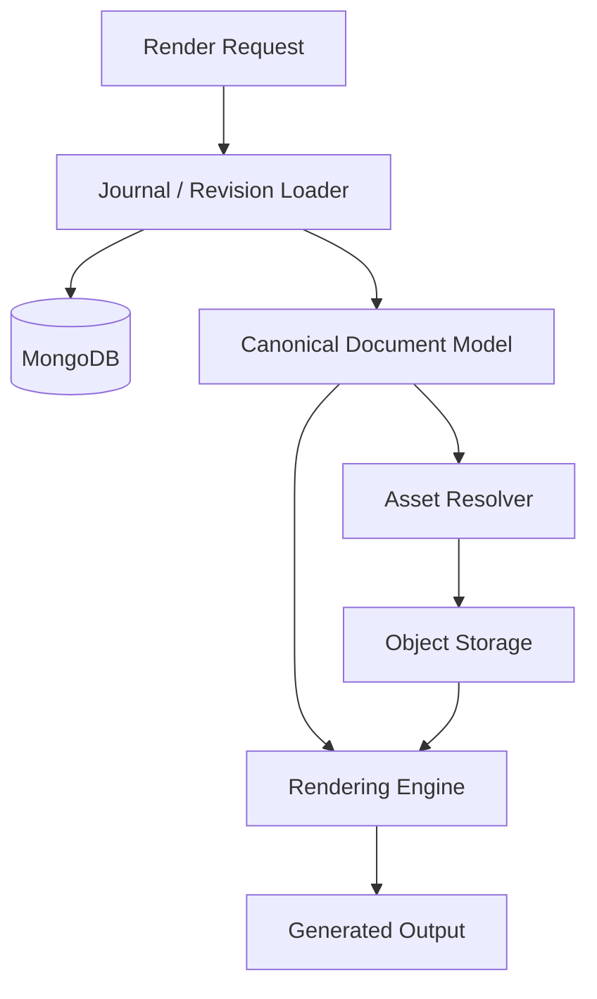
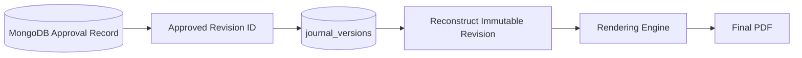
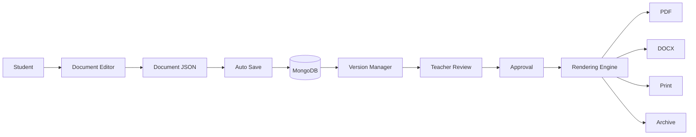

# 26. Rendering & Export Engine

## 26.1 Overview

Editing a journal is only the first stage of the document lifecycle. The final objective is to transform the structured document into professional academic outputs suitable for submission, printing, archival, and future reference.



---

### Principle 5 — Reusable Components

Every renderer reuses common rendering logic whenever possible.

This reduces duplicated code.

---

### Principle 6 — Extensible Architecture

New export formats should be added without modifying existing rendering logic.

---

# 26.3 MongoDB Document Retrieval for Rendering

The Rendering Engine does not render directly from MongoDB-specific BSON objects.

The backend first retrieves the requested journal or immutable approved revision, validates its document schema version, converts the stored representation into the canonical application document model, and then passes that model to the Rendering Engine.



For draft previews, the renderer may use the current journal document from the MongoDB `journals` collection.

For final approved exports, the renderer should use the exact immutable revision referenced by the approval record. This guarantees that the downloaded final PDF represents the same content that the teacher approved.

Binary assets such as images are resolved from object storage through references stored in image blocks.

This keeps the Rendering Engine independent of MongoDB and allows the same canonical document model to be reused across every output format.

---

# 26.4 High-Level Rendering Architecture



The document model remains unchanged regardless of the output format.

---

# 26.5 Rendering Pipeline

The rendering engine transforms a structured document into a final output through multiple stages.



Each stage has a clearly defined responsibility.

---

# 26.6 Rendering Stages

### Stage 1 — Document Validation

Before rendering begins, the engine verifies:

- Missing metadata
- Invalid blocks
- Unsupported content
- Broken references
- Missing images
- Invalid equations

Only valid documents proceed to rendering.

---

### Stage 2 — Layout Engine

The layout engine determines:

- Margins
- Font sizes
- Page orientation
- Line spacing
- Section spacing
- Header/Footer positions

The layout is independent of the editor.

---

### Stage 3 — Block Rendering

Each document block is rendered independently.



---

### Stage 4 — Page Composition

The page composer arranges rendered blocks onto pages.

Responsibilities include:

- Page breaks
- Margin handling
- Overflow detection
- Header placement
- Footer placement
- Page numbering

---
 
# 26.16 Rendering Data & Asset Resolution

The rendering process may require data from multiple persistence systems.



MongoDB stores structured document content and references.

Object storage contains binary assets such as:

- Uploaded images
- Diagrams
- Generated PDF files
- Generated DOCX files

The renderer resolves asset references securely before composing the final output.

Generated export metadata may be stored in MongoDB, while the generated binary file itself remains in object storage.

For example, an export record may track:

- Journal ID
- Revision ID
- Export format
- Generation status
- Object-storage reference
- Created timestamp
- Expiration or retention metadata

This separation avoids storing large generated binaries inside MongoDB.

---

## 26.16.1 Approved Revision Export Integrity

Final academic exports must be revision-specific.



The system must never generate a final approved PDF from an arbitrary newer draft simply because it shares the same journal ID.

This guarantees that:

```text
Approved Revision
        =
Rendered Final Document
        =
Downloaded Final Academic Output
```

---

# 26.17 Rendering Advantages

The rendering architecture is designed to produce consistent output across all supported formats.

| Traditional Editors | Proposed Architecture |
|---------------------|----------------------|
| HTML-based export | Structured document rendering |
| Browser-dependent layout | Deterministic rendering |
| Separate export logic | Unified rendering pipeline |
| Inconsistent PDF output | Identical cross-platform output |
| Limited extensibility | Modular renderer architecture |
| Weak mathematical support | Native equation rendering |

---

# 26.18 Complete Document Lifecycle

The Rendering Engine completes the end-to-end academic workflow.



This lifecycle demonstrates how a journal evolves from initial creation to its final exported form.

---

# 26.19 Summary

The Rendering & Export Engine transforms the structured document model into high-quality academic outputs while maintaining consistency across all supported formats.

By separating **editing**, **storage**, and **rendering**, the platform achieves:

- Predictable document formatting
- High-quality PDF generation
- Accurate mathematical rendering
- Efficient incremental rendering
- Extensible export capabilities
- Long-term maintainability

This architecture ensures that every journal created within the platform can be confidently submitted, reviewed, printed, and archived without manual formatting or post-processing.

---

## Transition to Part 4

With the completion of the Rendering & Export Engine, the core functional architecture of the Journal Management & Review System is fully defined.

The next section (**Part 4**) focuses on the implementation architecture, including:

- MongoDB Collection & Document Model
- Collection Relationships & References
- Storage Strategy
- API Design
- Folder Structure
- Technology Stack
- Deployment Architecture
- Scalability Considerations
- Security Model
- Future Enhancements

---

**End of Part 3C**
