---

# 27. Data Architecture & Database Design

## 27.1 Overview

MongoDB serves as the primary persistent structured-data layer of the Journal Management & Review System. It is responsible for storing users, classrooms, journals, document blocks, comments, revisions, approvals, notifications, and system metadata.

Unlike traditional document management systems that store complete documents as HTML or binary files, this platform stores **structured document data**. Every journal is represented as a collection of independent blocks, allowing efficient querying, versioning, rendering, and collaboration.

The database is designed with the following goals:

- Modular document storage
- High scalability
- Efficient block-level updates
- Minimal data duplication
- Fast retrieval
- Reliable version history
- Future collaborative editing support

---

# 27.2 Database Design Principles

The platform uses **MongoDB as the primary document database**. This choice aligns naturally with the journal architecture because the current journal state is already represented as structured block-based JSON and can be persisted as BSON while preserving nested metadata and block structures.

MongoDB's flexible document model does not mean the platform is schema-less at the application level. Pydantic/application models, collection validation, explicit `schemaVersion` fields, and controlled migration scripts maintain predictable document structures.


The database architecture follows these principles:

### Principle 1 — Normalize Business Data

Entities such as users, classrooms, and submissions are stored separately to avoid duplication.

---

### Principle 2 — Embed Document Content

Since document blocks are almost always accessed together, they are embedded within the journal document.

---

### Principle 3 — Immucollection Revisions

Once a revision is created, it is never modified.

---

### Principle 4 — Separation of Concerns

Content, comments, approvals, and notifications are stored independently.

---

### Principle 5 — Future Scalability

The schema should support:

- Real-time collaboration
- AI assistance
- OCR
- Offline synchronization
- External storage

without requiring major redesign.

---

# 27.3 High-Level Data Architecture

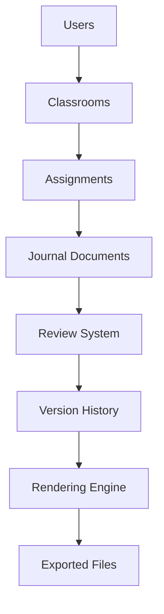

---

# 27.4 Entity Relationship Diagram (ERD)

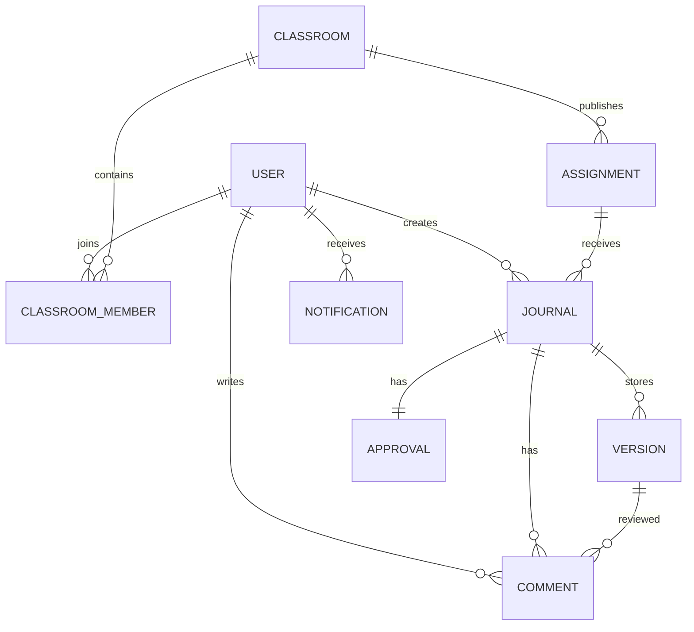

---

# 27.5 Core Entities

The system consists of the following major entities.

| Entity | Description |
|---------|-------------|
| User | Student or Teacher |
| Classroom | Academic class |
| ClassroomMember | Student enrollment |
| Assignment | Practical or experiment |
| Journal | Student submission |
| Version | Revision history |
| Comment | Teacher feedback |
| Approval | Final review |
| Notification | User alerts |
| Audit Log | System events |

---

# 27.6 User Entity

The User entity stores authentication and profile information.

```text
User

──────────────

id

name

email

role

department

semester

profilePhoto

createdAt

updatedAt
```

Role values:

- Student
- Teacher
- Administrator

---

# 27.7 Classroom Entity

Each classroom represents a course or practical batch.

```text
Classroom

──────────────

id

name

subject

semester

division

teacherId

joinCode

createdAt
```

---

# 27.8 Classroom Membership

A classroom contains multiple students.

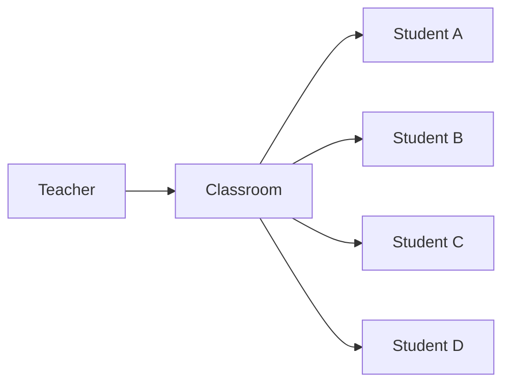

Membership is stored separately to support many-to-many relationships.

---

# 27.9 Assignment Entity

Teachers publish assignments for classrooms.

```text
Assignment

──────────────

id

classroomId

title

description

experimentNumber

deadline

createdAt
```

Each assignment may receive multiple journal submissions.

---

# 27.10 Journal Entity

The Journal is the primary document entity.

Instead of storing formatted HTML, it stores structured document blocks.

```text
Journal

──────────────

id

assignmentId

studentId

title

status

currentVersion

document

createdAt

updatedAt
```

The **document** field contains the complete block-based document model.

---

# 27.11 Block-Based Document Structure

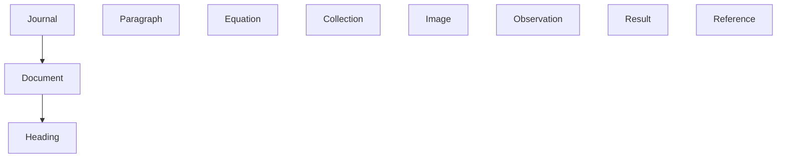

Each block is independently identifiable and renderable.

---

# 27.12 Example Journal Structure

```json
{
  "journalId": "JR-1001",
  "title": "Ohm's Law Experiment",
  "blocks": [
    {
      "id": "b1",
      "type": "heading",
      "content": "Introduction"
    },
    {
      "id": "b2",
      "type": "paragraph",
      "content": "Ohm's Law states..."
    },
    {
      "id": "b3",
      "type": "equation",
      "latex": "V = IR"
    }
  ]
}
```

The renderer interprets this structure directly.

---

# 27.13 Version Entity

Each revision creates a new version.

```text
Version

──────────────

id

journalId

versionNumber

authorId

changedBlocks

createdAt

summary
```

Versions are immucollection.

---

# 27.14 Comment Entity

Comments are linked to document blocks rather than plain text positions.

```text
Comment

──────────────

id

journalId

blockId

teacherId

message

status

createdAt
```

This ensures comments remain valid even when blocks move.

---

# 27.15 Approval Entity

Each journal has a review state.

```text
Approval

──────────────

id

journalId

teacherId

status

approvedAt

remarks
```

Possible states:

- Pending
- Under Review
- Changes Requested
- Approved

---

# 27.16 Notification Entity

The notification service informs users about important events.

```text
Notification

──────────────

id

userId

title

message

type

isRead

createdAt
```

Examples:

- Assignment published
- Review completed
- Changes requested
- Journal approved

---

# 27.17 Audit Log

Every important action is recorded.

```text
AuditLog

──────────────

id

userId

action

entity

entityId

timestamp

ipAddress
```

This improves traceability and debugging.

---

# 27.18 Database Indexing Strategy

Frequently queried fields are indexed.

| Entity | Indexed Fields |
|----------|----------------|
| User | email |
| Classroom | joinCode |
| Assignment | classroomId |
| Journal | assignmentId, studentId |
| Version | journalId |
| Comment | journalId, blockId |
| Notification | userId |

Proper indexing reduces query latency and improves scalability.

---

# 27.19 MongoDB Data & Schema Evolution Strategy

MongoDB does not require traditional SQL-style schema migrations for every structural change, but production data still requires controlled schema evolution.

The platform therefore uses **application-level migration scripts**, **document schema versions**, **MongoDB validation rules**, and **backward-compatible readers** to evolve stored data safely.

---

## 27.19.1 Migration Principles

### Principle 1 — Versioned Data Changes

Every structural data transformation must be represented by a version-controlled migration script.

### Principle 2 — Backward Compatibility

Application deployments should tolerate older document shapes during staged migrations whenever possible.

### Principle 3 — Document Schema Versioning

Structured journal documents shall contain an explicit `schemaVersion`.

### Principle 4 — Idempotent Migrations

Migration scripts should be safe to rerun where practical and should avoid transforming already migrated documents twice.

### Principle 5 — Data Preservation

Migration operations must preserve journal content, stable block IDs, revision history, teacher feedback, approvals, and audit records.

---

## 27.19.2 MongoDB Migration Architecture

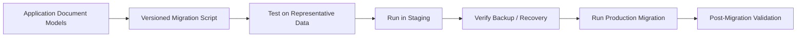

Unlike a relational system, many MongoDB changes can be introduced without immediately rewriting every existing document. The application can introduce a new field with a default behavior and migrate historical documents progressively.

---

## 27.19.3 Journal Document Schema Versioning

Every structured journal document maintains its own schema version.

```json
{
  "schemaVersion": 2,
  "journalId": "JR-1001",
  "metadata": {},
  "blocks": []
}
```

This is especially important because the journal's block-based JSON/BSON model will evolve independently from other MongoDB collections.

Examples of document-model evolution include:

- Adding new block types
- Changing equation representation
- Adding block metadata
- Introducing review anchors
- Adding rendering properties
- Changing table structures

---

## 27.19.4 Document Migration Workflow

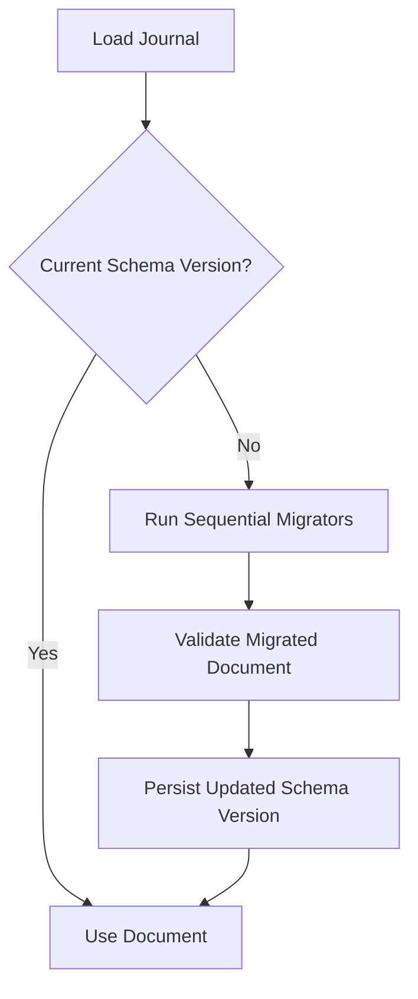

Sequential migrations allow safe upgrades:

```text
v1 → v2 → v3 → v4
```

instead of requiring every historical document format to migrate directly to the newest version.

---

## 27.19.5 Lazy vs Batch Migration

The system may use two migration approaches.

### Lazy Migration

A document is migrated when it is loaded.

Useful for:

- Small structural changes
- Rarely accessed historical documents
- Gradual migrations

### Batch Migration

A controlled background script migrates matching documents in batches.

Useful for:

- Index-dependent changes
- Large data transformations
- Changes required before a new feature launches

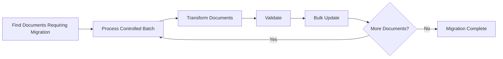

---

## 27.19.6 MongoDB Validation Strategy

Although MongoDB is flexible-schema, critical collections should use application validation and, where appropriate, MongoDB JSON Schema validation.

Validation may enforce:

- Required identifiers
- Allowed status values
- Required document metadata
- Correct field types
- Required schema versions
- Valid embedded block structure

Application-level models remain responsible for richer business validation.

---

## 27.19.7 Embedded vs Referenced Data

MongoDB document modeling is based on access patterns.

**Embed when:**

- Data is owned by one parent.
- Data is normally loaded with the parent.
- Data remains within safe document-size limits.

**Reference when:**

- Data grows independently.
- Data is queried independently.
- Data has its own lifecycle.
- Data is high-volume, such as comments, revisions, notifications, or audit logs.

The journal's current structured content can be embedded in the journal document, while revision snapshots/deltas, comments, and audit events should generally use dedicated collections.

---

## 27.19.8 Transaction Strategy

MongoDB supports multi-document transactions, but they should be used only when atomicity across multiple documents is genuinely required.

Examples may include:

- Final submission plus immutable revision creation
- Approval plus audit-event creation
- Critical workflow transitions affecting multiple collections

Single-document atomic updates should be preferred whenever the data model allows them.

---

## 27.19.9 Index Migration Strategy

Index definitions must also be version-controlled as infrastructure or migration code.

Important indexes may include:

- Unique email index
- Unique classroom join-code index
- Compound student/assignment journal index
- Journal status indexes
- Comment journal/block indexes
- Version journal/version-number indexes
- Notification user/read-state indexes
- Audit entity/timestamp indexes

Large production index builds must be planned and monitored to avoid unnecessary operational impact.

---

## 27.19.10 Rollback & Recovery Strategy

MongoDB data transformations may not always be safely reversible.

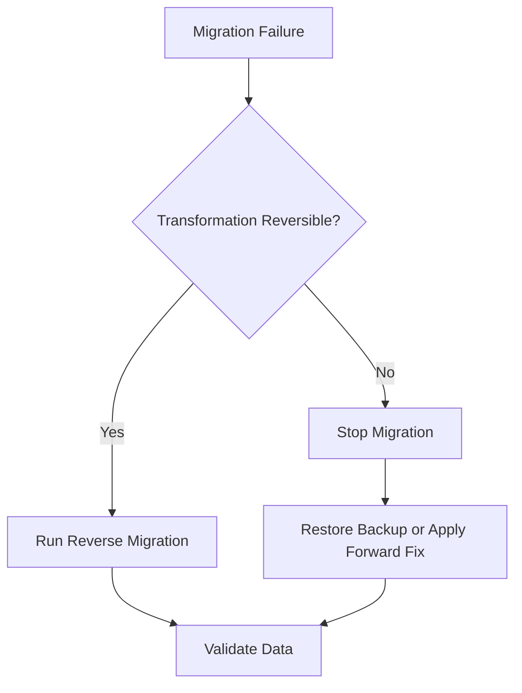

Destructive transformations require verified backup and recovery procedures before execution.

---

## 27.19.11 Seed Data Strategy

Seed scripts may initialize:

- Default roles
- Development users
- Sample classrooms
- Sample practical assignments
- Default journal templates
- Supported block definitions

Seed scripts should be idempotent where possible.

Sensitive production credentials must never be stored in seed files.

---

## 27.19.12 Migration Testing

Migration tests should verify:

- Older document versions remain readable.
- Migrated documents satisfy current validation rules.
- Stable block IDs are preserved.
- Mathematical expressions preserve semantic structure.
- Review anchors remain associated with correct blocks.
- Revision history remains accessible.
- Required indexes exist.
- Migration scripts can safely resume after interruption.

---

## 27.19.13 Production Migration Flow

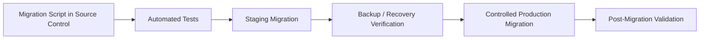

This strategy provides MongoDB's flexible document model while retaining the discipline required for production data evolution.

---

# 27.20 Storage Strategy

The platform separates structured data from binary assets.

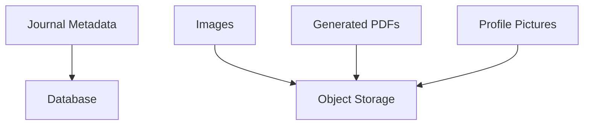

Only metadata and references are stored in the database.

Large files are stored in external object storage.

---

# 27.21 Data Flow

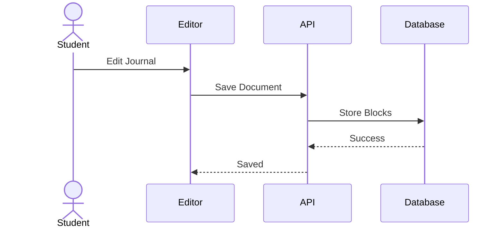

---

# 27.22 Database Advantages

The proposed database architecture provides:

- Structured document storage
- Efficient block updates
- Independent comments
- Immucollection version history
- Fast rendering
- Scalable relationships
- Better maintainability
- AI-ready document structure
- Future collaboration support

---

# 27.23 Transition to Backend Architecture

With the database layer established, the next chapter focuses on how the backend interacts with these entities.

The following section introduces the **Backend Architecture & API Design**, covering:

- FastAPI project structure
- Service layer
- Repository pattern
- Authentication middleware
- REST API architecture
- Request lifecycle
- Background workers
- API versioning

---

**End of Part 4A**
