---

# 28. Backend Architecture & API Design

## 28.1 Overview

The backend acts as the central orchestration layer of the Journal Management & Review System. It is responsible for processing business logic, validating requests, managing document workflows, coordinating reviews, handling authentication, and exposing RESTful APIs to the frontend.

Rather than allowing the frontend to interact directly with the database, every operation passes through well-defined backend services. This ensures consistent validation, security, maintainability, and scalability.

The backend is designed around a layered architecture that separates responsibilities into independent components.

---

# 28.2 Backend Design Principles

The backend follows these architectural principles:

### Principle 1 — Separation of Concerns

Each layer has a single responsibility.

- API Layer → HTTP communication
- Service Layer → Business logic
- Repository Layer → Database operations
- Models → Data representation

---

### Principle 2 — Stateless APIs

Every API request contains all information required to process it.

No application state is stored in server memory.

---

### Principle 3 — Reusable Business Logic

Business rules should never exist inside API routes.

All business logic belongs inside service classes.

---

### Principle 4 — Database Independence

Routes never directly communicate with the database.

Repositories abstract database access.

---

### Principle 5 — Extensibility

New modules should be added without modifying existing architecture.

---

# 28.3 High-Level Backend Architecture

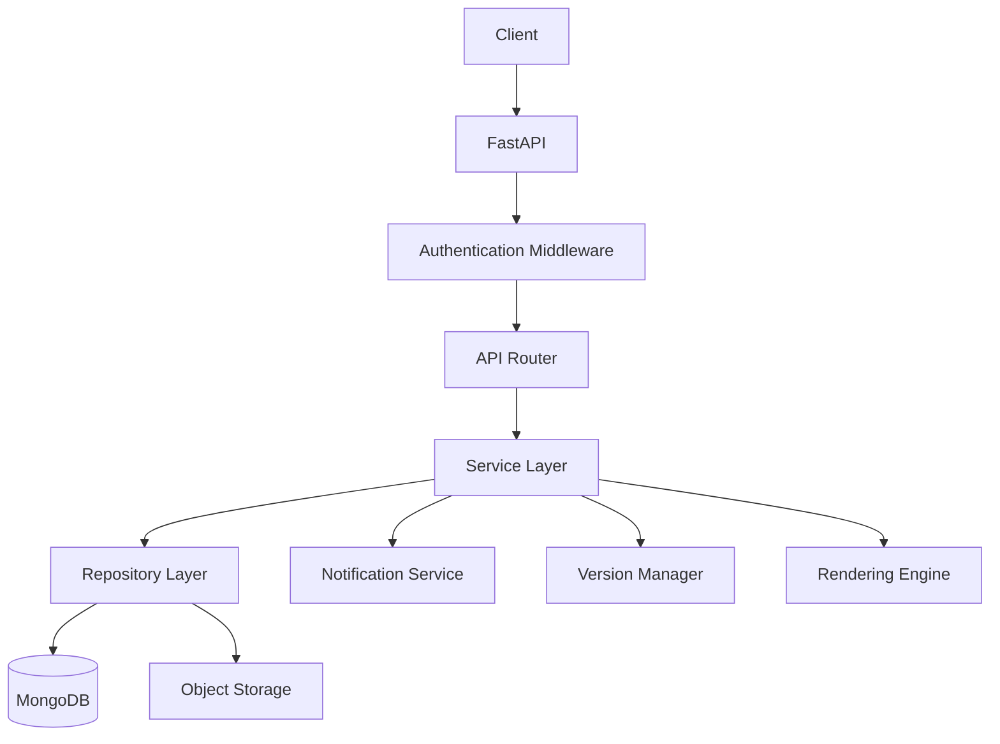

---

# 28.4 C4 Level 3 — Backend Component Diagram

The C4 Component view expands the FastAPI backend into its major internal components.

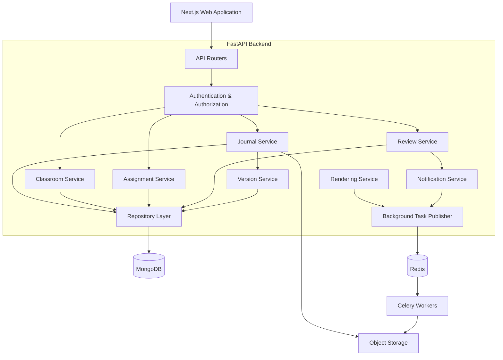

The component architecture keeps document operations, review workflows, version management, rendering, and persistence as separate responsibilities.

---

# 28.5 Request Lifecycle

Every request follows the same processing pipeline.

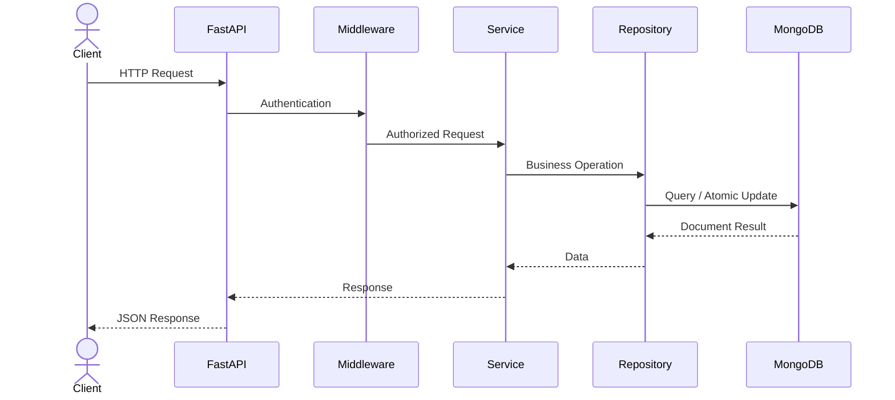

---

# 28.5 Backend Folder Structure

```
backend/

│

├── app/

│   ├── api/

│   ├── core/

│   ├── models/

│   ├── schemas/

│   ├── repositories/

│   ├── services/

│   ├── middleware/

│   ├── dependencies/

│   ├── utils/

│   ├── renderers/

│   ├── workers/

│   ├── notifications/

│   └── main.py

│

├── tests/

├── migrations/

├── scripts/

├── Dockerfile

└── requirements.txt
```

Each directory represents a single architectural concern.

---

# 28.6 API Layer

The API layer exposes REST endpoints.

Responsibilities include:

- Request parsing
- Authentication
- Validation
- Response serialization
- Error handling

Routes remain intentionally thin.

Example:

```
POST

/api/v1/journals
```

↓

Validate Request

↓

Call Service

↓

Return Response

---

# 28.7 Service Layer

The Service Layer contains the core business logic.

Examples:

- Create Journal
- Submit Journal
- Approve Submission
- Publish Assignment
- Generate PDF
- Restore Version

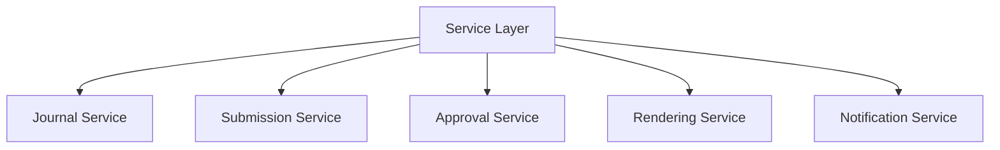

The service layer coordinates business rules and delegates persistence work to repositories.

---

# 28.8 Repository Layer

Repositories isolate MongoDB persistence logic from business services.

Instead of writing MongoDB queries directly inside services:

```text
JournalService
    ↓
JournalRepository
    ↓
MongoDB Collection
```

The repository layer is responsible for:

- Collection access
- Query construction
- Projection
- Pagination
- Atomic updates
- Bulk operations
- Index-aware query patterns
- BSON-to-application-model conversion
- ObjectId handling where ObjectId is used internally

Advantages include:

- Easier testing
- Cleaner service logic
- Centralized persistence behavior
- Reusable queries
- Easier optimization of MongoDB access patterns
- Reduced coupling between business logic and the database driver

The backend should use the official MongoDB Python driver with asynchronous support where appropriate. Application-facing schemas remain Pydantic models, while repositories handle conversion between API/domain identifiers and MongoDB document identifiers.

---

## 28.8.1 MongoDB Data Access Architecture

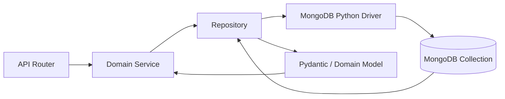

The API layer never receives raw MongoDB documents. Database-specific representations are normalized before leaving the repository boundary.

---

## 28.8.2 MongoDB Connection Management

The application maintains a shared MongoDB client per backend process rather than creating a new connection for every request.

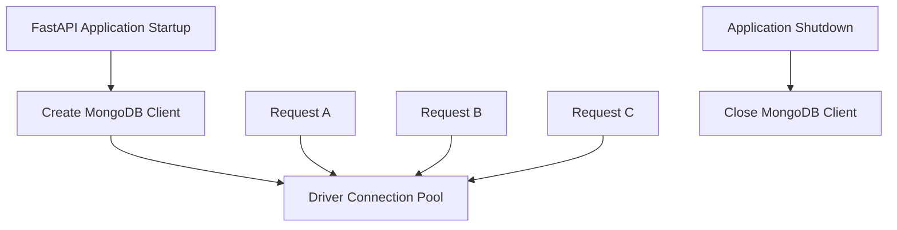

Connection configuration is loaded from environment-based application settings.

Typical configuration includes:

- MongoDB connection URI
- Database name
- Connection timeout
- Server selection timeout
- Connection pool limits
- TLS requirements

Secrets must never be hardcoded into source code.

---

## 28.8.3 Collection Repository Structure

The repository layer may contain focused repositories such as:

```text
repositories/

├── user_repository.py
├── classroom_repository.py
├── assignment_repository.py
├── journal_repository.py
├── version_repository.py
├── comment_repository.py
├── approval_repository.py
├── notification_repository.py
└── audit_log_repository.py
```

Each repository owns persistence operations for one primary collection or closely related access pattern.

---

## 28.8.4 Identifier Strategy

MongoDB commonly uses `ObjectId` as the internal `_id`.

The platform may expose stable string identifiers through the API while keeping database-specific identifiers internal.

Example API response:

```json
{
  "id": "67f0a9c21a4d9b73f9c00123",
  "title": "Ohm's Law Experiment"
}
```

The repository or serialization layer converts MongoDB `_id` values into API-safe strings.

Alternatively, domain-generated UUID/ULID identifiers may be used when globally portable IDs are preferred.

The chosen identifier strategy must remain consistent across:

- API contracts
- Document references
- Comments
- Versions
- Review anchors
- Audit events

---

## 28.8.5 Atomic Updates & Transactions

MongoDB guarantees atomicity for single-document writes.

Because the current journal state is stored as one structured document, many operations can use atomic updates without multi-document transactions.

Examples:

- Updating journal metadata
- Replacing or updating a document block
- Changing save status
- Updating current revision metadata

Multi-document transactions should be reserved for workflows requiring atomic changes across multiple collections.

Examples:

- Final submission plus immutable revision creation
- Approval plus audit record creation
- Critical state transitions involving multiple documents

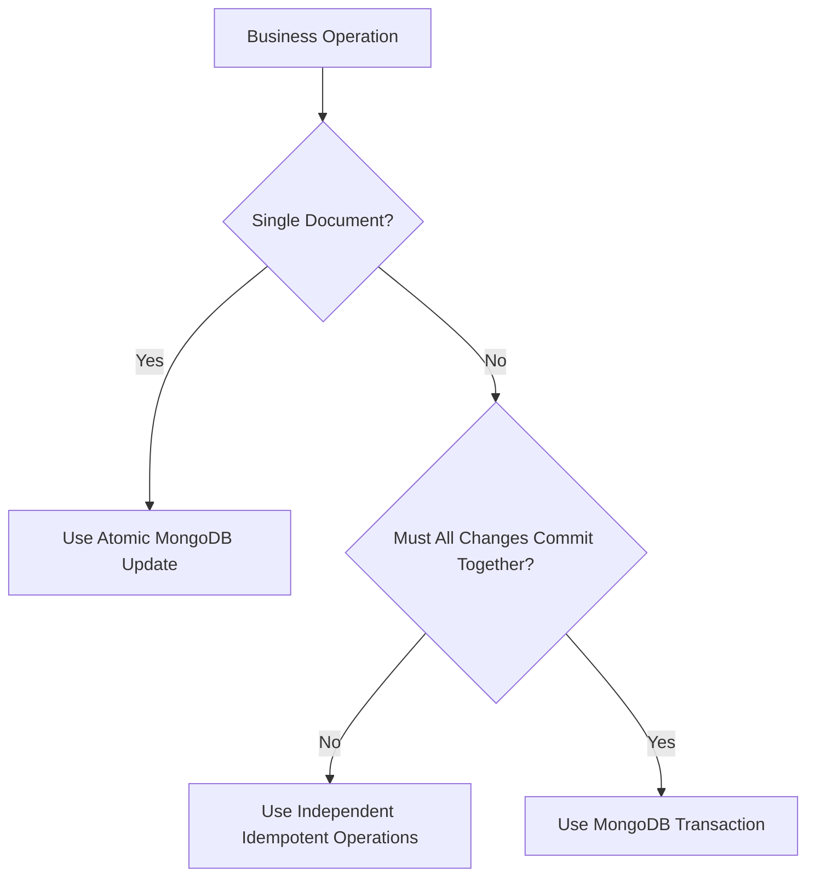

---

# 28.9 Horizontal Scaling


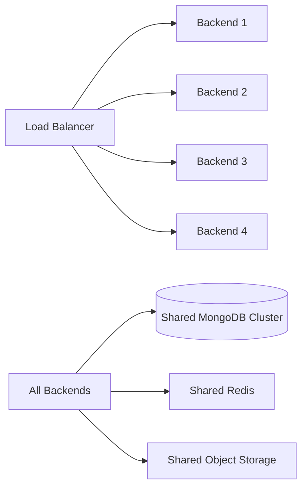

This keeps application instances stateless and horizontally scalable.

# 28.10 Authentication Middleware

Every protected request passes through authentication middleware.

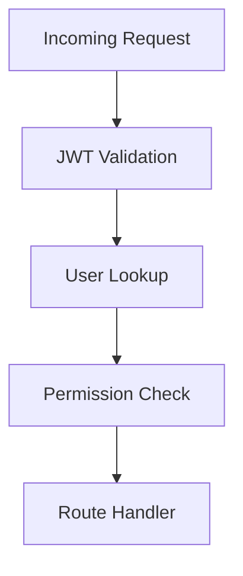

If authentication fails, the request is rejected before reaching the business logic.

---

# 28.11 Authorization Model

Different users have different permissions.

| Role | Permissions |
|------|-------------|
| Student | Create/Edit Journals |
| Teacher | Publish Assignments, Review Journals |
| Admin | Manage Platform |

Authorization is enforced at the service layer.

---

# 28.12 Validation Layer

Incoming requests are validated using Pydantic models.

Validation includes:

- Required fields
- Data types
- String lengths
- Email format
- Enum values
- Nested structures

Only validated data reaches the service layer.

---

# 28.13 REST API Design

The backend follows RESTful conventions.

Examples:

| Method | Endpoint | Purpose |
|---------|----------|---------|
| GET | /journals | List journals |
| POST | /journals | Create journal |
| GET | /journals/{id} | Retrieve journal |
| PATCH | /journals/{id} | Update journal |
| DELETE | /journals/{id} | Delete journal |

Resources are identified using unique IDs.

---

# 28.14 Detailed API Contracts

API contracts define stable request and response structures between the frontend and backend.

All endpoints should return predictable status codes and structured error responses.

---

## 28.14.1 Create Journal

```http
POST /api/v1/journals
```

Request:

```json
{
  "assignmentId": "assignment_123",
  "title": "Ohm's Law Experiment"
}
```

Response:

```json
{
  "success": true,
  "data": {
    "id": "journal_123",
    "assignmentId": "assignment_123",
    "title": "Ohm's Law Experiment",
    "status": "draft",
    "schemaVersion": 1,
    "blocks": []
  }
}
```

---

## 28.14.2 Retrieve Journal

```http
GET /api/v1/journals/{journalId}
```

Response:

```json
{
  "success": true,
  "data": {
    "id": "journal_123",
    "status": "draft",
    "document": {
      "schemaVersion": 1,
      "blocks": []
    },
    "updatedAt": "2026-07-19T10:30:00Z"
  }
}
```

---

## 28.14.3 Incremental Block Update

```http
PATCH /api/v1/journals/{journalId}/blocks/{blockId}
```

Request:

```json
{
  "content": {
    "text": "Updated observation"
  },
  "clientRevision": 12
}
```

Response:

```json
{
  "success": true,
  "data": {
    "blockId": "block_123",
    "serverRevision": 13,
    "savedAt": "2026-07-19T10:31:00Z"
  }
}
```

Revision metadata allows the backend to detect stale updates and reduce accidental overwrites.

---

## 28.14.4 Submit Journal

```http
POST /api/v1/journals/{journalId}/submit
```

Response:

```json
{
  "success": true,
  "data": {
    "journalId": "journal_123",
    "status": "submitted",
    "submittedAt": "2026-07-19T10:35:00Z"
  }
}
```

Submission validation should verify required metadata, document integrity, and current workflow state before changing status.

---

## 28.14.5 Add Review Comment

```http
POST /api/v1/journals/{journalId}/comments
```

Request:

```json
{
  "blockId": "block_123",
  "message": "Please verify this calculation.",
  "type": "comment"
}
```

---

## 28.14.6 Request Changes

```http
POST /api/v1/journals/{journalId}/request-changes
```

Request:

```json
{
  "remarks": "Correct the calculation and update the observation table."
}
```

---

## 28.14.7 Approve Journal

```http
POST /api/v1/journals/{journalId}/approve
```

Request:

```json
{
  "marks": 18,
  "remarks": "Approved."
}
```

Only authorized teachers may perform approval operations.

---

## 28.14.8 Generate PDF

```http
POST /api/v1/journals/{journalId}/exports
```

Request:

```json
{
  "format": "pdf"
}
```

Response:

```json
{
  "success": true,
  "data": {
    "jobId": "export_job_123",
    "status": "queued"
  }
}
```

Long-running exports are processed asynchronously.

---

## 28.14.9 API Error Contract

```json
{
  "success": false,
  "error": {
    "code": "JOURNAL_NOT_FOUND",
    "message": "Requested journal does not exist.",
    "details": null
  }
}
```

Common error categories include:

- `VALIDATION_ERROR`
- `UNAUTHORIZED`
- `FORBIDDEN`
- `JOURNAL_NOT_FOUND`
- `INVALID_WORKFLOW_STATE`
- `REVISION_CONFLICT`
- `UPLOAD_FAILED`
- `EXPORT_FAILED`

---

# 28.15 API Concurrency & Conflict Handling

Auto-save introduces the possibility that multiple requests may arrive out of order.

The backend should use revision numbers or optimistic concurrency controls for journal updates.

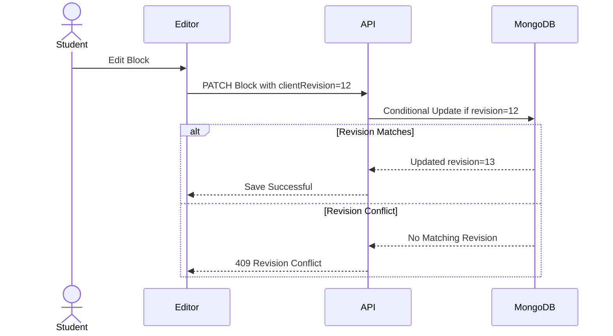

This prevents a stale auto-save request from silently overwriting newer document content.

---

# 28.16 Testing Strategy

The backend testing strategy verifies business logic, MongoDB persistence, API contracts, workflow rules, and integration with external services.

## Unit Tests

Unit tests cover:

- Service-layer business rules
- Permission checks
- Workflow state transitions
- Document validation
- Mathematical/document schema validation
- Identifier conversion
- Error mapping

Repositories and external services may be mocked when testing isolated business logic.

## Repository Tests

Repository tests verify:

- MongoDB queries
- Atomic updates
- Pagination
- Index-dependent access patterns
- ObjectId or domain-ID conversion
- Version retrieval
- Comment/block lookup

Tests should use an isolated MongoDB test database or disposable test environment.

## Integration Tests

Integration tests verify:

- FastAPI routes with real service dependencies
- MongoDB persistence
- Authentication and authorization
- Submission workflows
- Review workflows
- Revision creation
- Background task publication

## API Contract Tests

Contract tests verify:

- Request validation
- Response schemas
- HTTP status codes
- Structured error formats
- Backward compatibility of versioned endpoints

## End-to-End Tests

End-to-end tests cover critical user journeys:

```text
Register
→ Join Classroom
→ Create Journal
→ Auto-Save
→ Submit
→ Teacher Review
→ Request Changes
→ Resubmit
→ Approve
→ Generate PDF
```

## Rendering Tests

Rendering tests should verify:

- Mathematical equations
- Tables
- Images
- Page breaks
- Headers and footers
- Institution templates

Golden-file or visual-regression techniques may be used for deterministic output where appropriate.

## Migration Tests

Migration tests verify that older MongoDB document schema versions can be upgraded without losing:

- Block IDs
- Mathematical semantics
- Comments
- Review anchors
- Revision relationships

## Load & Performance Tests

Performance tests should measure:

- Concurrent journal reads
- Auto-save update throughput
- Submission spikes
- Teacher dashboard queries
- Background export queue behavior

## Security Tests

Security testing should verify:

- Unauthorized journal access is rejected.
- Students cannot access other students' private journals.
- Teachers cannot review unauthorized classrooms.
- Invalid tokens are rejected.
- Upload validation is enforced.
- Rate limits work as configured.

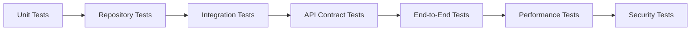

Automated tests should run in CI before deployment.

---

# 28.17 Journal API Workflow

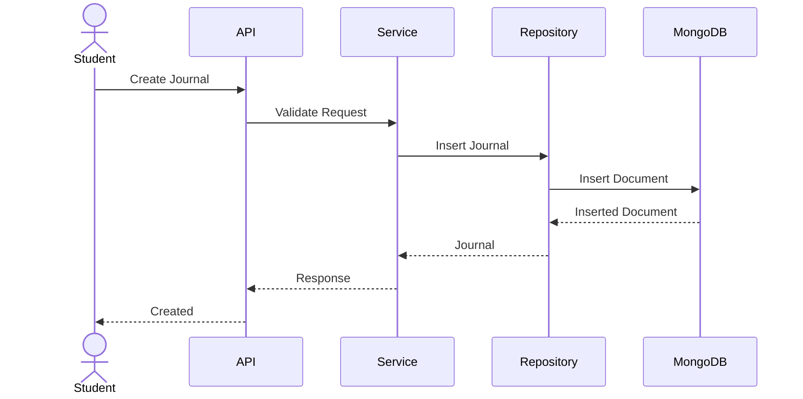

---

# 28.18 File Upload Architecture

Images and attachments are uploaded separately from document metadata.

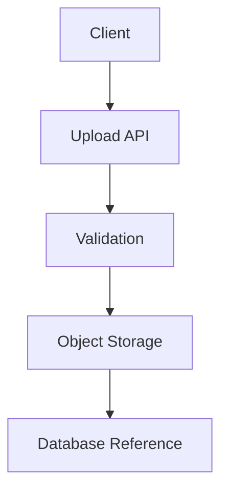

The database stores only file references.

---

# 28.19 Notification Service

Notifications are generated asynchronously.

Examples:

- Assignment Published
- Review Completed
- Journal Approved
- Comment Added

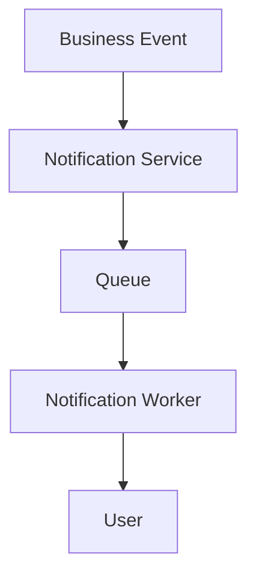

---

# 28.20 Background Workers

Long-running operations execute outside the request lifecycle.

Examples:

- PDF generation
- Email delivery
- Notification dispatch
- Thumbnail generation
- Cleanup tasks

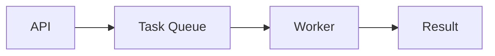

This keeps API responses fast.

---

# 28.21 Error Handling

Every error returns a structured response.

Example:

```json
{
  "success": false,
  "error": {
    "code": "JOURNAL_NOT_FOUND",
    "message": "Requested journal does not exist."
  }
}
```

This enables predictable frontend behavior.

---

# 28.22 API Versioning

All APIs are versioned.

```
/api/v1/

↓

Future

↓

/api/v2/
```

Versioning prevents breaking existing clients.

---

# 28.23 Backend Advantages

The proposed backend architecture provides:

- Clear separation of responsibilities
- Reusable business logic
- Database abstraction
- Secure authentication
- Efficient request processing
- Background task support
- Scalable API design
- Easier testing and maintenance

---

# 28.24 Transition to Infrastructure & Security

With the backend architecture established, the final implementation layer focuses on deployment, scalability, monitoring, and security.

The next chapter introduces the **Infrastructure, Deployment & Security Architecture**, covering:

- Docker deployment
- Reverse proxy configuration
- Background workers
- Redis
- Object storage
- Monitoring
- Logging
- Backup strategy
- Security model
- Scalability considerations

---

**End of Part 4B**
