# 29. Infrastructure, Deployment & Security Architecture

## 29.1 Overview

The Journal Management & Review System is designed to support thousands of concurrent users while maintaining high availability, reliability, and security.

The infrastructure separates responsibilities into independent services such as the frontend, backend, database, object storage, caching, background workers, and monitoring. This modular architecture enables each component to scale independently as system demand grows.

Rather than deploying a single monolithic application, the platform adopts a service-oriented architecture where every component performs a dedicated responsibility.

---

# 29.2 Infrastructure Design Principles

The infrastructure follows these architectural principles.

### Principle 1 — Separation of Services

Each infrastructure component performs a single responsibility.

- Frontend → User Interface
- Backend → Business Logic
- Database → Persistent Storage
- Object Storage → Media Files
- Redis → Cache & Message Broker
- Workers → Background Processing

---

### Principle 2 — Stateless Application Servers

Application servers should never store user state locally.

All persistent information is stored in external services.

This enables horizontal scaling.

---

### Principle 3 — Independent Scalability

Every service should be scalable independently.

For example,

- Increase backend instances during examinations.
- Increase worker instances during PDF generation.
- Increase Redis memory during peak activity.

---

### Principle 4 — Fault Isolation

A failure in one service should not stop the entire platform.

---

### Principle 5 — Secure by Default

Security is integrated into every infrastructure layer rather than added afterward.

---

# 29.3 High-Level Infrastructure Architecture

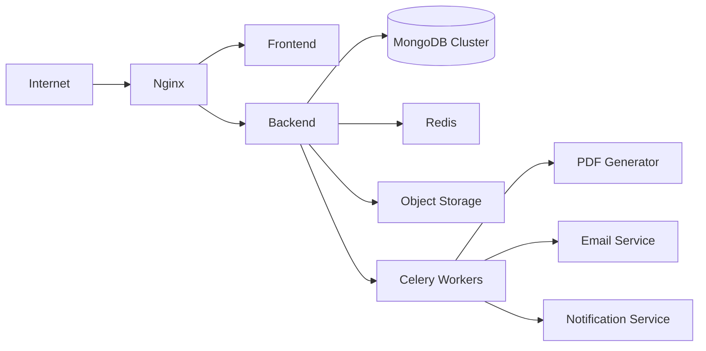

---

# 29.4 Deployment Architecture

The platform is deployed using containerized services.

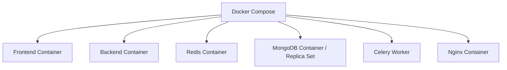

Each service runs independently inside its own container.

---

# 29.5 Offline Synchronization Flow

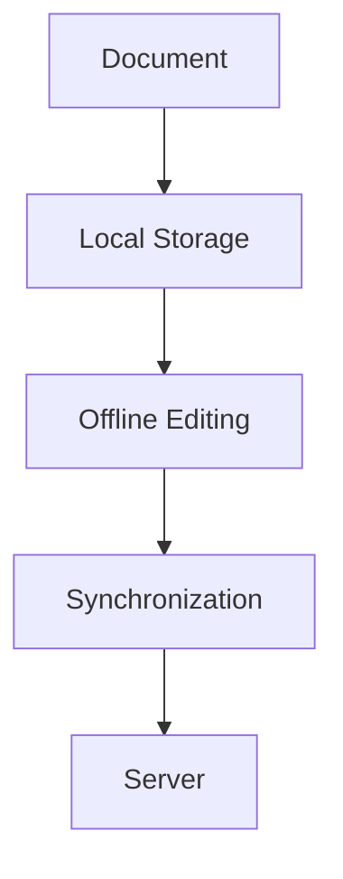

This flow supports editing when the client is temporarily disconnected.

---

# 29.6 Reverse Proxy (Nginx)

Nginx acts as the public gateway to the platform.

Responsibilities include:

- HTTPS termination
- Reverse proxy routing
- Load balancing
- Static asset delivery
- Compression
- Request size limits
- Security headers
- Forwarding client metadata to trusted backend services

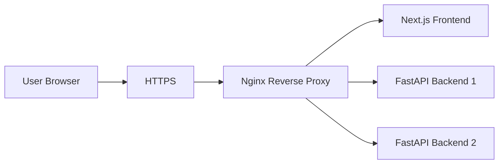

Nginx does not store application data. Persistent application data remains in MongoDB and object storage, while Redis is used for caching and task-broker responsibilities.

---

# 29.7 Request Lifecycle

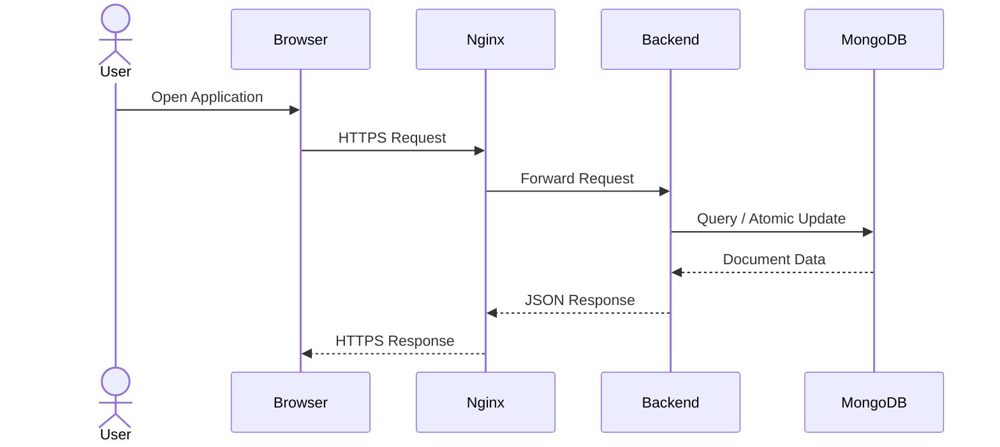

All protected backend requests pass through authentication and authorization before accessing application data.

---

# 29.8 Horizontal Scalability

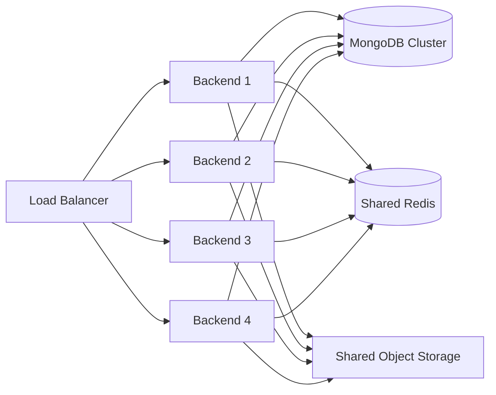

Each application instance remains stateless and can scale independently.

MongoDB stores structured application data and block-based journal documents. Object storage stores binary media and generated files.

---

# 29.9 MongoDB Infrastructure Architecture

MongoDB is the primary persistent structured-data store for the platform.

It stores collections for:

- Users
- Classrooms
- Classroom memberships
- Assignments
- Journals
- Journal versions
- Comments
- Approvals
- Notifications
- Audit logs

The current journal document can preserve its block-based JSON structure naturally as BSON.

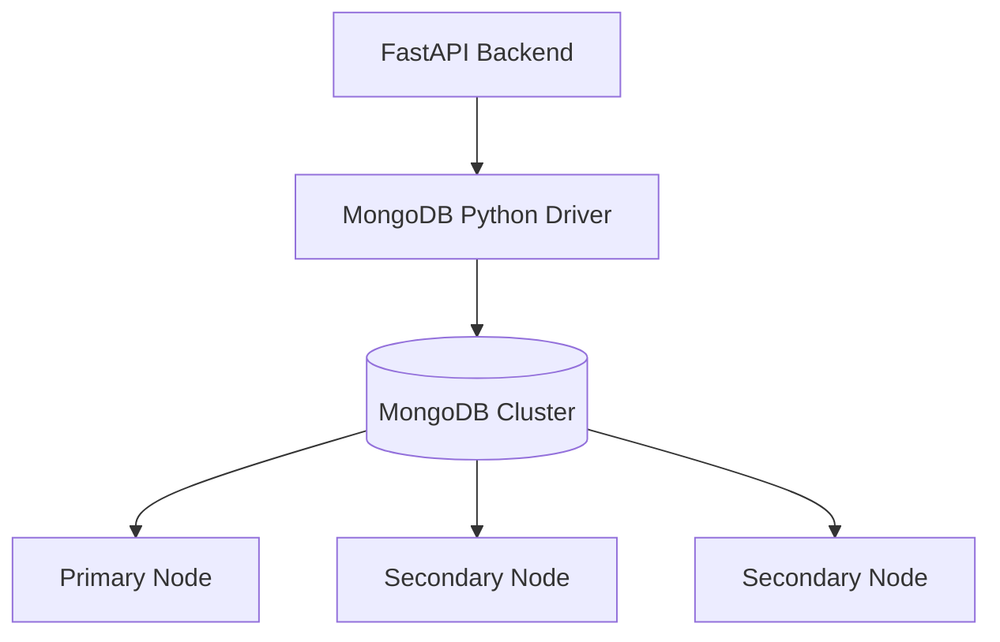

For local development, a single MongoDB container may be sufficient.

For production, a managed MongoDB deployment or properly configured replica set is recommended to provide redundancy and failover.

---

## 29.9.1 Replica Set & High Availability

A production MongoDB replica set maintains multiple copies of application data.

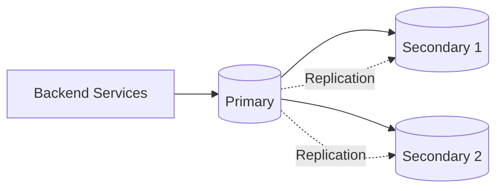

If the primary becomes unavailable, an eligible secondary can be elected as the new primary.

Application connection strings should specify the appropriate replica-set or managed-cluster configuration so the MongoDB driver can automatically discover available nodes.

---

## 29.9.2 MongoDB Connection Security

MongoDB connections must use:

- Authentication
- TLS encryption in production
- Least-privilege database users
- Network access restrictions
- Secret-managed connection URIs
- Separate credentials per environment where appropriate

The MongoDB deployment should not expose unrestricted database ports directly to the public internet.

---

## 29.9.3 MongoDB Index Monitoring

Indexes improve query performance but consume storage and write resources.

The platform should monitor:

- Slow queries
- Collection scan frequency
- Index usage
- Index size
- Working-set memory
- Query latency
- Connection pool usage

Indexes should be reviewed as application query patterns evolve.

---

# 29.10 Configuration Management

Application configuration must remain separate from source code.

Configuration categories include:

- Environment name
- Frontend URL
- Backend URL
- MongoDB URI
- MongoDB database name
- Redis URL
- Object-storage credentials
- JWT/authentication settings
- Email provider configuration
- PDF renderer settings
- Logging level
- CORS configuration
- Upload limits

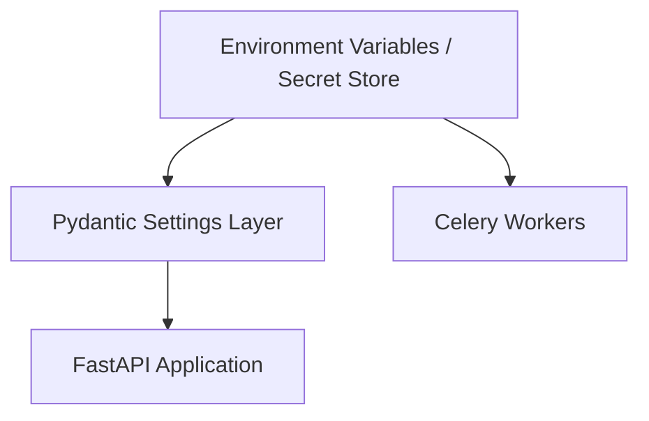

Configuration should follow these principles:

### Environment Separation

Development, testing, staging, and production must use separate configuration values and data stores.

### Secret Management

Passwords, API keys, MongoDB credentials, signing keys, and storage secrets must never be committed to Git.

### Validation

Required configuration should be validated during application startup so invalid deployments fail early.

### Rotation

Production credentials should support secure rotation without requiring source-code changes.

---

# 29.11 Redis Architecture

Redis provides high-speed in-memory storage.

Responsibilities include:

- API caching
- Session caching
- Background task broker
- Rate limiting
- Temporary data

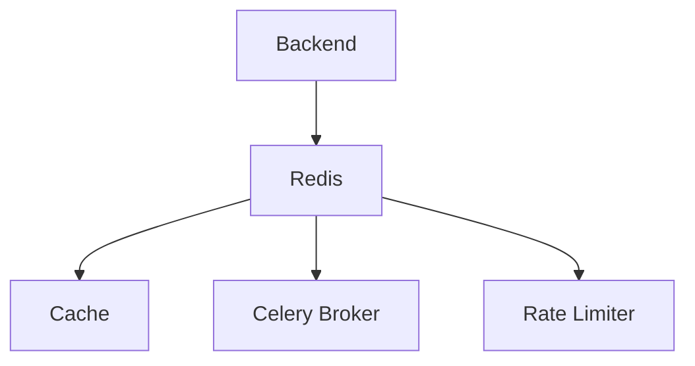

---

# 29.12 Background Processing

Long-running tasks should never block API requests.

Examples include:

- PDF generation
- DOCX generation
- Email delivery
- Notification dispatch
- Scheduled cleanup

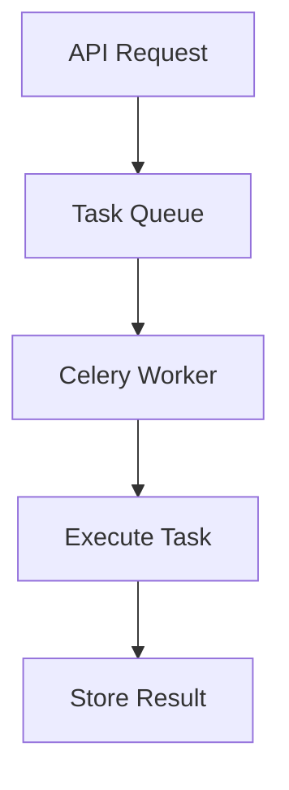

---

# 29.13 Caching Strategy

Frequently accessed data is cached.

Examples:

- User profiles


---

# 29.14 Logging Strategy

The platform uses structured application logging to support debugging, monitoring, auditing, and incident investigation.

Logging is divided into distinct categories.

## 29.14.1 Application Logs

Application logs record:

- Service startup and shutdown
- Request processing failures
- Business operation failures
- Background task failures
- External service errors

Logs should use structured fields rather than relying only on unstructured text.

Example fields:

```json
{
  "timestamp": "2026-07-19T10:30:00Z",
  "level": "ERROR",
  "service": "backend",
  "requestId": "req_123",
  "event": "journal_export_failed",
  "journalId": "journal_123"
}
```

Sensitive document content, passwords, access tokens, and secrets must not be written to logs.

---

## 29.14.2 Access Logs

Access logs may record:

- HTTP method
- Route
- Response status
- Response time
- Request correlation ID

Personally sensitive information should be minimized.

---

## 29.14.3 Audit Logs

Audit logs record security-sensitive and academically important operations.

Examples:

- Journal submitted
- Changes requested
- Journal approved
- Marks modified
- Version restored
- Classroom membership changed
- Administrative action performed

Audit logs should be append-oriented and protected from unauthorized modification.

---

## 29.14.4 Background Worker Logs

Worker logs record:

- Task ID
- Task type
- Start time
- Completion time
- Retry count
- Failure reason

This is especially important for PDF generation and notification delivery.

---

## 29.14.5 Correlation IDs

A unique request or correlation ID should follow operations across services.


This makes distributed failures easier to trace.

---

# 29.15 Monitoring & Observability

Monitoring should cover:

- API latency
- API error rate
- Request throughput
- MongoDB query latency
- MongoDB connection usage
- Redis health
- Queue depth
- Worker failures
- PDF generation duration
- Object-storage failures
- CPU and memory utilization

Alerts should focus on actionable conditions rather than generating unnecessary noise.

---

# 29.16 MongoDB Backup & Restore Strategy

Backups protect against accidental deletion, migration failures, application bugs, and infrastructure incidents.

The backup strategy should include:

- Automated scheduled backups
- Retention policy
- Encrypted backup storage
- Restore testing
- Recovery documentation

For managed MongoDB services, provider-supported snapshots and point-in-time recovery should be enabled when available and appropriate.

For self-managed deployments, supported MongoDB backup tooling should be used consistently.

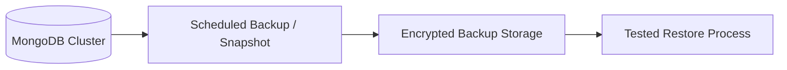

A backup is not considered reliable until restoration has been tested.

Binary media stored in object storage requires a separate backup or versioning policy.

---

# 29.17 Security Architecture

Security is enforced across multiple layers.

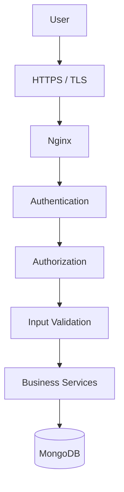

Security controls include:

- HTTPS
- Secure authentication
- Role-based authorization
- Input validation
- Rate limiting
- Upload validation
- Least-privilege database access
- Secret management
- Secure HTTP headers
- Audit logging

---

# 29.18 Risk Analysis

| Risk | Potential Impact | Mitigation |
|---|---|---|
| MongoDB unavailable | Journals and application data temporarily inaccessible | Production replica set or managed HA cluster, health monitoring, tested recovery |
| Accidental data deletion | Loss of academic records | Automated backups, restricted permissions, audit logs |
| Migration failure | Corrupted or partially migrated documents | Versioned migration scripts, backups, batch migrations, validation |
| Auto-save conflict | Newer student work overwritten | Optimistic concurrency and revision checks |
| Redis failure | Cache and background task disruption | Graceful cache fallback where possible, Redis persistence/HA based on deployment needs |
| Worker failure | Delayed PDF or notifications | Retry policies, task monitoring, dead-letter/failure handling |
| Object storage outage | Images or generated files unavailable | Retry strategy, durable provider, backup/versioning policy |
| Unauthorized access | Privacy and academic integrity violation | Authentication, RBAC, least privilege, audit logging |
| Credential exposure | Infrastructure compromise | Secret management, rotation, no secrets in Git |
| Large journal documents | Performance degradation | Block-level updates, projections, document-size monitoring, external media storage |
| Traffic spike | Slow or unavailable service | Horizontal scaling, caching, rate limiting, queue-based background processing |
| PDF rendering failure | Student cannot obtain final output | Asynchronous retries, renderer validation, observable job status |

Risk analysis should be revisited whenever architecture, deployment scale, or institutional requirements change.

---

# 29.19 Infrastructure Advantages

The infrastructure architecture provides:

- Independent service scalability
- Stateless backend deployment
- MongoDB high-availability options
- Separated structured data and binary storage
- Asynchronous background processing
- Centralized configuration
- Structured logging
- Auditable workflows
- Backup and recovery planning
- Layered security controls

---

# 29.20 Transition to Final Architecture

The final chapter (**Part 4D**) concludes the Software Design Document with:

- Complete technology stack
- Final architectural decisions
- MongoDB technology choices
- Future roadmap
- Final system architecture
- Glossary
- References

---

**End of Part 4C**
