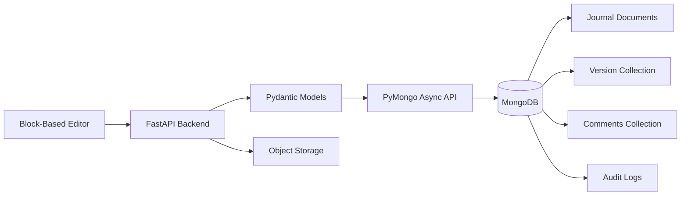
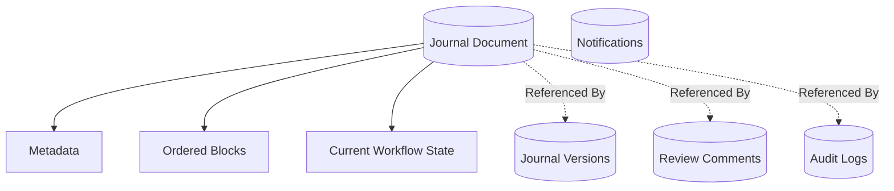
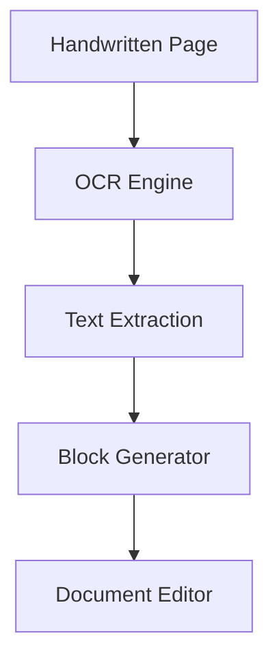
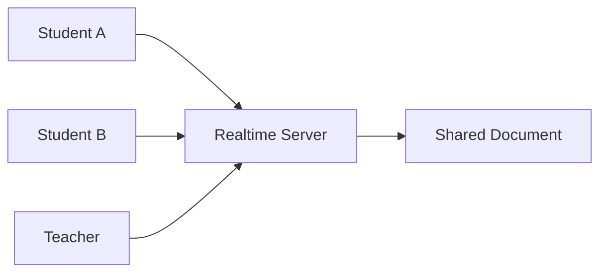
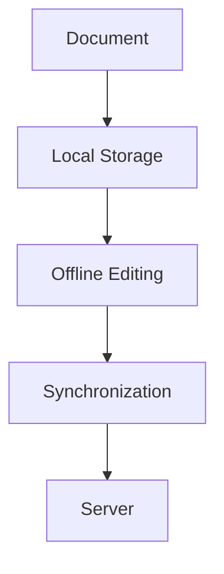
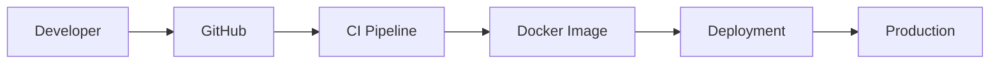
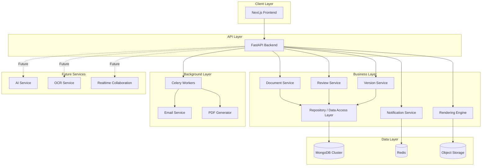

---

# 30. Technology Stack, Future Roadmap & Conclusion

## 30.1 Overview

The Journal Management & Review System is designed using modern, scalable, and industry-proven technologies. Every technology has been selected based on long-term maintainability, developer productivity, performance, and compatibility with the system architecture described throughout this document.

Rather than selecting technologies based solely on popularity, the stack prioritizes:

- Scalability
- Type Safety
- Performance
- Maintainability
- Community Support
- Future AI Integration

---

# 30.2 Complete Technology Stack

| Layer | Technology | Purpose |
|---------|------------|----------|
| Frontend | Next.js (App Router) | Web Application |
| Language | TypeScript | Type-safe Development |
| Styling | Tailwind CSS | UI Styling |
| UI Components | shadcn/ui | Accessible Components |
| Rich Text | Lexical / BlockNote | Block-based Document Editor |
| State Management | Zustand | Client State |
| Backend | FastAPI | REST API |
| Language | Python | Backend Services |
| Validation | Pydantic | Request & Response Validation |
| Database Driver | PyMongo (Async API) | MongoDB Connectivity & Data Access |
| Data Modeling | Pydantic | Application & Document Validation |
| Data Migration | Versioned Python Migration Scripts | MongoDB Data & Document Schema Evolution |
| Database | MongoDB | Primary Document Database |
| Cache | Redis | Caching & Task Broker |
| Background Jobs | Celery | Asynchronous Tasks |
| File Storage | S3-Compatible Storage | Images & PDFs |
| Authentication | JWT | User Authentication |
| PDF Rendering | ReportLab / WeasyPrint | Document Export |
| Mathematics | KaTeX | Equation Rendering |
| Containerization | Docker | Deployment |
| Reverse Proxy | Nginx | Traffic Management |
| Version Control | Git | Source Control |

---

# 30.3 Frontend Technology Decisions

The frontend is implemented using **Next.js App Router**, providing:

- Server Components
- Client Components
- File-based Routing
- Fast Navigation
- SEO Support
- Future SSR Capability

TypeScript improves reliability by detecting errors during development.

Tailwind CSS enables consistent and responsive user interfaces while minimizing custom CSS.

---

# 30.4 Backend Technology Decisions

The backend is built with **FastAPI** because it offers:

- High Performance
- Automatic API Documentation
- Native Type Hint Support
- Pydantic Validation
- Asynchronous Request Handling
- Excellent Python Ecosystem Integration

This architecture is particularly well-suited for document processing and AI-powered features.

---

# 30.5 Database Technology Decisions

**MongoDB** is selected as the primary persistent document database.

This choice aligns naturally with the platform's block-based journal architecture because journal content is already represented as structured JSON and can be stored as BSON while preserving nested document structure.

MongoDB provides:

- Flexible document-oriented data modeling
- Natural storage for block-based journal documents
- Nested metadata and block structures
- Atomic single-document updates
- Rich indexing
- Aggregation pipelines
- Replica-set high availability
- Multi-document transactions when required
- Horizontal scaling options for future growth

The platform does **not** treat MongoDB as an uncontrolled schema-less store.

Predictable data structures are maintained through:

- Pydantic application models
- MongoDB collection validation where appropriate
- Explicit `schemaVersion` fields
- Version-controlled migration scripts
- Backward-compatible document readers
- Controlled data migration workflows

The current journal state can be stored as a structured document containing metadata and ordered blocks, while independently growing entities such as journal versions, comments, notifications, and audit events can use dedicated collections.

Binary media such as uploaded images and generated PDFs remains in object storage rather than inside MongoDB.

This design preserves MongoDB's document-model flexibility while maintaining strong application-level data contracts.

---

# 30.6 Why Block-Based Documents?

The document model intentionally avoids storing HTML as the primary representation.

Advantages include:

- Cleaner data structures
- Easier rendering
- Better version control
- Independent block updates
- AI-friendly content representation
- Simplified review workflow

The block architecture also enables future collaborative editing without redesigning the storage layer.

---

# 30.7 Third-Party Libraries

The platform leverages several libraries to accelerate development while maintaining flexibility.

| Library | Purpose |
|----------|---------|
| Lexical / BlockNote | Rich Block Editor |
| KaTeX | Mathematical Rendering |
| React Hook Form | Form Handling |
| Zod | Frontend Validation |
| TanStack Query | Server State |
| React DnD / dnd-kit | Drag & Drop |
| ReportLab / WeasyPrint | PDF Generation |
| Pillow | Image Processing |
| Celery | Background Jobs |
| PyMongo | MongoDB Driver & Data Access |

Each library addresses a specific concern and can be replaced independently if future requirements change.

---

# 30.8 Architectural Decisions

The project intentionally adopts several key architectural decisions.

| Decision | Reason |
|-----------|--------|
| Block-Based Editor | Structured document editing |
| Layered Backend | Separation of concerns |
| Repository Pattern | Database abstraction |
| Stateless APIs | Horizontal scalability |
| Immutable Versions | Reliable history |
| Dedicated Rendering Engine | Consistent exports |
| Background Workers | Non-blocking processing |
| Object Storage | Efficient media handling |
| MongoDB Document Model | Natural persistence for block-based JSON/BSON journals |
| Explicit Document Schema Versions | Safe long-term evolution of journal structures |
| Application-Level Data Migrations | Controlled MongoDB schema and data evolution |

These decisions collectively improve maintainability and long-term scalability.

---

# 30.9 MongoDB Architectural Fit

MongoDB is not selected merely because journals are JSON-shaped. The choice is based on the platform's dominant access and evolution patterns.

The journal is an aggregate containing ordered heterogeneous blocks that are normally loaded together for editing and rendering. This makes a document-oriented representation appropriate for the current journal state.

At the same time, unbounded or independently queried data remains separated into dedicated collections.

This hybrid document-modeling approach avoids two extremes:

1. Splitting every block into unnecessary independent records.
2. Embedding unlimited revisions, comments, and audit history into one ever-growing journal document.

The resulting architecture supports efficient journal loading while allowing high-growth data to scale independently.

---

# 30.10 AI Integration Opportunities

The architecture has been designed to support AI-powered features without requiring structural changes.

Potential integrations include:

### AI Writing Assistant

- Grammar suggestions
- Sentence improvement
- Academic writing guidance

---

### Mathematical Assistance

- Formula completion
- Derivation suggestions
- Equation validation
- Symbol recommendations

---

### Intelligent Review

- Automatic plagiarism detection
- Formatting validation
- Missing section detection
- Grammar analysis

---

### OCR Integration

Students may upload handwritten pages that are converted into editable document blocks.

---

### AI Summarization

Teachers could automatically generate:

- Journal summaries
- Feedback summaries
- Student progress reports

---

# 30.11 Real-Time Collaboration

Future versions may introduce collaborative editing similar to modern document platforms.

Potential features:

- Live cursors
- Simultaneous editing
- Presence indicators
- Shared comments
- Conflict resolution

---

# 30.12 Offline Support

The editor can be extended with offline capabilities.

---

# 30.13 Implementation Roadmap

### Phase 1

Initial delivery focuses on the core document workflow and deployment pipeline.

---

### Phase 2

- Advanced Version History
- Notification System
- Improved Rendering
- Dashboard Analytics

---

### Phase 3

- OCR Integration
- AI Writing Assistant
- Mathematical Intelligence
- AI Review Suggestions

---

### Phase 4

- Real-Time Collaboration
- Mobile Application
- Offline Editing
- Cloud Synchronization

---

### Phase 5

- LMS Integration
- Digital Signatures
- Institution Analytics
- Public API
- Plugin Ecosystem

---

# 30.14 Final System Architecture

This architecture demonstrates the separation of presentation, business logic, data management, background processing, and future intelligent services.

---

# 30.15 Key Achievements

The proposed architecture provides:

- Structured academic document editing
- Intelligent mathematical writing
- Block-based storage
- MongoDB-native structured document persistence
- Versioned document schema evolution
- Incremental version management
- Teacher review workflow
- Modular rendering engine
- Secure backend architecture
- Scalable deployment infrastructure
- AI-ready design
- Future collaboration support

The system is designed to remain maintainable and extensible as new requirements emerge.

---

# 30.16 Conclusion

The **Journal Management & Review System** is more than a digital journal editor—it is a comprehensive academic document platform that modernizes the entire lifecycle of practical journal creation, review, revision, approval, and export.

By adopting a **block-based document architecture**, the platform separates content, presentation, and rendering, enabling consistent outputs, efficient version control, precise teacher feedback, and seamless mathematical authoring.

The use of **MongoDB** complements this architecture by allowing structured journal content to be persisted naturally as document-oriented BSON while application-level schemas, explicit schema versions, and controlled migrations preserve long-term data consistency.

The modular architecture ensures that future capabilities such as artificial intelligence, OCR, real-time collaboration, offline editing, and institutional integrations can be incorporated without fundamental changes to the system.

This Software Design Document establishes a robust architectural foundation that prioritizes maintainability, scalability, usability, and long-term evolution, making the platform suitable for educational institutions seeking a modern and extensible solution for academic documentation.

---

# 30.17 Glossary

| Term | Meaning |
|---|---|
| **Block** | The smallest independently addressable unit of journal content, such as a paragraph, equation, table, or image. |
| **Block-Based Document** | A document represented as an ordered collection of structured content blocks rather than one large HTML string. |
| **BSON** | MongoDB's binary document representation used to store JSON-like structured data. |
| **Journal** | A student's structured academic practical or laboratory document. |
| **Practical Assignment** | A teacher-published academic task from which a student creates a journal. |
| **Document Model** | The canonical structured representation of a journal used for editing, storage, review, versioning, and rendering. |
| **schemaVersion** | A version identifier stored with structured documents to support controlled document-format evolution. |
| **Revision** | A recoverable historical state or change representation of a journal. |
| **Immutable Version** | A historical journal version that is not modified after creation. |
| **Auto-Save** | Background persistence of student changes without requiring repeated manual save actions. |
| **Incremental Synchronization** | Sending only changed document content or blocks instead of replacing the complete journal after every edit. |
| **Optimistic Concurrency** | A conflict-prevention strategy that verifies revision state before accepting an update. |
| **Review Anchor** | A stable reference connecting teacher feedback to a specific block or content location. |
| **Rendering Engine** | The subsystem that converts the canonical document model into Web Preview, PDF, DOCX, or Print output. |
| **Visual Equation Builder** | A mathematical authoring interface that allows students to construct equations without directly writing LaTeX. |
| **KaTeX** | A mathematical typesetting library used to render mathematical notation. |
| **MongoDB** | The primary document database used to store structured application and journal data. |
| **Collection** | A MongoDB grouping of related documents, conceptually similar to a data container for one domain entity. |
| **ObjectId** | A MongoDB identifier type that may be used internally for document identifiers. |
| **Replica Set** | A MongoDB deployment configuration that maintains multiple data-bearing nodes for redundancy and automatic failover. |
| **PyMongo** | The official MongoDB Python driver used by the backend data-access layer. |
| **Pydantic** | The Python validation and data-modeling library used to define application-level schemas. |
| **Repository Layer** | The backend layer that isolates database queries and persistence operations from business services. |
| **Object Storage** | External storage used for binary assets such as images and generated files. |
| **Redis** | In-memory infrastructure used for caching, rate limiting, and background task brokering. |
| **Celery** | Background task processing system used for asynchronous operations such as document generation and notifications. |
| **C4 Model** | A hierarchical software architecture visualization approach covering system context, containers, components, and optionally code. |
| **RBAC** | Role-Based Access Control used to restrict operations according to user roles and permissions. |
| **Audit Log** | An append-oriented record of important security, review, approval, and academic workflow events. |

---

# 30.18 References

### Documentation

- Next.js Documentation
- FastAPI Documentation
- MongoDB Documentation
- PyMongo Documentation
- Pydantic Documentation
- Redis Documentation
- Celery Documentation
- KaTeX Documentation
- Docker Documentation
- Nginx Documentation

### Design Principles

- REST Architectural Style
- Layered Architecture Pattern
- Repository Pattern
- Domain-Driven Design (DDD)
- SOLID Principles
- Clean Architecture
- Document Database Modeling
- MongoDB Data Modeling Patterns
- C4 Model for Software Architecture

---

# End of Software Design Document

**Version:** 1.0

**Document Status:** Complete

**Prepared For:** Journal Management & Review System

**Architecture Style:** Block-Based Academic Document Platform

**Prepared By:** Project Development Team

---