# Project Architecture
## Journal Management & Review System

> This document defines the complete technical architecture of the Journal Management & Review System — from system context down to component-level details, data models, persistence strategies, and infrastructure topology. Any agent or developer reading this document should understand exactly how every part of the system fits together.

---

## Table of Contents

1. [Architecture Overview](#1-architecture-overview)
2. [C4 Level 1 — System Context Diagram](#2-c4-level-1--system-context-diagram)
3. [C4 Level 2 — Container Diagram](#3-c4-level-2--container-diagram)
4. [C4 Level 3 — Backend Component Diagram](#4-c4-level-3--backend-component-diagram)
5. [High-Level System Architecture](#5-high-level-system-architecture)
6. [Final Layered System Architecture](#6-final-layered-system-architecture)
7. [Frontend Architecture](#7-frontend-architecture)
8. [Backend Architecture](#8-backend-architecture)
9. [Database Architecture (MongoDB)](#9-database-architecture-mongodb)
10. [Document Model Architecture](#10-document-model-architecture)
11. [Visual Block-Based Document Editor Architecture](#11-visual-block-based-document-editor-architecture)
12. [Mathematical Writing System Architecture](#12-mathematical-writing-system-architecture)
13. [Auto-Save & Synchronization Architecture](#13-auto-save--synchronization-architecture)
14. [Review & Annotation Architecture](#14-review--annotation-architecture)
15. [Version History Architecture](#15-version-history-architecture)
16. [Rendering & Export Engine Architecture](#16-rendering--export-engine-architecture)
17. [Authentication & Authorization Architecture](#17-authentication--authorization-architecture)
18. [Classroom & Assignment Architecture](#18-classroom--assignment-architecture)
19. [Notification Architecture](#19-notification-architecture)
20. [Infrastructure & Deployment Architecture](#20-infrastructure--deployment-architecture)
21. [Security Architecture](#21-security-architecture)
22. [Technology Stack Reference](#22-technology-stack-reference)

---

## 1. Architecture Overview

The Journal Management & Review System is a unified Next.js + FastAPI application for creating, reviewing, managing, and evaluating academic practical journals using a visual block-based document editor.

### Core Architectural Principles

1. **Separation of Concerns** — Editing, storage, review, versioning, rendering, and export are independent subsystems.
2. **Block-Based Document Model** — Journals are structured collections of independent blocks, not HTML strings.
3. **Single Source of Truth** — The canonical document model drives editor, preview, auto-save, versioning, review, and all export renderers.
4. **Stateless Application Servers** — No user state in server memory. All persistent data in MongoDB, Redis, or object storage.
5. **Layered Backend** — API Layer → Service Layer → Repository Layer → MongoDB.
6. **Client-Server Boundary** — The browser never connects directly to MongoDB. All persistence through authenticated backend APIs.
7. **Independent Scalability** — Every infrastructure component scales independently.

---

## 2. C4 Level 1 — System Context Diagram

The System Context view defines the platform boundary and shows how the primary human actors and external services interact with the system.

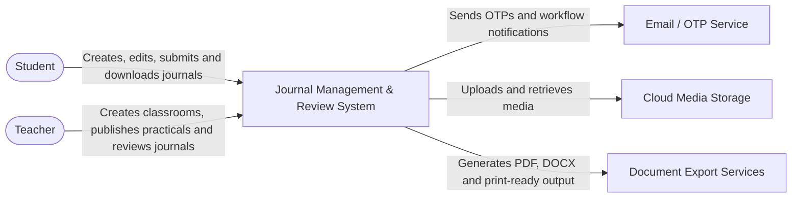

### Actors

| Actor | Interaction |
|-------|-------------|
| Student | Creates, edits, submits, and downloads journals |
| Teacher | Creates classrooms, publishes practicals, reviews and approves journals |

### External Systems

| System | Purpose |
|--------|---------|
| Email / OTP Service | Sends OTPs for verification and workflow notifications |
| Cloud Media Storage | Stores uploaded images, diagrams, generated PDFs, DOCX files |
| Document Export Services | PDF, DOCX, and print-ready document generation |

---

## 3. C4 Level 2 — Container Diagram

The Container view expands the system boundary into major runtime responsibilities.

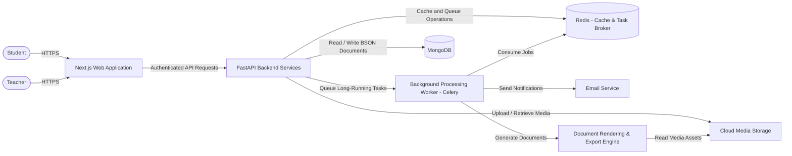

### Container Responsibilities

| Container | Technology | Responsibility |
|-----------|-----------|---------------|
| Web Application | Next.js (App Router) + TypeScript | User interface, client state, editor |
| Backend API | FastAPI + Python | Business logic, validation, API |
| Background Worker | Celery + Python | PDF generation, email, notifications |
| Database | MongoDB | Structured data persistence |
| Cache / Broker | Redis | Caching, task brokering, rate limiting |
| Media Storage | S3-compatible / Cloudinary | Binary asset storage |
| Reverse Proxy | Nginx | HTTPS termination, routing, load balancing |

---

## 4. C4 Level 3 — Backend Component Diagram

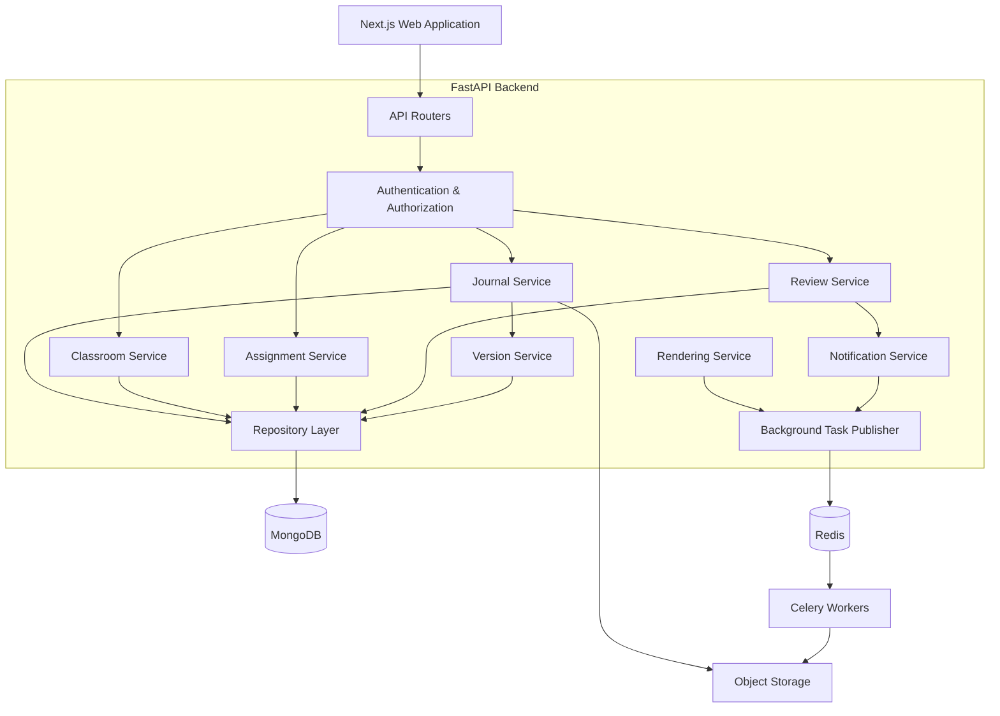

### Component Responsibilities

| Component | Responsibility |
|-----------|---------------|
| API Routers | HTTP request parsing, response serialization, thin controllers |
| Authentication & Authorization | JWT validation, RBAC enforcement, profile verification |
| Journal Service | Journal CRUD, document operations, submission workflow |
| Classroom Service | Classroom management, enrollment, join codes |
| Assignment Service | Practical assignment publishing and management |
| Review Service | Comments, suggestions, highlights, approval decisions |
| Version Service | Revision creation, snapshot/delta management, restore |
| Rendering Service | PDF/DOCX/Print generation coordination |
| Notification Service | In-app and email notification generation |
| Repository Layer | MongoDB data access, query construction, BSON-to-model conversion |
| Background Task Publisher | Task queue management (Celery) |

---

## 5. High-Level System Architecture

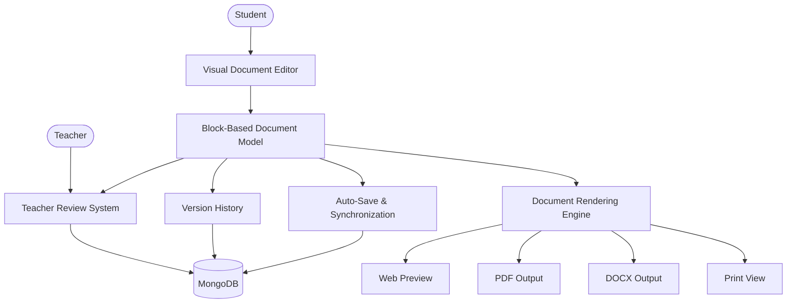

The structured document model is the **single source of truth** for editing, review, versioning, rendering, and export.

---

## 6. Final Layered System Architecture

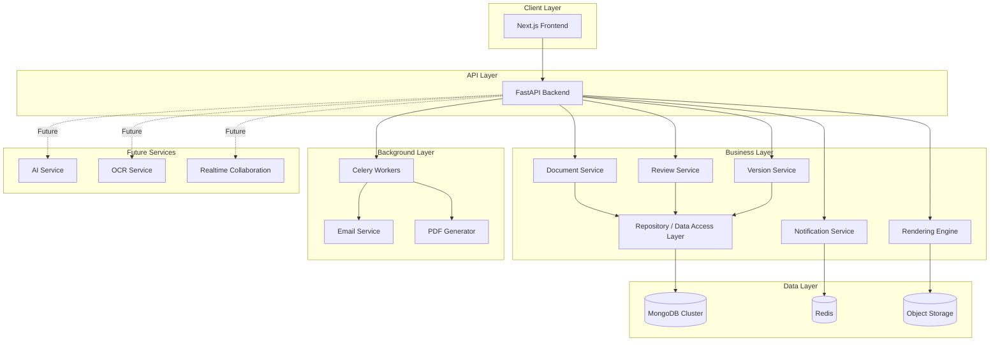

---

## 7. Frontend Architecture

### Technology

| Technology | Purpose |
|-----------|---------|
| Next.js (App Router) | Web application framework with server/client components |
| TypeScript | Type-safe development |
| Tailwind CSS | UI styling |
| shadcn/ui | Accessible UI component library |
| Lexical / BlockNote | Block-based document editor engine |
| Zustand | Client-side state management |
| TanStack Query | Server state and data fetching |
| React Hook Form + Zod | Form handling and validation |
| React DnD / dnd-kit | Drag and drop |
| KaTeX | Mathematical equation rendering |

### Client Architecture Flow

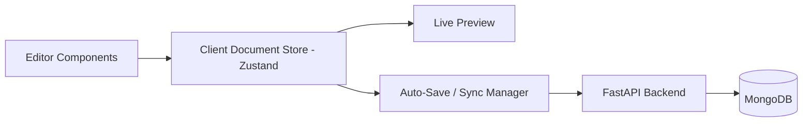

- **Client Document Store** (Zustand) is the immediate source of truth during active editing.
- **MongoDB journal document** is the durable server-side source of truth after successful synchronization.
- The frontend NEVER makes direct database connections.

---

## 8. Backend Architecture

### Layered Design

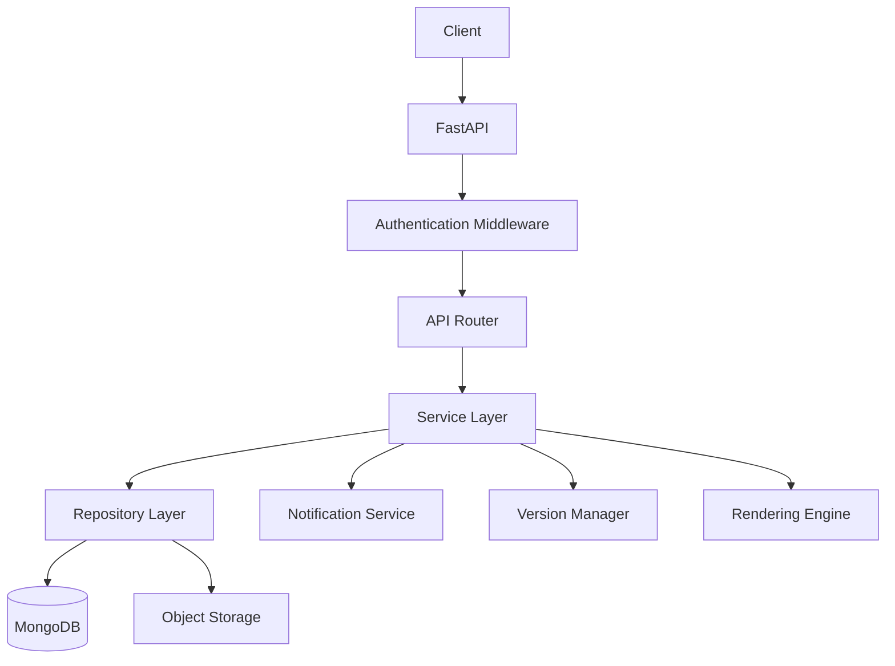

### Request Lifecycle

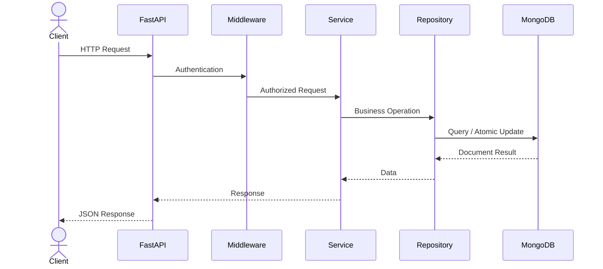

### Backend Folder Structure

```
backend/
├── app/
│   ├── api/              # API routes (thin controllers)
│   ├── core/             # Configuration, security, constants
│   ├── models/           # Database/document models
│   ├── schemas/          # Pydantic request/response schemas
│   ├── repositories/     # MongoDB data access layer
│   │   ├── user_repository.py
│   │   ├── classroom_repository.py
│   │   ├── assignment_repository.py
│   │   ├── journal_repository.py
│   │   ├── version_repository.py
│   │   ├── comment_repository.py
│   │   ├── approval_repository.py
│   │   ├── notification_repository.py
│   │   └── audit_log_repository.py
│   ├── services/         # Business logic layer
│   ├── middleware/        # Authentication, CORS, etc.
│   ├── dependencies/     # Dependency injection
│   ├── utils/            # Shared utilities
│   ├── renderers/        # PDF, DOCX, Print rendering
│   ├── workers/          # Celery background tasks
│   ├── notifications/    # Notification service
│   └── main.py           # Application entry point
├── tests/
├── migrations/           # Versioned migration scripts
├── scripts/              # Seed data, admin scripts
├── Dockerfile
└── requirements.txt
```

### Service Layer Components

| Service | Responsibility |
|---------|---------------|
| Journal Service | Journal CRUD, document operations |
| Submission Service | Submission workflow, validation |
| Approval Service | Approval decisions, mark assignment |
| Classroom Service | Classroom management, enrollment |
| Assignment Service | Practical publishing |
| Version Service | Revision management, restore |
| Rendering Service | Export coordination |
| Notification Service | Alert generation and dispatch |

### Repository Layer Responsibilities

- Collection access, query construction, projection
- Pagination, atomic updates, bulk operations
- Index-aware query patterns
- BSON-to-application-model conversion
- ObjectId handling

### MongoDB Data Access Architecture

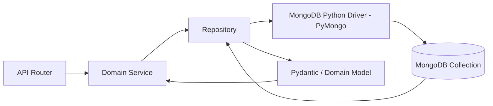

### MongoDB Connection Management

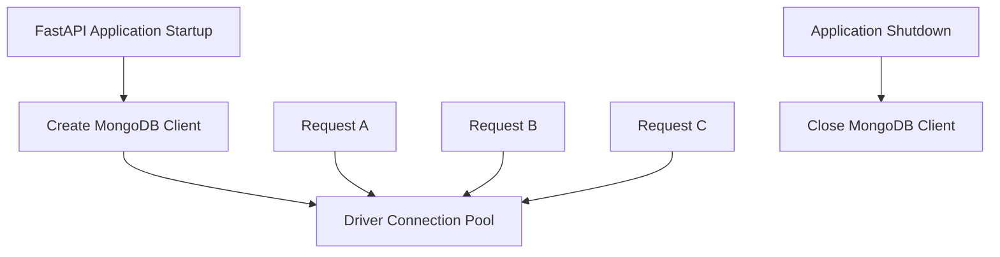

- One shared MongoDB client per backend process
- Connection pool managed by PyMongo driver
- Configuration from environment variables: MongoDB URI, database name, timeouts, TLS, pool limits

### Horizontal Scaling

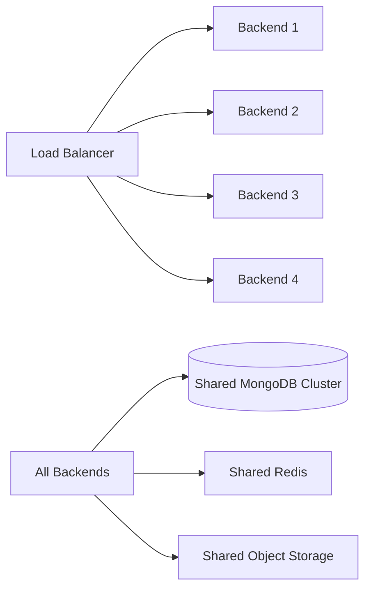

All application instances are stateless and horizontally scalable.

---

## 9. Database Architecture (MongoDB)

### Collections & Their Purposes

```
MongoDB
├── users                    # Authentication, profile, role
├── classrooms               # Academic classes/batches
├── classroom_memberships    # Student enrollment (many-to-many)
├── assignments              # Practical/experiment templates
├── journals                 # Current journal state with embedded blocks
│   └── document
│       ├── schemaVersion
│       ├── metadata
│       └── blocks[]
├── journal_versions         # Immutable revision history
├── comments                 # Teacher review comments
├── approvals                # Approval records
├── notifications            # User alerts
└── audit_logs               # System event log
```

### Entity Relationship Diagram

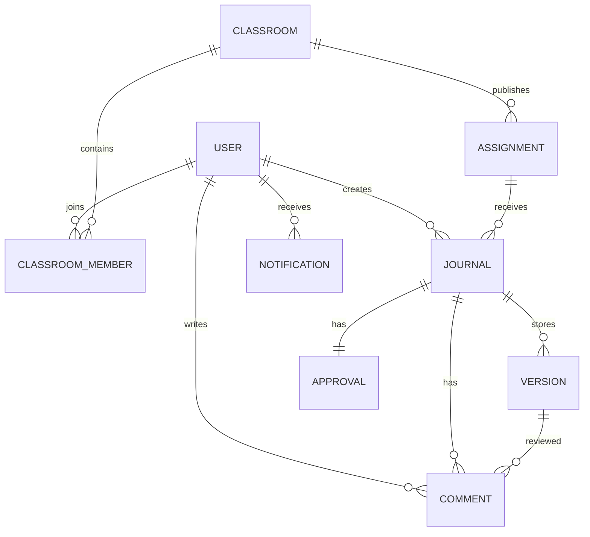

### Entity Details

#### User Document

```
id, name, email, role, department, semester, enrollmentNumber (student),
facultyId (teacher), designation (teacher), division, college, university,
profilePhoto, passwordHash, isVerified, createdAt, updatedAt
```

Roles: `student`, `teacher`, `administrator` (future)

#### Classroom Document

```
id, name, subject, semester, division, department, teacherId, joinCode, createdAt
```

- Unique index on `joinCode`

#### Classroom Membership Document

```
classroomId, studentId, joinedAt, status
```

- Compound unique index on `classroomId + studentId`

#### Assignment Document

```
id, classroomId, title, description, experimentNumber, aim, instructions,
maxMarks, deadline, references, additionalNotes, createdAt
```

#### Journal Document (Current State)

```json
{
  "id": "journal_123",
  "schemaVersion": 1,
  "assignmentId": "assignment_123",
  "classroomId": "classroom_123",
  "studentId": "student_123",
  "title": "Ohm's Law Experiment",
  "status": "draft",
  "currentRevision": 15,
  "blockOrder": ["block_001", "block_002", "block_003"],
  "blocks": [
    {
      "id": "block_001",
      "type": "heading",
      "content": { "text": "Introduction" },
      "metadata": { "createdAt": "...", "updatedAt": "..." }
    },
    {
      "id": "block_002",
      "type": "paragraph",
      "content": { "text": "Ohm's Law states..." },
      "metadata": { "createdAt": "...", "updatedAt": "..." }
    },
    {
      "id": "block_003",
      "type": "equation",
      "displayMode": true,
      "data": { "latex": "V = IR", "mathml": "<math>...</math>" },
      "metadata": { "createdAt": "...", "updatedAt": "..." }
    }
  ],
  "createdAt": "...",
  "updatedAt": "..."
}
```

#### Journal Version Document (Revision History)

```json
{
  "id": "revision_005",
  "journalId": "journal_123",
  "revisionNumber": 5,
  "parentRevisionId": "revision_004",
  "authorId": "student_123",
  "createdAt": "2026-07-19T10:30:00Z",
  "status": "submitted",
  "schemaVersion": 1,
  "type": "snapshot | delta",
  "changes": [
    {
      "blockId": "block_eq_001",
      "operation": "update",
      "beforeHash": "hash_a",
      "after": { "type": "equation", "data": { "latex": "V = IR" } }
    }
  ]
}
```

#### Comment Document

```json
{
  "id": "comment_123",
  "journalId": "journal_123",
  "blockId": "block_456",
  "authorId": "teacher_123",
  "type": "comment | suggestion | highlight | warning | approval | question",
  "message": "Please verify this calculation.",
  "status": "open | resolved",
  "parentCommentId": null,
  "createdAt": "2026-07-19T10:30:00Z",
  "resolvedAt": null
}
```

#### Approval Document

```json
{
  "journalId": "journal_123",
  "revisionId": "revision_005",
  "teacherId": "teacher_123",
  "status": "approved",
  "marks": 18,
  "remarks": "Approved.",
  "approvedAt": "2026-07-19T11:00:00Z"
}
```

#### Notification Document

```
id, userId, title, message, type, isRead, createdAt
```

#### Audit Log Document

```
id, userId, action, entity, entityId, timestamp, ipAddress
```

### Indexing Strategy

| Collection | Indexes |
|------------|---------|
| users | Unique: `email` |
| classrooms | Unique: `joinCode` |
| classroom_memberships | Compound unique: `classroomId + studentId` |
| assignments | `classroomId` |
| journals | `assignmentId + studentId`, `studentId`, `status` |
| journal_versions | Unique: `journalId + revisionNumber`, `journalId + createdAt`, `authorId + createdAt` |
| comments | `journalId + blockId`, `journalId + status`, `authorId` |
| approvals | `journalId`, `teacherId` |
| notifications | `userId + isRead`, `userId + createdAt` |
| audit_logs | `entity + entityId`, `timestamp`, `userId` |

### Embedding vs Referencing Strategy

| Embed (Inside Journal Document) | Reference (Separate Collection) |
|---------------------------------|--------------------------------|
| Document blocks (metadata + content) | Revision history (journal_versions) |
| Block ordering | Teacher comments |
| Current workflow state | Approval records |
| | Notifications |
| | Audit logs |

### Transaction Strategy

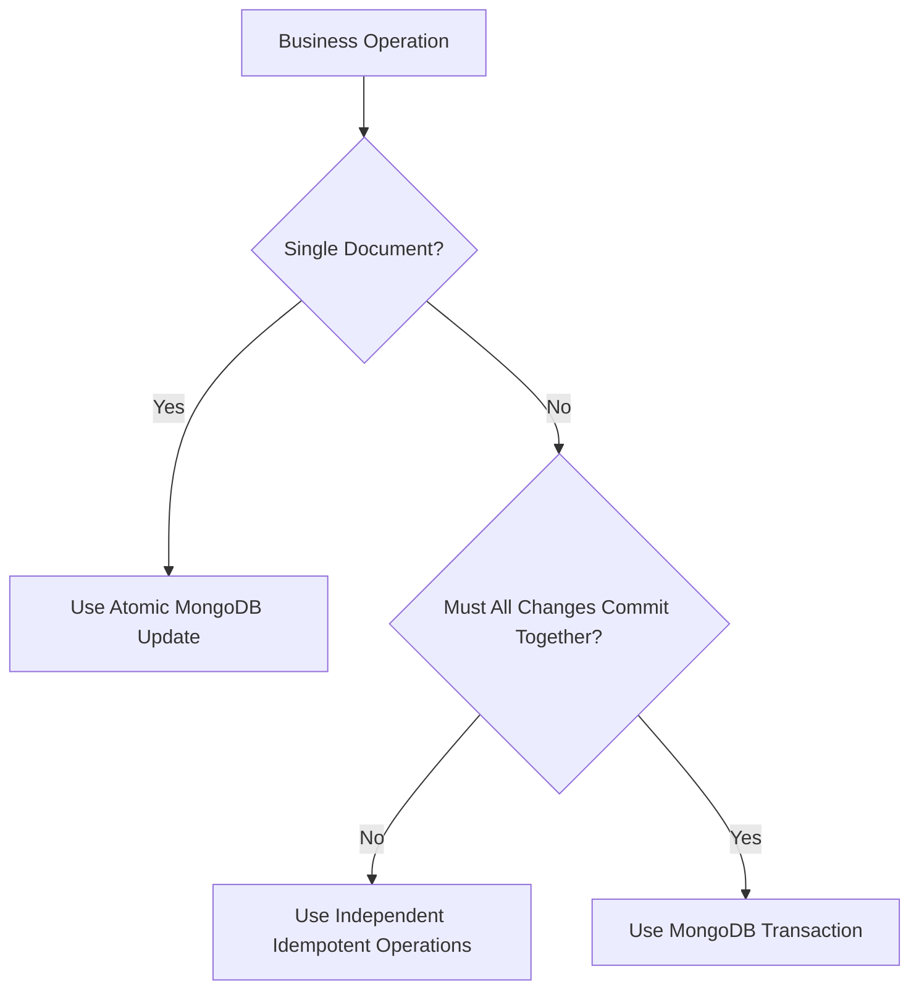

### Schema Evolution Strategy

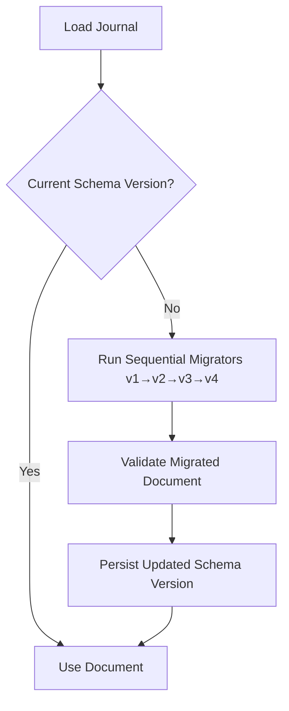

### Storage Strategy

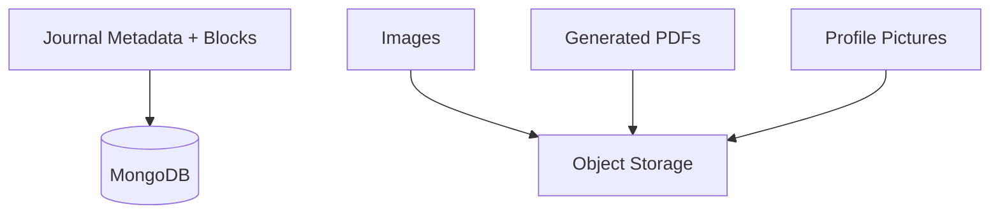

---

## 10. Document Model Architecture

### Block Architecture

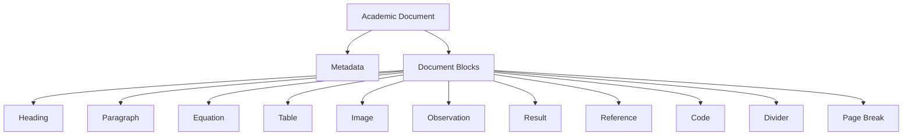

### Block Lifecycle

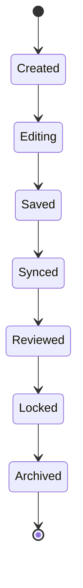

### Supported Block Types (v1)

| Block | Purpose | Renderer |
|-------|---------|----------|
| `heading` | Section Titles | HeadingRenderer |
| `paragraph` | Rich Text (with inline equation support) | ParagraphRenderer |
| `equation` | Display Mathematical Expressions | EquationRenderer |
| `table` | Experimental Data | TableRenderer |
| `image` | Diagrams (caption, alignment, resizing) | ImageRenderer |
| `observation` | Experimental Observations | ObservationRenderer |
| `result` | Results | ResultRenderer |
| `reference` | Citations | ReferenceRenderer |
| `code` | Programming Practical | CodeRenderer |
| `divider` | Section Separator | DividerRenderer |
| `pagebreak` | PDF Page Formatting | PageBreakRenderer |

---

## 11. Visual Block-Based Document Editor Architecture

### Editor Architecture

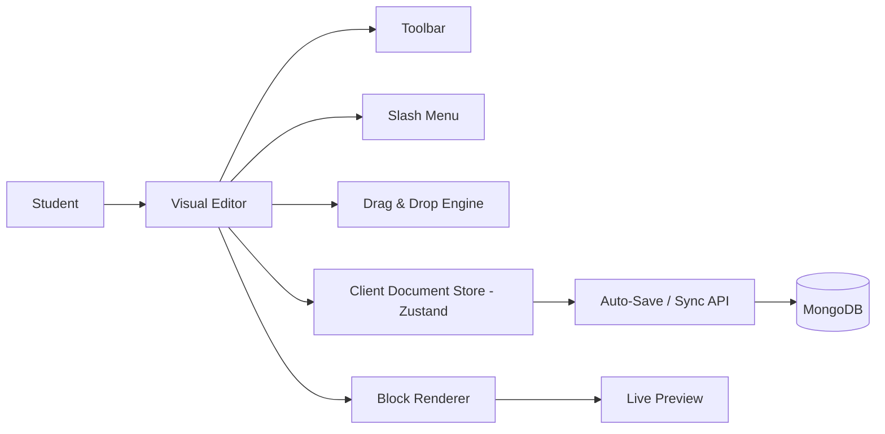

### Editor Layout

```
+-------------------------------------------------------------+
 File     Edit     Insert     View     Export
--------------------------------------------------------------
 Title
--------------------------------------------------------------
 Rich Toolbar
--------------------------------------------------------------
| Heading Block                                                |
| Paragraph Block                                              |
| Equation Block                                               |
| Table Block                                                  |
| Image Block                                                  |
| Observation Block                                            |
| Result Block                                                 |
| [+] [Duplicate] [Delete] [Move]                              |
--------------------------------------------------------------
 Status: Saved • Revision 15 • Synced
+-------------------------------------------------------------+
```

### Block Creation Workflow

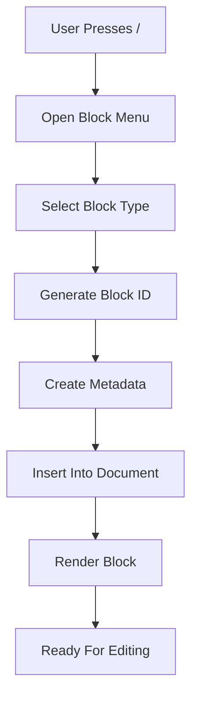

### Block Rendering Strategy

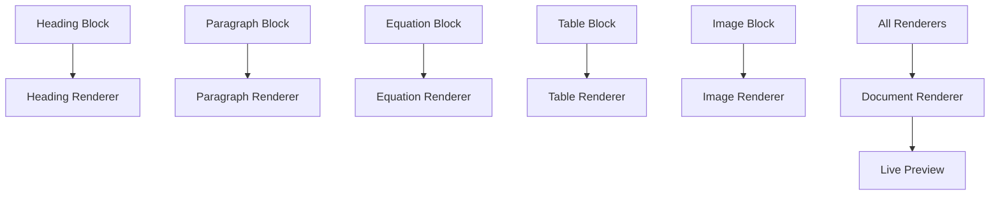

### Drag & Drop Architecture

```mermaid
flowchart LR
    BlockA[Block A] --> Drag[Drag]
    Drag --> Drop[Drop]
    Drop --> UpdatePosition[Update Position/Order]
    UpdatePosition --> ReRender[Re-render]
    ReRender --> SaveNewOrder[Save New Order]
```

Only block positions change. Content remains untouched.

---

## 12. Mathematical Writing System Architecture

### Math Pipeline

```mermaid
flowchart TD
    A[Student]
    --> B[Visual Equation Editor]
    B --> C[Equation Document Model]
    C --> D[LaTeX Generator]
    D --> E[KaTeX Renderer]
    E --> F[Live Preview]
    F --> G[Document JSON]
    G --> H[PDF Renderer]
    G --> I[DOCX Renderer]
    G --> J[Print Preview]
```

### Math Editor Components

```mermaid
flowchart LR
    A[Equation Toolbar]
    B[Scientific Keyboard]
    C[Formula Templates]
    D[Equation Canvas]
    E[Symbol Search]
    F[Autocomplete]
    G[LaTeX Generator]
    H[Equation Renderer]

    A --> D
    B --> D
    C --> D
    E --> D
    F --> D
    D --> G
    G --> H
```

### Smart Recognition Engine

```mermaid
flowchart TD
    A[Keyboard Input] --> B[Input Listener]
    B --> C[Math Recognition Engine]
    C --> D{Recognized?}
    D -- No --> E[Normal Rich Text]
    D -- Yes --> F[Equation Parser]
    F --> G[Equation Model]
    G --> H[LaTeX Generator]
    H --> I[KaTeX Renderer]
    I --> J[Replace With Formatted Equation]
```

### Inline Equation Architecture

```mermaid
flowchart LR
    ParagraphBlock[Paragraph Block] --> Text[Text]
    ParagraphBlock --> InlineEquation[Inline Equation Node]
    ParagraphBlock --> Text2[Text]
    Text --> ParagraphRenderer[Paragraph Renderer]
    InlineEquation --> ParagraphRenderer
    Text2 --> ParagraphRenderer
    ParagraphRenderer --> RenderedParagraph[Rendered Paragraph]
```

### Mathematical Persistence Architecture

```mermaid
flowchart LR
    MathEditor[Visual Math Editor]
    --> EquationModel[Equation Model]
    --> JournalState[Client Journal State]
    --> SyncAPI[Auto-Save / Sync API]
    --> Validation[Backend Validation]
    --> Mongo[(MongoDB Journal Document)]

    Mongo --> LoadAPI[Journal Load API]
    LoadAPI --> EquationRenderer[Equation Renderer]
```

---

## 13. Auto-Save & Synchronization Architecture

### Incremental Block Synchronization

```mermaid
sequenceDiagram
    actor Student
    participant Editor
    participant Store as Client Document Store
    participant API as Auto-Save API
    participant MongoDB

    Student->>Editor: Edit Block
    Editor->>Store: Update Local Block
    Store->>Store: Mark Block Dirty
    Store->>API: Send Changed Block + clientRevision
    API->>API: Validate Block
    API->>MongoDB: Conditional Atomic Block Update (if revision matches)
    MongoDB-->>API: Update Successful
    API-->>Store: Saved Revision (serverRevision)
    Store-->>Editor: Show Synced
```

### Concurrency & Conflict Handling

```mermaid
sequenceDiagram
    actor Student
    participant Editor
    participant API
    participant MongoDB

    Student->>Editor: Edit Block
    Editor->>API: PATCH Block with clientRevision=12
    API->>MongoDB: Conditional Update if revision=12

    alt Revision Matches
        MongoDB-->>API: Updated revision=13
        API-->>Editor: Save Successful
    else Revision Conflict
        MongoDB-->>API: No Matching Revision
        API-->>Editor: 409 Revision Conflict
    end
```

---

## 14. Review & Annotation Architecture

### Review System Architecture

```mermaid
flowchart TD
    A[Student Submission]
    --> B[Teacher Dashboard]
    B --> C[Open Document]
    C --> D[Review Layer]
    D --> E[Comments]
    D --> F[Suggestions]
    D --> G[Highlights]
    D --> H[Approval Status]
    E --> I[Notification Engine]
    F --> I
    G --> I
    H --> I
    I --> J[Student Dashboard]
```

### Review Lifecycle

```mermaid
stateDiagram-v2
    [*] --> Draft
    Draft --> Submitted
    Submitted --> UnderReview
    UnderReview --> ChangesRequested
    ChangesRequested --> Revised
    Revised --> UnderReview
    UnderReview --> Approved
    Approved --> Archived
    Archived --> [*]
```

### MongoDB Review Persistence Architecture

```mermaid
flowchart LR
    Teacher[Teacher Review UI]
    --> API[Review API]
    --> ReviewService[Review Service]

    ReviewService --> Comments[(MongoDB comments)]
    ReviewService --> Approvals[(MongoDB approvals)]
    ReviewService --> Audit[(MongoDB audit_logs)]

    Comments -. references .-> Journal[Journal ID + Block ID]
    Approvals -. references .-> Journal
    Audit -. references .-> Journal
```

### Suggestion Workflow

```mermaid
flowchart TD
    Teacher[Teacher] --> CreateSuggestion[Create Suggestion]
    CreateSuggestion --> StudentReviews[Student Reviews]
    StudentReviews --> Accept[Accept]
    StudentReviews --> Reject[Reject]
    Accept --> DocumentUpdated[Document Updated - New Revision Created]
    Reject --> SuggestionStateChanged[Suggestion State Changed Only]
```

---

## 15. Version History Architecture

### Version Management Architecture

```mermaid
flowchart TD
    A[Student Editing] --> B[Document State]
    B --> C[Version Manager]
    C --> D[Detect Changes]
    D --> E[Create Revision]
    E --> F[(MongoDB journal_versions)]
    F --> G[Timeline]
    F --> H[Restore Engine]
    H --> I[Document Editor]
```

### MongoDB Version Persistence Architecture

```mermaid
flowchart LR
    Editor[Student Editor]
    --> Sync[Auto-Save / Sync Service]
    --> Current[(MongoDB journals)]

    Current --> VersionManager[Version Manager]
    VersionManager --> Versions[(MongoDB journal_versions)]

    Versions --> Diff[Diff Engine]
    Versions --> Restore[Restore Engine]
    Restore --> Current
```

### Snapshot + Delta Strategy

```mermaid
flowchart LR
    V1[Revision 1 - Full Snapshot]
    --> V2[Revision 2 - Delta]
    --> V3[Revision 3 - Delta]
    --> V4[Revision 4 - Full Snapshot]
    --> V5[Revision 5 - Delta]
```

### Revision Reconstruction

```mermaid
flowchart LR
    Request[Request Revision 5]
    --> Snapshot[Load Nearest Snapshot]
    --> Delta2[Apply Delta]
    --> Delta3[Apply Delta]
    --> Target[Reconstructed Revision 5]
```

### Restore Workflow

```mermaid
flowchart TD
    SelectRevision[Select Revision] --> Restore[Restore]
    Restore --> CreateNewRevision[Create New Revision]
    CreateNewRevision --> UpdateCurrentDocument[Update Current Document]
    UpdateCurrentDocument --> ContinueEditing[Continue Editing]
```

Original revision remains unchanged. Restoring always creates a new revision.

---

## 16. Rendering & Export Engine Architecture

### Rendering Pipeline

```mermaid
flowchart LR
    DocumentJSON[Document JSON] --> Validation[Validation]
    Validation --> LayoutEngine[Layout Engine]
    LayoutEngine --> BlockRenderer[Block Renderer]
    BlockRenderer --> PageComposer[Page Composer]
    PageComposer --> ExportRenderer[Export Renderer]
    ExportRenderer --> OutputFile[Output File]
```

### High-Level Rendering Architecture

```mermaid
flowchart TD
    A[Document JSON] --> B[Rendering Engine]
    B --> C[Preview Renderer]
    B --> D[PDF Renderer]
    B --> E[DOCX Renderer]
    B --> F[Print Renderer]
    C --> G[Web Preview]
    D --> H[PDF File]
    E --> I[DOCX File]
    F --> J[Printable Layout]
```

### MongoDB Document Retrieval for Rendering

```mermaid
flowchart LR
    Request[Preview / Export Request]
    --> API[FastAPI Backend]
    --> Mongo[(MongoDB)]

    Mongo --> Loader[Document / Revision Loader]
    Loader --> Migration[Schema Version Compatibility Layer]
    Migration --> Validation[Document Validation]
    Validation --> Canonical[Canonical Document Model]
    Canonical --> Renderer[Rendering Engine]

    Renderer --> Preview[Web Preview]
    Renderer --> PDF[PDF]
    Renderer --> DOCX[DOCX]
    Renderer --> Print[Print]
```

### Approved Revision Export Integrity

```mermaid
flowchart LR
    Approval[(MongoDB Approval Record)]
    --> RevisionID[Approved Revision ID]
    --> Versions[(journal_versions)]
    --> Reconstruct[Reconstruct Immutable Revision]
    --> Render[Rendering Engine]
    --> PDF[Final PDF]
```

### Rendering Data & Asset Resolution

```mermaid
flowchart TD
    RenderRequest[Render Request]
    --> JournalLoader[Journal / Revision Loader]

    JournalLoader --> Mongo[(MongoDB)]
    JournalLoader --> Canonical[Canonical Document Model]

    Canonical --> AssetResolver[Asset Resolver]
    AssetResolver --> Storage[Object Storage]

    Canonical --> Renderer[Rendering Engine]
    Storage --> Renderer
    Renderer --> Output[Generated Output]
```

---

## 17. Authentication & Authorization Architecture

### Authentication Pipeline

```mermaid
flowchart TD
    A[Browser Request]
    --> B[Next.js Middleware]
    --> C{JWT Cookie Present?}
    C -- No --> D[Redirect Login]
    C -- Yes --> E[Validate JWT]
    E --> F{Token Valid?}
    F -- No --> D
    F -- Yes --> G[Load User]
    G --> H[Verify Role]
    H --> I[Verify Profile]
    I --> J[Allow Access]
```

### Profile Validation Flow

```mermaid
flowchart TD
    A[Authenticated User]
    --> B[Profile Validation]
    B --> C{Profile Exists?}
    C -- No --> D[Redirect Profile Setup]
    C -- Yes --> E{Required Fields Complete?}
    E -- No --> D
    E -- Yes --> F[Grant Dashboard Access]
```

### Authorization Flow

```mermaid
flowchart TD
    A[Authenticated User]
    --> B[Requested Route]
    --> C{Required Role}
    C --> D[Student]
    C --> E[Teacher]
    D --> F{Is Student?}
    E --> G{Is Teacher?}
    F -->|Yes| H[Grant Access]
    G -->|Yes| H
    F -->|No| I[403 Forbidden]
    G -->|No| I
```

### Registration & OTP Sequence

```mermaid
sequenceDiagram
    actor User
    participant UI as Next.js UI
    participant API as Auth API
    participant DB as MongoDB
    participant Mail as Email Service

    User->>UI: Fill Registration Form
    UI->>API: POST Register
    API->>API: Hash Password
    API->>API: Generate OTP
    API->>DB: Store Temporary User
    API->>Mail: Send OTP
    Mail-->>User: Email OTP
    User->>UI: Enter OTP
    UI->>API: Verify OTP
    API->>DB: Validate OTP

    alt OTP Valid
        API->>DB: Activate Account
        API-->>UI: Success
    else Invalid OTP
        API-->>UI: Error
    end
```

---

## 18. Classroom & Assignment Architecture

### Classroom Architecture

```mermaid
flowchart TD
    A[Teacher]
    --> B[Create Classroom]
    B --> C[Generate Unique Classroom Code]
    C --> D[(MongoDB)]
    D --> E[Student Receives Code]
    E --> F[Join Classroom]
    F --> G[Validate Code]
    G --> H[Student Added to Classroom]
    H --> I[Classroom Dashboard]
```

### Classroom Entity Relationship

```mermaid
flowchart LR
    Teacher[Teacher] --> Classroom[Classroom]
    Classroom --> Students[Students]
    Classroom --> Practicals[Practicals]
    Practicals --> StudentDocuments[Student Documents]
    StudentDocuments --> Reviews[Reviews]
    Reviews --> Grades[Grades]
```

### Practical Publishing Flow

```mermaid
flowchart TD
    Teacher[Teacher] --> CreatePractical[Create Practical]
    CreatePractical --> SaveTemplate[Save Practical Template]
    SaveTemplate --> Publish[Publish Practical]
    Publish --> NotifyStudents[Notify Students]
    NotifyStudents --> Students[Students]
    Students --> ViewPractical[View Practical]
    ViewPractical --> OpenPractical[Open Practical]
    OpenPractical --> GenerateDocument[Generate Document from Template]
```

### Document Creation Workflow

```mermaid
flowchart TD
    A([Student Dashboard])
    --> B[Select Practical]
    B --> C[Generate Cover Page Automatically]
    C --> D[Open Block-Based Document Editor]
    D --> E[Insert Heading]
    D --> F[Insert Paragraph]
    D --> G[Insert Equation]
    D --> H[Insert Table]
    D --> I[Insert Image]
    D --> J[Insert Observation]
    D --> K[Insert Result]
    E --> L[Document Model]
    F --> L
    G --> L
    H --> L
    I --> L
    J --> L
    K --> L
    L --> M[Incremental Auto Save]
    M --> N[Revision Created]
    L --> O[Preview Renderer]
    O --> P[Preview PDF]
    P --> Q[Submit Document]
    Q --> R[Read Only]
    R --> S[Notify Teacher]
```

---

## 19. Notification Architecture

```mermaid
flowchart TD
    BusinessEvent[Business Event] --> NotificationService[Notification Service]
    NotificationService --> Queue[Task Queue - Redis]
    Queue --> NotificationWorker[Celery Worker]
    NotificationWorker --> InApp[In-App Notification - MongoDB]
    NotificationWorker --> Email[Email Notification]
```

---

## 20. Infrastructure & Deployment Architecture

### High-Level Infrastructure

```mermaid
flowchart LR
    Internet[Internet] --> Nginx[Nginx]
    Nginx --> Frontend[Frontend - Next.js]
    Nginx --> Backend[Backend - FastAPI]
    Backend --> MongoDB[(MongoDB Cluster)]
    Backend --> Redis[Redis]
    Backend --> ObjectStorage[Object Storage]
    Backend --> CeleryWorkers[Celery Workers]
    CeleryWorkers --> PDFGenerator[PDF Generator]
    CeleryWorkers --> EmailService[Email Service]
    CeleryWorkers --> NotificationService[Notification Service]
```

### Containerized Deployment

```mermaid
flowchart TD
    DockerCompose[Docker Compose] --> FrontendContainer[Frontend Container]
    DockerCompose --> BackendContainer[Backend Container]
    DockerCompose --> RedisContainer[Redis Container]
    DockerCompose --> MongoDBContainer[MongoDB Container / Replica Set]
    DockerCompose --> CeleryWorker[Celery Worker Container]
    DockerCompose --> NginxContainer[Nginx Container]
```

### Nginx Responsibilities

- HTTPS termination
- Reverse proxy routing
- Load balancing
- Static asset delivery
- Compression
- Request size limits
- Security headers

### MongoDB Infrastructure

```mermaid
flowchart TD
    Backend[FastAPI Backend]
    --> Driver[MongoDB Python Driver]
    --> Cluster[(MongoDB Cluster)]

    Cluster --> Primary[Primary Node]
    Cluster --> Secondary1[Secondary Node]
    Cluster --> Secondary2[Secondary Node]
```

### Redis Architecture

```mermaid
flowchart TD
    Backend[Backend] --> Redis[Redis]
    Redis --> Cache[API Cache]
    Redis --> CeleryBroker[Celery Broker]
    Redis --> RateLimiter[Rate Limiter]
```

### Configuration Management

```mermaid
flowchart TD
    Env[Environment Variables / Secret Store]
    --> Settings[Pydantic Settings Layer]
    --> Backend[FastAPI Application]

    Env --> Worker[Celery Workers]
```

### Backup Strategy

```mermaid
flowchart LR
    Mongo[(MongoDB Cluster)]
    --> Backup[Scheduled Backup / Snapshot]
    --> Secure[Encrypted Backup Storage]
    --> Restore[Tested Restore Process]
```

### Offline Synchronization Flow

```mermaid
flowchart TD
    Document[Document] --> LocalStorage[Local Storage]
    LocalStorage --> OfflineEditing[Offline Editing]
    OfflineEditing --> Synchronization[Synchronization]
    Synchronization --> Server[Server]
```

---

## 21. Security Architecture

### Layered Security

```mermaid
flowchart TD
    User[User]
    --> HTTPS[HTTPS / TLS]
    --> Nginx[Nginx]
    --> Auth[Authentication]
    --> Authorization[Authorization]
    --> Validation[Input Validation]
    --> Services[Business Services]
    --> Mongo[(MongoDB)]
```

### Security Controls

| Layer | Controls |
|-------|---------|
| Transport | HTTPS/TLS encryption |
| Gateway | Nginx security headers, rate limiting, request size limits |
| Authentication | JWT tokens, OTP verification, password hashing |
| Authorization | RBAC, role verification, profile validation |
| Application | Pydantic input validation, upload validation |
| Data | Least-privilege MongoDB users, network restrictions, TLS |
| Operations | Secret management, audit logging, backup encryption |

### Risk Analysis

| Risk | Mitigation |
|------|-----------|
| MongoDB unavailable | Replica set / managed HA cluster, health monitoring, tested recovery |
| Accidental data deletion | Automated backups, restricted permissions, audit logs |
| Migration failure | Versioned scripts, backups, batch migrations, validation |
| Auto-save conflict | Optimistic concurrency and revision checks |
| Redis failure | Graceful cache fallback, Redis persistence/HA |
| Worker failure | Retry policies, task monitoring, dead-letter handling |
| Unauthorized access | Authentication, RBAC, least privilege, audit logging |
| Large journal documents | Block-level updates, projections, document-size monitoring |
| Traffic spike | Horizontal scaling, caching, rate limiting, queue-based processing |

---

## 22. Technology Stack Reference

| Layer | Technology | Purpose |
|-------|-----------|---------|
| Frontend | Next.js (App Router) | Web Application |
| Language (Frontend) | TypeScript | Type-safe Development |
| Styling | Tailwind CSS | UI Styling |
| UI Components | shadcn/ui | Accessible Components |
| Rich Text Editor | Lexical / BlockNote | Block-based Document Editor |
| State Management | Zustand | Client State |
| Server State | TanStack Query | Data Fetching |
| Forms | React Hook Form + Zod | Form Handling & Validation |
| Drag & Drop | React DnD / dnd-kit | Block Reordering |
| Backend | FastAPI | REST API |
| Language (Backend) | Python | Backend Services |
| Validation | Pydantic | Request & Response Validation |
| Database Driver | PyMongo (Async API) | MongoDB Data Access |
| Database | MongoDB | Primary Document Database |
| Cache & Broker | Redis | Caching, Task Broker, Rate Limiting |
| Background Jobs | Celery | Async Tasks (PDF, Email, Notifications) |
| File Storage | S3-Compatible / Cloudinary | Binary Asset Storage |
| Authentication | JWT | User Authentication |
| PDF Rendering | ReportLab / WeasyPrint | Document Export |
| Mathematics | KaTeX | Equation Rendering |
| Containerization | Docker | Deployment |
| Reverse Proxy | Nginx | Traffic Management |
| Version Control | Git | Source Control |

---

**End of Project Architecture**
