# Building Phases
## Journal Management & Review System

> This document defines all building phases for the Journal Management & Review System. Each phase is broken down into granular tasks with clear deliverables, dependencies, acceptance criteria, and technical implementation details. Any agent or developer should be able to pick up any phase and build it correctly by following this document alongside the PRD, Rules, and Architecture documents.

---

## Table of Contents

1. [Phase Overview](#phase-overview)
2. [Phase 1 — Foundation & Core Infrastructure](#phase-1--foundation--core-infrastructure)
3. [Phase 2 — Authentication, Profiles & Classroom Management](#phase-2--authentication-profiles--classroom-management)
4. [Phase 3 — Visual Block-Based Document Editor](#phase-3--visual-block-based-document-editor)
5. [Phase 4 — Intelligent Mathematical Writing System](#phase-4--intelligent-mathematical-writing-system)
6. [Phase 5 — Auto-Save, Synchronization & Document Persistence](#phase-5--auto-save-synchronization--document-persistence)
7. [Phase 6 — Submission & Review System](#phase-6--submission--review-system)
8. [Phase 7 — Version History & Approval Workflow](#phase-7--version-history--approval-workflow)
9. [Phase 8 — Rendering & Export Engine](#phase-8--rendering--export-engine)
10. [Phase 9 — Notification System](#phase-9--notification-system)
11. [Phase 10 — Dashboard, Reports & Gradebook](#phase-10--dashboard-reports--gradebook)
12. [Phase 11 — Testing, QA & Hardening](#phase-11--testing-qa--hardening)
13. [Phase 12 — Deployment & DevOps](#phase-12--deployment--devops)
14. [Phase 13 — Polish, Optimization & Documentation](#phase-13--polish-optimization--documentation)
15. [Future Phases](#future-phases)

---

## Phase Overview

```mermaid
flowchart LR
    P1[Phase 1: Foundation] --> P2[Phase 2: Auth & Classrooms]
    P2 --> P3[Phase 3: Editor]
    P3 --> P4[Phase 4: Math System]
    P4 --> P5[Phase 5: Auto-Save]
    P5 --> P6[Phase 6: Review System]
    P6 --> P7[Phase 7: Version History]
    P7 --> P8[Phase 8: Export Engine]
    P8 --> P9[Phase 9: Notifications]
    P9 --> P10[Phase 10: Dashboards]
    P10 --> P11[Phase 11: Testing]
    P11 --> P12[Phase 12: Deployment]
    P12 --> P13[Phase 13: Polish]
```



| Phase | Name | Key Deliverables |
|-------|------|-----------------|
| 1 | Foundation & Core Infrastructure | Project setup, Docker, MongoDB, Redis, Nginx, folder structure |
| 2 | Authentication, Profiles & Classrooms | Registration, OTP, JWT, profiles, classrooms, assignments |
| 3 | Visual Block-Based Document Editor | Block editor, toolbar, slash menu, drag-and-drop, block types |
| 4 | Intelligent Mathematical Writing System | Equation builder, scientific toolbar, templates, KaTeX rendering |
| 5 | Auto-Save & Synchronization | Incremental sync, dirty tracking, conflict handling, local recovery |
| 6 | Submission & Review System | Submit workflow, review mode, block-level comments, suggestions |
| 7 | Version History & Approval | Revision management, snapshots/deltas, restore, approval workflow |
| 8 | Rendering & Export Engine | PDF generation, DOCX, print, layout engine, async exports |
| 9 | Notification System | In-app notifications, email notifications, background dispatch |
| 10 | Dashboards, Reports & Gradebook | Student/teacher dashboards, progress tracking, gradebook export |
| 11 | Testing, QA & Hardening | Unit, integration, E2E, security, performance tests |
| 12 | Deployment & DevOps | CI/CD pipeline, production Docker, monitoring, backups |
| 13 | Polish & Documentation | UX polish, accessibility, performance optimization, documentation |

---

## Phase 1 — Foundation & Core Infrastructure

### Goal
Set up the complete development environment, project structure, Docker composition, database connectivity, and base configurations so all subsequent phases have a solid foundation.

### Dependencies
None — this is the starting phase.

### Tasks

#### 1.1 Project Initialization

- [ ] Create monorepo or dual-repo structure with `frontend/` and `backend/` directories
- [ ] Initialize Next.js project with App Router and TypeScript (`npx -y create-next-app@latest ./frontend --typescript --app --tailwind --eslint --src-dir`)
- [ ] Initialize FastAPI project with Python virtual environment in `backend/`
- [ ] Set up Git repository with `.gitignore` for Node, Python, Docker, env files
- [ ] Create initial `README.md` with project overview

#### 1.2 Frontend Foundation

- [ ] Configure Tailwind CSS
- [ ] Install and configure shadcn/ui component library
- [ ] Set up base layout with App Router (`layout.tsx`, `page.tsx`)
- [ ] Configure path aliases (`@/` imports)
- [ ] Install Zustand for state management
- [ ] Install TanStack Query for server state
- [ ] Install React Hook Form + Zod for form handling
- [ ] Create base API client utility (`lib/api.ts`) for backend communication
- [ ] Set up environment variable configuration (`.env.local`)

#### 1.3 Backend Foundation

- [ ] Create FastAPI application entry point (`app/main.py`)
- [ ] Set up Pydantic Settings for environment-based configuration
- [ ] Create the complete folder structure:
  ```
  backend/app/
  ├── api/
  ├── core/
  ├── models/
  ├── schemas/
  ├── repositories/
  ├── services/
  ├── middleware/
  ├── dependencies/
  ├── utils/
  ├── renderers/
  ├── workers/
  ├── notifications/
  └── main.py
  ```
- [ ] Configure CORS middleware
- [ ] Create base error handling utilities with structured error responses
- [ ] Set up structured JSON logging
- [ ] Create health check endpoint (`GET /api/v1/health`)
- [ ] Install and configure PyMongo with async support
- [ ] Create MongoDB connection manager (shared client per process, connection pool)
- [ ] Create base repository class with common MongoDB operations
- [ ] Create `requirements.txt` with initial dependencies

#### 1.4 Database Setup

- [ ] Set up MongoDB (local container or Atlas free tier)
- [ ] Create database with application name
- [ ] Create initial collection stubs: `users`, `classrooms`, `classroom_memberships`, `assignments`, `journals`, `journal_versions`, `comments`, `approvals`, `notifications`, `audit_logs`
- [ ] Create seed script framework (`scripts/seed.py`)
- [ ] Create migration script framework (`migrations/`)
- [ ] Set up initial indexes as defined in architecture (unique email, unique joinCode, compound indexes)

#### 1.5 Redis Setup

- [ ] Set up Redis container
- [ ] Configure Redis connection in backend settings
- [ ] Create Redis client utility
- [ ] Verify Redis connectivity from backend

#### 1.6 Docker Composition

- [ ] Create `Dockerfile` for frontend (Next.js)
- [ ] Create `Dockerfile` for backend (FastAPI)
- [ ] Create `docker-compose.yml` with all services:
  - Frontend container
  - Backend container
  - MongoDB container
  - Redis container
  - Nginx container (basic reverse proxy)
- [ ] Create Nginx configuration for reverse proxying to frontend and backend
- [ ] Create `.env.example` with all required environment variables
- [ ] Verify complete stack starts with `docker-compose up`

#### 1.7 API Versioning Foundation

- [ ] Set up API router with `/api/v1/` prefix
- [ ] Create base response envelope: `{ "success": true/false, "data": ..., "error": ... }`
- [ ] Create standard error code constants (`VALIDATION_ERROR`, `UNAUTHORIZED`, `FORBIDDEN`, etc.)
- [ ] Create global exception handlers

### Acceptance Criteria

- [ ] `docker-compose up` starts all services without errors
- [ ] Frontend accessible at `http://localhost:3000`
- [ ] Backend health check returns 200 at `http://localhost:8000/api/v1/health`
- [ ] MongoDB connection verified and collections created
- [ ] Redis connection verified
- [ ] Nginx proxying works correctly
- [ ] Structured logging outputs JSON to stdout

---

## Phase 2 — Authentication, Profiles & Classroom Management

### Goal
Implement complete user authentication (registration, OTP, JWT), profile management (student and teacher), classroom creation/joining, and practical assignment publishing.

### Dependencies
Phase 1 complete.

### Tasks

#### 2.1 User Registration

- [ ] Create User Pydantic model and MongoDB schema
- [ ] Create `user_repository.py` with CRUD operations
- [ ] Create registration API: `POST /api/v1/auth/register`
  - Accept: email, password, role (student/teacher)
  - Hash password (bcrypt)
  - Generate 6-digit OTP
  - Store temporary unverified user in MongoDB
  - Send OTP via email service
- [ ] Create registration form UI (Next.js)
- [ ] Implement email service utility (SMTP / provider API)

#### 2.2 OTP Verification

- [ ] Create OTP verification API: `POST /api/v1/auth/verify-otp`
  - Validate OTP against stored value
  - Activate user account on success
  - Return error on invalid/expired OTP
- [ ] Create OTP input UI component
- [ ] Implement OTP expiration logic (configurable TTL)
- [ ] Implement OTP resend endpoint: `POST /api/v1/auth/resend-otp`

#### 2.3 Login & JWT Authentication

- [ ] Create login API: `POST /api/v1/auth/login`
  - Validate credentials
  - Generate JWT token
  - Set HTTP-only secure cookie
- [ ] Create JWT utility (generate, validate, decode)
- [ ] Create authentication middleware for FastAPI
  - Extract JWT from cookie
  - Validate token
  - Load user from MongoDB
  - Attach user to request context
- [ ] Create login form UI
- [ ] Create logout API: `POST /api/v1/auth/logout` (clear cookie)

#### 2.4 Next.js Authentication Middleware

- [ ] Create Next.js middleware (`middleware.ts`)
  - Check JWT cookie presence
  - Validate token
  - Redirect unauthenticated users to login
  - Redirect incomplete profiles to profile setup
- [ ] Define public routes (login, register, verify)
- [ ] Define protected routes (dashboard, editor, etc.)

#### 2.5 Profile Management

- [ ] Create Profile Pydantic schemas (StudentProfile, TeacherProfile)
- [ ] Create profile API endpoints:
  - `GET /api/v1/profile` — Get current user profile
  - `PUT /api/v1/profile` — Update profile
  - `POST /api/v1/profile/photo` — Upload profile picture
- [ ] Implement profile validation (required fields per role)
- [ ] Create student profile setup page (Full Name, Enrollment Number, Department, Semester, Division, College, University, Profile Picture)
- [ ] Create teacher profile setup page (Full Name, Faculty ID, Department, Designation, College, University, Profile Picture)
- [ ] Implement profile lock — redirect to setup if incomplete
- [ ] Profile picture upload to object storage (Cloudinary/S3)

#### 2.6 Classroom Management

- [ ] Create Classroom Pydantic model and MongoDB schema
- [ ] Create ClassroomMembership model and schema
- [ ] Create `classroom_repository.py`
- [ ] Create classroom service with business logic
- [ ] Create classroom API endpoints:
  - `POST /api/v1/classrooms` — Create classroom (teacher only)
  - `GET /api/v1/classrooms` — List teacher's classrooms or student's enrolled classrooms
  - `GET /api/v1/classrooms/{id}` — Get classroom details
  - `POST /api/v1/classrooms/join` — Join classroom with code (student only)
  - `DELETE /api/v1/classrooms/{id}/members/{studentId}` — Remove student
- [ ] Generate unique join code on classroom creation (e.g., `CS401-7F2A`)
- [ ] Create unique index on `joinCode`
- [ ] Create compound unique index on `classroomId + studentId` in memberships
- [ ] Create classroom creation UI (teacher)
- [ ] Create join classroom UI (student)
- [ ] Create classroom dashboard UI showing subject, members, practicals

#### 2.7 Practical Assignment Management

- [ ] Create Assignment Pydantic model and MongoDB schema
- [ ] Create `assignment_repository.py`
- [ ] Create assignment service
- [ ] Create assignment API endpoints:
  - `POST /api/v1/classrooms/{classroomId}/assignments` — Publish assignment (teacher only)
  - `GET /api/v1/classrooms/{classroomId}/assignments` — List assignments
  - `GET /api/v1/assignments/{id}` — Get assignment details
  - `PUT /api/v1/assignments/{id}` — Update assignment
  - `DELETE /api/v1/assignments/{id}` — Delete assignment
- [ ] Assignment fields: practical number, title, aim, instructions, max marks, deadline, references, additional notes
- [ ] Create assignment publishing UI (teacher)
- [ ] Create assignment viewing UI (student)
- [ ] Validate teacher ownership of classroom before allowing assignment operations

#### 2.8 Authorization Enforcement

- [ ] Create role-checking dependency/decorator for FastAPI routes
- [ ] Enforce student-only routes (join classroom, create journal, submit)
- [ ] Enforce teacher-only routes (create classroom, publish assignment, review, approve)
- [ ] Create `audit_log_repository.py` and log auth events

### Acceptance Criteria

- [ ] Users can register with email, receive OTP, verify, and login
- [ ] JWT authentication works with HTTP-only cookies
- [ ] Incomplete profiles redirect to profile setup
- [ ] Teachers can create classrooms and get join codes
- [ ] Students can join classrooms with valid codes
- [ ] Teachers can publish practical assignments
- [ ] Students can view assignments in their classrooms
- [ ] RBAC prevents unauthorized access
- [ ] All auth events are audit-logged

---

## Phase 3 — Visual Block-Based Document Editor

### Goal
Build the core block-based document editor with all supported block types, toolbar, slash menu, drag-and-drop, and live preview.

### Dependencies
Phase 2 complete (users, classrooms, assignments exist).

### Tasks

#### 3.1 Editor Foundation

- [ ] Install Lexical or BlockNote as the block editor engine
- [ ] Create editor page route (`/editor/[journalId]`)
- [ ] Set up Zustand store for client document state (DocumentStore)
- [ ] Create editor layout component with:
  - Menu bar (File, Edit, Insert, View, Export)
  - Title area
  - Rich toolbar
  - Block canvas area
  - Block controls ([+], Duplicate, Delete, Move)
  - Status bar (Saved • Revision N • Synced)

#### 3.2 Journal Creation from Assignment

- [ ] Create journal API: `POST /api/v1/journals`
  - Accept: `assignmentId`, auto-populate `studentId`, `classroomId`
  - Initialize empty journal document with `schemaVersion: 1`, `status: "draft"`, empty `blocks[]`
  - Prevent duplicate journals (one per student per assignment)
- [ ] Create `journal_repository.py`
- [ ] Create journal service
- [ ] Auto-generate cover page metadata from student profile + classroom + assignment data
- [ ] Create "Create Journal" button on assignment view
- [ ] Redirect to editor after creation

#### 3.3 Block Type Implementations

Implement each block type with its editor component and renderer:

- [ ] **Heading Block** — Section titles with level selection (H1–H4)
- [ ] **Paragraph Block** — Rich text with bold, italic, underline, strikethrough, text highlighting
- [ ] **Table Block** — Configurable rows and columns, cell editing, add/remove rows/columns
- [ ] **Image Block** — Upload to object storage, display with caption, alignment options, resizing
- [ ] **Code Block** — Syntax-highlighted code with language selection
- [ ] **Observation Block** — Structured observation content
- [ ] **Result Block** — Structured result content
- [ ] **Reference Block** — Citation entries
- [ ] **Divider Block** — Visual section separator
- [ ] **Page Break Block** — PDF page break marker

#### 3.4 Toolbar Implementation

- [ ] Create formatting toolbar with context-sensitive options:
  - Text: Bold, Italic, Underline, Strikethrough
  - Heading level selector
  - List: Ordered, Unordered
  - Alignment: Left, Center, Right
  - Insert: All block types
- [ ] Show/hide options based on selected block type
- [ ] Keyboard shortcuts for common formatting (Ctrl+B, Ctrl+I, etc.)

#### 3.5 Slash Menu

- [ ] Implement slash command system (type `/` to open block menu)
- [ ] Show filterable list of block types
- [ ] Insert selected block type at cursor position
- [ ] Assign unique ID, type, position, and creation timestamp to each new block

#### 3.6 Block Operations

- [ ] Insert block (at position or end)
- [ ] Duplicate block (deep copy with new ID)
- [ ] Delete block (with confirmation)
- [ ] Move block up/down (arrow controls)

#### 3.7 Drag & Drop

- [ ] Install dnd-kit or React DnD
- [ ] Implement drag handles on each block
- [ ] Implement drop zones between blocks
- [ ] Update block order on drop
- [ ] Visual feedback during drag (placeholder, opacity change)
- [ ] Only positions update — content unchanged

#### 3.8 Live Preview

- [ ] Create preview panel/mode
- [ ] Every block modification immediately updates the preview
- [ ] Preview renders blocks using the same renderer components used for export
- [ ] Toggle between edit and preview modes

#### 3.9 Image Upload Integration

- [ ] Create upload API: `POST /api/v1/uploads/images`
  - Validate file type (JPEG, PNG, WebP, SVG) and size limits
  - Upload to Cloudinary/S3
  - Return secure URL
- [ ] Create image upload component in editor
- [ ] Store image URL reference in image block data (never embed binary in document)
- [ ] Support image captions, alignment, and resizing metadata

#### 3.10 Block Metadata

- [ ] Every block stores: `id`, `type`, `content`, `metadata { createdAt, updatedAt }`
- [ ] Generate stable UUIDs for block IDs
- [ ] Track block creation and modification timestamps

### Acceptance Criteria

- [ ] Students can create a journal from an assignment
- [ ] Editor opens with all supported block types available
- [ ] Toolbar formatting works for text blocks
- [ ] Slash menu inserts new blocks correctly
- [ ] Drag-and-drop reorders blocks with visual feedback
- [ ] Images upload to object storage and display in editor
- [ ] Live preview reflects current document state
- [ ] Block duplicate, delete, and move operations work
- [ ] Document state is managed via Zustand store

---

## Phase 4 — Intelligent Mathematical Writing System

### Goal
Build the visual equation builder, scientific toolbar, formula templates, KaTeX rendering, smart recognition engine, and inline/display equation support.

### Dependencies
Phase 3 complete (editor exists with block system).

### Tasks

#### 4.1 KaTeX Integration

- [ ] Install KaTeX library
- [ ] Create KaTeX renderer component that takes LaTeX string and renders formatted math
- [ ] Test rendering of common equations (fractions, integrals, matrices, etc.)
- [ ] Ensure identical rendering in editor and preview

#### 4.2 Equation Block (Display Mode)

- [ ] Create Equation block type for standalone display equations
- [ ] Equation block stores: `{ id, type: "equation", displayMode: true, data: { latex, mathml } }`
- [ ] Create equation editing interface (opens when equation block is selected)
- [ ] Render equation using KaTeX
- [ ] Center-align display equations in the document

#### 4.3 Visual Equation Builder

- [ ] Create equation builder modal/panel:
  - Template buttons (Fraction, Root, Power, Matrix, Integral, Sigma, etc.)
  - Equation canvas with placeholders (□)
  - Live preview of the equation
  - Cancel and Insert buttons
- [ ] Implement placeholder system — students fill boxes, system generates LaTeX
- [ ] Support nested templates (fraction inside a root, etc.)

#### 4.4 Formula Templates

Implement clickable templates that create LaTeX structures with placeholders:

- [ ] Fraction: `\frac{□}{□}`
- [ ] Square Root: `\sqrt{□}`
- [ ] Nth Root: `\sqrt[□]{□}`
- [ ] Power: `{□}^{□}`
- [ ] Subscript: `{□}_{□}`
- [ ] Integral: `\int_{□}^{□} □ \, d□`
- [ ] Summation: `\sum_{□}^{□} □`
- [ ] Limit: `\lim_{□ \to □} □`
- [ ] Matrix: `\begin{bmatrix} □ & □ \\ □ & □ \end{bmatrix}`
- [ ] Vector: `\vec{□}`
- [ ] Piecewise: `\begin{cases} □ & □ \\ □ & □ \end{cases}`
- [ ] Determinant: `\begin{vmatrix} □ & □ \\ □ & □ \end{vmatrix}`

#### 4.5 Scientific Toolbar

- [ ] Create symbol panel with quick-insert buttons:
  - Greek: α, β, γ, δ, θ, π, μ, σ, Ω, λ
  - Operators: ±, ×, ÷, ≈, ≠, ≤, ≥
  - Symbols: ∞, √, ∫, ∑, ∂, ∇, °
  - Arrows: →, ←, ⇌
- [ ] Create symbol search functionality (type "alpha" to find α)
- [ ] Organize symbols by category (Greek, Operators, Relations, Arrows, etc.)

#### 4.6 Smart Mathematical Recognition Engine

- [ ] Create input listener that monitors typed text in paragraph blocks
- [ ] Implement pattern matching for common expressions:
  - `sqrt(x)` → √x
  - `x^2` → x²
  - `x_1` → x₁
  - `pi` → π
  - `theta` → θ
  - `alpha` → α
  - `<=` → ≤
  - `>=` → ≥
  - `!=` → ≠
  - `inf` → ∞
  - `sum` → Σ
  - `int` → ∫
- [ ] Show suggestion popup (non-intrusive) — student accepts or ignores
- [ ] Convert accepted suggestions into proper KaTeX-rendered math

#### 4.7 Inline Equations

- [ ] Create inline equation node within paragraph blocks
- [ ] Trigger inline equation insertion with a keyboard shortcut or UI action
- [ ] Inline equations behave like characters in the text flow
- [ ] Store inline equation data within the paragraph block's content structure
- [ ] Render inline equations using KaTeX within the paragraph

#### 4.8 Equation Persistence

- [ ] Equation blocks serialize to JSON with `latex` and `mathml` fields
- [ ] Equation blocks synchronize through the same auto-save API as other blocks
- [ ] Backend validates equation block structure
- [ ] Equations load correctly from MongoDB on journal open

### Acceptance Criteria

- [ ] Students can insert display equations using the visual equation builder
- [ ] All formula templates work with placeholder filling
- [ ] Scientific toolbar allows quick symbol insertion
- [ ] Smart recognition suggests mathematical formatting while typing
- [ ] Inline equations render correctly within paragraphs
- [ ] KaTeX renders equations identically in editor and preview
- [ ] Equations persist correctly through save/load cycles
- [ ] No LaTeX syntax is exposed to students

---

## Phase 5 — Auto-Save, Synchronization & Document Persistence

### Goal
Implement incremental auto-save, dirty block tracking, optimistic concurrency, conflict handling, and local recovery.

### Dependencies
Phase 3 and 4 complete (editor and math system exist).

### Tasks

#### 5.1 Client-Side Dirty Tracking

- [ ] Enhance Zustand DocumentStore to track dirty (modified) blocks
- [ ] Mark blocks as dirty when content changes
- [ ] Maintain `clientRevision` counter
- [ ] Clear dirty flags after successful sync

#### 5.2 Auto-Save Manager

- [ ] Create auto-save manager that triggers periodically (configurable interval, e.g., 2–5 seconds of inactivity)
- [ ] Collect all dirty blocks
- [ ] Send only changed blocks to backend API
- [ ] Update status bar: "Saving..." → "Saved • Revision N • Synced"

#### 5.3 Backend Block Update API

- [ ] Create incremental block update endpoint:
  ```
  PATCH /api/v1/journals/{journalId}/blocks/{blockId}
  Body: { content: {...}, clientRevision: N }
  Response: { blockId, serverRevision: N+1, savedAt }
  ```
- [ ] Validate block structure and type
- [ ] Implement optimistic concurrency check:
  - If `clientRevision` matches current `serverRevision` → update, increment revision
  - If mismatch → return `409 REVISION_CONFLICT`
- [ ] Atomic MongoDB update of specific block within journal document

#### 5.4 Batch Block Operations

- [ ] Create batch block sync endpoint for multiple blocks:
  ```
  PATCH /api/v1/journals/{journalId}/blocks
  Body: { blocks: [{blockId, content}], clientRevision: N }
  ```
- [ ] Handle block insertion, deletion, and reordering in batch
- [ ] Create block reorder endpoint:
  ```
  PUT /api/v1/journals/{journalId}/block-order
  Body: { blockOrder: ["id1", "id2", ...], clientRevision: N }
  ```

#### 5.5 Conflict Handling

- [ ] On 409 conflict:
  - Show user-friendly notification
  - Offer to reload latest version
  - Preserve local changes in temporary state
- [ ] Handle network disconnection gracefully

#### 5.6 Local Recovery

- [ ] Save document state to localStorage/IndexedDB periodically
- [ ] On page load, check for unsynchronized local state
- [ ] Offer to recover local draft if server state is older
- [ ] Clear local recovery data after successful full sync

#### 5.7 Save Status UI

- [ ] Display real-time save status in editor status bar
- [ ] States: "Unsaved changes", "Saving...", "Saved", "Sync Error", "Offline"
- [ ] Show current revision number
- [ ] Show last saved timestamp

### Acceptance Criteria

- [ ] Auto-save triggers automatically without manual save button
- [ ] Only modified blocks are sent to the server (incremental sync)
- [ ] Revision conflict returns 409, never silently overwrites
- [ ] Status bar shows real-time save status
- [ ] Local recovery works after accidental browser closure
- [ ] Multiple rapid edits don't cause data loss
- [ ] Block reordering persists correctly

---

## Phase 6 — Submission & Review System

### Goal
Implement journal submission workflow, teacher review mode with block-level comments, suggestions, highlights, and threaded discussions.

### Dependencies
Phase 5 complete (auto-save works, documents persist).

### Tasks

#### 6.1 Journal Submission

- [ ] Create submission API: `POST /api/v1/journals/{journalId}/submit`
  - Validate: all required metadata present, document has content, current status is "draft"
  - Change status to "submitted"
  - Create immutable revision snapshot
  - Make document read-only
  - Trigger teacher notification
- [ ] Create pre-submission preview page (read-only rendered view)
- [ ] Create submit button with confirmation dialog
- [ ] Validate submission eligibility (e.g., deadline check if configured)

#### 6.2 Teacher Review Dashboard

- [ ] Create teacher dashboard page showing:
  - Pending reviews count
  - Approved count
  - Changes requested count
  - List of submissions with: student name, practical number, subject, submitted at, current status
  - "Open Review" button for each submission
- [ ] Create API: `GET /api/v1/classrooms/{classroomId}/submissions`
  - Filter by status, practical, student
  - Pagination support

#### 6.3 Review Mode Editor

- [ ] Create read-only review mode for the editor
- [ ] Render student's submitted document (blocks are not editable by teacher)
- [ ] Add review panel/sidebar with:
  - Comment panel
  - Suggestion panel
  - Approval controls
  - "Save Review" button

#### 6.4 Block-Level Comments

- [ ] Create `comment_repository.py`
- [ ] Create comment service
- [ ] Create comment API endpoints:
  - `POST /api/v1/journals/{journalId}/comments` — Add comment
  - `GET /api/v1/journals/{journalId}/comments` — List comments for journal
  - `PUT /api/v1/comments/{commentId}` — Update comment
  - `DELETE /api/v1/comments/{commentId}` — Delete comment
  - `POST /api/v1/comments/{commentId}/resolve` — Resolve comment
- [ ] Comment schema: `{ journalId, blockId, authorId, type, message, status, parentCommentId, createdAt }`
- [ ] Store in dedicated `comments` collection with `journalId + blockId` index
- [ ] Display comment indicators on blocks in review mode
- [ ] Create comment popover/panel when a block's comment indicator is clicked

#### 6.5 Comment Types

- [ ] Implement comment types: comment, suggestion, highlight, warning, approval, question
- [ ] Visual differentiation for each type (icons, colors)
- [ ] Suggestion type includes proposed replacement text

#### 6.6 Threaded Discussions

- [ ] Support replies on comments (nested via `parentCommentId`)
- [ ] Render threaded discussion UI
- [ ] Notification on new replies

#### 6.7 Suggestion Workflow

- [ ] Create suggestion creation UI for teachers
- [ ] Student view: show suggestions with Accept/Reject buttons
- [ ] Accept: triggers student-authorized document update, creates new revision
- [ ] Reject: changes suggestion status only, no document change

#### 6.8 Request Changes

- [ ] Create API: `POST /api/v1/journals/{journalId}/request-changes`
  - Body: `{ remarks: "..." }`
  - Change journal status to "changes_requested"
  - Notify student
  - Log audit event
- [ ] Reopen journal for student editing
- [ ] Student can revise and resubmit

#### 6.9 Review Status Indicators

- [ ] Display per-block review status: Pending, Reviewed, Changes Requested, Approved, Resolved
- [ ] Color-coded indicators (plus icon/text — not color-only for accessibility)
- [ ] Overall journal status visible to both student and teacher

### Acceptance Criteria

- [ ] Students can preview and submit journals
- [ ] Submitted journals become read-only
- [ ] Teachers see submissions in their review dashboard
- [ ] Teachers can add comments, suggestions, highlights to specific blocks
- [ ] Threaded discussions work on comments
- [ ] Students see teacher feedback with visual indicators
- [ ] Request changes reopens journal for student editing
- [ ] Suggestions can be accepted or rejected by students
- [ ] All review actions create audit log entries

---

## Phase 7 — Version History & Approval Workflow

### Goal
Implement revision management with snapshot+delta strategy, revision timeline, diff comparison, restore functionality, and formal approval workflow with marks.

### Dependencies
Phase 6 complete (submissions and reviews work).

### Tasks

#### 7.1 Version Repository & Service

- [ ] Create `version_repository.py`
- [ ] Create version service
- [ ] Define revision document schema:
  ```json
  {
    "id", "journalId", "revisionNumber", "parentRevisionId",
    "authorId", "createdAt", "status", "schemaVersion",
    "type": "snapshot | delta",
    "changes": [{ "blockId", "operation", "beforeHash", "after" }],
    "fullSnapshot": { ... }
  }
  ```

#### 7.2 Revision Creation

- [ ] Create revision triggers:
  - On journal submission → full snapshot
  - On resubmission after changes → full snapshot
  - On significant edit threshold → delta
  - On explicit checkpoint → delta or snapshot
  - On restore → new revision
- [ ] Implement snapshot creation (full document copy)
- [ ] Implement delta creation (changed blocks only)
- [ ] Create periodic snapshot strategy (every N deltas)

#### 7.3 Revision Timeline API

- [ ] Create API: `GET /api/v1/journals/{journalId}/versions`
  - Return chronological list of revisions with metadata
  - Pagination support
- [ ] Create API: `GET /api/v1/journals/{journalId}/versions/{revisionId}`
  - Return specific revision (reconstructed if delta)

#### 7.4 Revision Reconstruction

- [ ] Implement reconstruction from nearest snapshot + deltas
- [ ] Handle schema version differences (migrate for display, don't modify stored record)
- [ ] Cache frequently requested reconstructions temporarily

#### 7.5 Revision Timeline UI

- [ ] Create version history sidebar/panel in editor
- [ ] Show chronological revision list with: revision number, author, timestamp, status
- [ ] Click to preview any historical revision (read-only view)

#### 7.6 Revision Comparison (Diff)

- [ ] Create diff engine that compares two revisions
- [ ] Highlight: added blocks, removed blocks, modified text, updated equations, changed images, reordered sections
- [ ] Create side-by-side or inline diff UI
- [ ] Create API: `GET /api/v1/journals/{journalId}/versions/compare?from={revA}&to={revB}`

#### 7.7 Restore Previous Version

- [ ] Create restore API: `POST /api/v1/journals/{journalId}/versions/{revisionId}/restore`
  - Reconstruct selected revision
  - Validate against current schema
  - Write as new current journal state
  - Create new immutable revision recording the restore
  - Use MongoDB transaction (current journal + revision creation)
  - Create audit event
- [ ] Create restore button in version history UI with confirmation dialog
- [ ] Original revision remains unchanged

#### 7.8 Approval Workflow

- [ ] Create `approval_repository.py`
- [ ] Create approval service
- [ ] Create approval API: `POST /api/v1/journals/{journalId}/approve`
  - Body: `{ marks, remarks }`
  - Teacher authorization required
  - Associate approval with specific revision ID
  - Change journal status to "approved"
  - Create audit event
  - Notify student
- [ ] Create approval record: `{ journalId, revisionId, teacherId, status, marks, remarks, approvedAt }`
- [ ] Store in `approvals` collection
- [ ] Create marks assignment UI for teachers

#### 7.9 Approval Integrity

- [ ] After approval, any further editing creates a new revision and invalidates the previous approval
- [ ] Final exports reference the approved revision, not the current draft
- [ ] Audit trail tracks all approval events

### Acceptance Criteria

- [ ] Revisions are created at defined trigger points
- [ ] Snapshot + delta strategy works correctly
- [ ] Users can view revision timeline
- [ ] Revision comparison shows meaningful diffs
- [ ] Restore creates new revision without destroying history
- [ ] Teachers can approve with marks and remarks
- [ ] Approval links to specific revision
- [ ] All version/approval actions are audit-logged

---

## Phase 8 — Rendering & Export Engine

### Goal
Build the rendering pipeline that converts structured documents into professional PDF, DOCX, and print outputs with correct academic formatting, mathematical notation, and institutional templates.

### Dependencies
Phase 7 complete (approvals and versions work).

### Tasks

#### 8.1 Rendering Pipeline Foundation

- [ ] Create rendering service architecture:
  - Document Validation
  - Layout Engine
  - Block Renderers
  - Page Composer
  - Export Renderers (PDF, DOCX, Print)
- [ ] Create canonical document model converter (MongoDB BSON → rendering model)
- [ ] Schema version compatibility layer for older revisions

#### 8.2 Block Renderers (PDF)

Create individual PDF renderers for each block type:

- [ ] HeadingRenderer — formatted section titles
- [ ] ParagraphRenderer — rich text with inline math
- [ ] EquationRenderer — KaTeX-rendered math for PDF
- [ ] TableRenderer — formatted data tables
- [ ] ImageRenderer — embedded images with captions
- [ ] ObservationRenderer — observation formatting
- [ ] ResultRenderer — result formatting
- [ ] ReferenceRenderer — citation formatting
- [ ] CodeRenderer — syntax-highlighted code
- [ ] DividerRenderer — horizontal rule
- [ ] PageBreakRenderer — page break control

#### 8.3 Layout Engine

- [ ] Configure institutional formatting rules:
  - Page size (A4)
  - Margins
  - Font family and sizes
  - Line spacing
  - Section spacing
  - Header/footer templates
  - Page numbering
- [ ] Make layout configurable (not hardcoded)
- [ ] Cover page generation from metadata

#### 8.4 PDF Generation

- [ ] Install and configure ReportLab or WeasyPrint
- [ ] Create PDF generation pipeline
- [ ] Test with sample journals including:
  - Mixed block types
  - Mathematical equations
  - Tables
  - Images
  - Page breaks
- [ ] Ensure output matches editor preview

#### 8.5 Async Export Processing

- [ ] Create Celery task for PDF generation
- [ ] Create export API: `POST /api/v1/journals/{journalId}/exports`
  - Body: `{ format: "pdf" | "docx" }`
  - Queue to Celery worker
  - Return: `{ jobId, status: "queued" }`
- [ ] Create export status API: `GET /api/v1/exports/{jobId}`
- [ ] Create download API: `GET /api/v1/exports/{jobId}/download`
- [ ] Store generated files in object storage
- [ ] Store export metadata in MongoDB

#### 8.6 Approved Revision Export

- [ ] For final approved exports, use the immutable revision from the approval record
- [ ] Reconstruct approved revision → render → generate PDF
- [ ] Guarantee: approved revision = rendered document = downloadable output

#### 8.7 Asset Resolution

- [ ] Resolve image URLs from object storage during rendering
- [ ] Handle missing/broken image references gracefully
- [ ] Download and embed images into PDF

#### 8.8 DOCX Generation (Foundation)

- [ ] Install python-docx or equivalent
- [ ] Create basic DOCX renderer for primary block types
- [ ] Support text, headings, tables, images
- [ ] Mathematical equations in DOCX (image fallback or MathML)

#### 8.9 Print Preview

- [ ] Create print-oriented CSS layout
- [ ] Create print preview page that uses the same rendering model
- [ ] Support browser print dialog

#### 8.10 Export UI

- [ ] Create export dropdown in editor (PDF, DOCX, Print)
- [ ] Show export progress/status
- [ ] Download button when export is ready
- [ ] Error handling with meaningful messages

### Acceptance Criteria

- [ ] PDF generates with correct academic formatting
- [ ] Mathematical equations render correctly in PDF
- [ ] Images, tables, code blocks display properly
- [ ] Cover page auto-generates from metadata
- [ ] Page breaks, headers, footers work correctly
- [ ] PDF generation is async (doesn't block UI)
- [ ] Approved revision export matches reviewed content
- [ ] DOCX generation works for basic content
- [ ] Print preview is functional
- [ ] Export errors show meaningful messages

---

## Phase 9 — Notification System

### Goal
Implement in-app and email notification system for all workflow events.

### Dependencies
Phase 6 complete (review events generate notifications).

### Tasks

#### 9.1 Notification Infrastructure

- [ ] Create `notification_repository.py`
- [ ] Create notification service
- [ ] Create notification Celery worker
- [ ] Define notification schema: `{ id, userId, title, message, type, isRead, entityType, entityId, createdAt }`

#### 9.2 Notification API

- [ ] `GET /api/v1/notifications` — List user's notifications (paginated)
- [ ] `GET /api/v1/notifications/unread-count` — Get unread count
- [ ] `PUT /api/v1/notifications/{id}/read` — Mark as read
- [ ] `PUT /api/v1/notifications/read-all` — Mark all as read

#### 9.3 Notification Triggers

- [ ] Assignment published → notify enrolled students
- [ ] Journal submitted → notify teacher
- [ ] Comment added → notify student
- [ ] Changes requested → notify student
- [ ] Journal approved → notify student
- [ ] Marks published → notify student

#### 9.4 In-App Notification UI

- [ ] Notification bell icon in header with unread count badge
- [ ] Notification dropdown/panel with notification list
- [ ] Click notification → navigate to relevant page
- [ ] Mark as read on click

#### 9.5 Email Notifications

- [ ] Create email templates for each notification type
- [ ] Queue email sending via Celery worker
- [ ] Handle email delivery failures gracefully (retry, don't lose data)
- [ ] Respect email preferences (future: notification settings)

### Acceptance Criteria

- [ ] Users receive in-app notifications for all workflow events
- [ ] Unread count displays correctly
- [ ] Clicking notifications navigates to relevant content
- [ ] Email notifications are sent for critical events
- [ ] Email failures don't affect journal content
- [ ] Notifications are stored in MongoDB for history

---

## Phase 10 — Dashboard, Reports & Gradebook

### Goal
Build student and teacher dashboards with progress tracking, submission analytics, and gradebook export capabilities.

### Dependencies
Phase 9 complete (notifications work).

### Tasks

#### 10.1 Student Dashboard

- [ ] Show enrolled classrooms
- [ ] Show practical assignments per classroom with status (Not Started, In Progress, Submitted, Approved)
- [ ] Show recent notifications
- [ ] Show journal status summary (drafts, submitted, approved)
- [ ] Quick actions: Open editor, View feedback, Download PDF

#### 10.2 Teacher Dashboard

- [ ] Show created classrooms with student counts
- [ ] Show submission progress per practical (submitted / total)
- [ ] Show pending reviews count
- [ ] Show recently reviewed journals
- [ ] Quick actions: Open review, Publish assignment, Export gradebook

#### 10.3 Classroom Analytics (Teacher)

- [ ] Per-classroom view:
  - Submission progress per practical
  - Student-wise submission status matrix
  - Average marks per practical
  - Review completion status

#### 10.4 Gradebook

- [ ] Create gradebook API: `GET /api/v1/classrooms/{classroomId}/gradebook`
  - Return student × practical matrix with marks
- [ ] Create gradebook UI (table view)
- [ ] Export gradebook as CSV
- [ ] Export gradebook as Excel (xlsx)

#### 10.5 Student Progress View

- [ ] Per-student view (for teachers):
  - All practicals with marks
  - Submission dates
  - Review history
  - Total/average marks

### Acceptance Criteria

- [ ] Student dashboard shows all relevant academic information
- [ ] Teacher dashboard shows submission and review overview
- [ ] Gradebook displays marks matrix
- [ ] Gradebook exports to CSV/Excel
- [ ] Classroom analytics show submission progress

---

## Phase 11 — Testing, QA & Hardening

### Goal
Implement comprehensive testing at all levels to ensure reliability, security, and performance.

### Dependencies
All feature phases (1–10) substantially complete.

### Tasks

#### 11.1 Unit Tests

- [ ] Service-layer business logic tests
- [ ] Permission check tests
- [ ] Workflow state transition tests
- [ ] Document validation tests
- [ ] Identifier conversion tests
- [ ] Error mapping tests

#### 11.2 Repository Tests

- [ ] MongoDB query tests with isolated test database
- [ ] Atomic update verification
- [ ] Pagination tests
- [ ] Index-dependent access pattern tests

#### 11.3 Integration Tests

- [ ] FastAPI route tests with real dependencies
- [ ] Full submission workflow tests
- [ ] Full review workflow tests
- [ ] Revision creation and restoration tests

#### 11.4 API Contract Tests

- [ ] Request validation tests
- [ ] Response schema verification
- [ ] HTTP status code verification
- [ ] Error format verification

#### 11.5 End-to-End Tests

- [ ] Complete user journey: Register → Profile → Join → Create → Edit → Save → Submit → Review → Approve → Export
- [ ] Multiple review cycles (request changes → revise → resubmit)

#### 11.6 Security Tests

- [ ] Unauthorized access rejection
- [ ] Cross-student journal access prevention
- [ ] Invalid token rejection
- [ ] Upload validation enforcement
- [ ] Rate limiting verification

#### 11.7 Rendering Tests

- [ ] PDF generation with all block types
- [ ] Mathematical equation rendering accuracy
- [ ] Image embedding verification
- [ ] Golden-file comparison for deterministic output

#### 11.8 Migration Tests

- [ ] Older schema version upgrade tests
- [ ] Block ID preservation
- [ ] Mathematical expression preservation
- [ ] Comment/review anchor preservation

#### 11.9 Performance Tests

- [ ] Concurrent journal read performance
- [ ] Auto-save throughput
- [ ] Submission spike handling
- [ ] Dashboard query performance

### Acceptance Criteria

- [ ] All test suites pass
- [ ] Test coverage meets targets (aim for 80%+ on business logic)
- [ ] No known security vulnerabilities
- [ ] Performance meets defined thresholds
- [ ] CI runs all tests before deployment

---

## Phase 12 — Deployment & DevOps

### Goal
Set up production deployment pipeline, CI/CD, monitoring, alerting, and backup strategies.

### Dependencies
Phase 11 complete (testing passes).

### Tasks

#### 12.1 CI/CD Pipeline

- [ ] Set up GitHub Actions (or equivalent) CI pipeline:
  - Lint frontend
  - Lint backend
  - Run all test suites
  - Build Docker images
  - Push to container registry
- [ ] Set up CD pipeline for staging deployment
- [ ] Set up CD pipeline for production deployment (manual approval)

#### 12.2 Production Docker Setup

- [ ] Optimize frontend Dockerfile (multi-stage build)
- [ ] Optimize backend Dockerfile (multi-stage build)
- [ ] Production Docker Compose with:
  - Frontend
  - Backend (multiple instances behind load balancer)
  - MongoDB (replica set or managed service)
  - Redis
  - Celery workers
  - Nginx
- [ ] Environment-specific Docker Compose overrides

#### 12.3 MongoDB Production Setup

- [ ] Set up MongoDB replica set or managed MongoDB Atlas
- [ ] Configure authentication and TLS
- [ ] Create least-privilege database users
- [ ] Network access restrictions
- [ ] Monitor connection pool usage

#### 12.4 Monitoring & Alerting

- [ ] Set up structured log collection
- [ ] Monitor: API latency, error rate, throughput
- [ ] Monitor: MongoDB query latency, connection usage
- [ ] Monitor: Redis health, queue depth
- [ ] Monitor: Worker failures, PDF generation duration
- [ ] Set up alerts for actionable conditions
- [ ] Create correlation ID system for distributed tracing

#### 12.5 Backup Strategy

- [ ] Configure automated MongoDB backups (scheduled)
- [ ] Set retention policy
- [ ] Encrypt backup storage
- [ ] Test restore process
- [ ] Object storage backup/versioning policy

#### 12.6 SSL/TLS

- [ ] Configure SSL certificates for production domain
- [ ] Nginx HTTPS termination
- [ ] Force HTTPS redirect
- [ ] HSTS headers

### Acceptance Criteria

- [ ] CI pipeline runs all tests on every push
- [ ] CD deploys to staging automatically
- [ ] Production deployment requires manual approval
- [ ] MongoDB has redundancy and backups
- [ ] Monitoring dashboards show system health
- [ ] Alerts fire for critical issues
- [ ] SSL/HTTPS works correctly

---

## Phase 13 — Polish, Optimization & Documentation

### Goal
Final UX polish, performance optimization, accessibility improvements, and comprehensive documentation.

### Dependencies
Phase 12 complete (deployed to staging).

### Tasks

#### 13.1 UX Polish

- [ ] Review all UI flows for consistency
- [ ] Add loading states and skeleton screens
- [ ] Add empty states (no classrooms, no assignments, etc.)
- [ ] Add confirmation dialogs for destructive actions
- [ ] Smooth transitions and animations
- [ ] Mobile responsiveness review

#### 13.2 Accessibility

- [ ] Keyboard navigation for editor and menus
- [ ] Accessible labels for form fields and controls
- [ ] Color-independent status indicators (icons + text + color)
- [ ] Screen reader compatibility for critical flows
- [ ] Focus management in modals and popovers

#### 13.3 Performance Optimization

- [ ] Frontend bundle analysis and optimization
- [ ] Lazy loading for non-critical components
- [ ] Image optimization (WebP, responsive sizes)
- [ ] MongoDB query optimization (check slow query log)
- [ ] Redis caching for frequently accessed data (user profiles, classroom data)
- [ ] API response pagination everywhere

#### 13.4 Error UX

- [ ] User-friendly error messages for all error codes
- [ ] Graceful degradation when non-critical services fail
- [ ] Retry UI for failed operations
- [ ] 404 and 500 error pages

#### 13.5 Documentation

- [ ] API documentation (auto-generated via FastAPI OpenAPI)
- [ ] Developer setup guide
- [ ] Deployment guide
- [ ] Architecture overview (link to architecture.md)
- [ ] Contributing guidelines

### Acceptance Criteria

- [ ] All UI flows are polished and consistent
- [ ] Editor is keyboard-navigable
- [ ] Performance is acceptable under expected load
- [ ] Error messages are user-friendly
- [ ] Documentation is complete and accurate

---

## Future Phases

These phases extend the platform beyond the initial release:

### Future Phase A — Advanced Version History & Notifications

- Enhanced diff visualization
- Real-time notification (WebSocket)
- Notification preferences/settings
- Dashboard analytics improvements

### Future Phase B — AI Integration

- AI writing assistant (grammar, suggestions)
- Mathematical formula completion
- Derivation suggestions
- Equation validation and error detection
- Automatic plagiarism detection
- Missing section detection
- AI review suggestions

### Future Phase C — OCR Integration

- Upload handwritten pages
- OCR text extraction
- Convert to editable document blocks
- Handwritten equation recognition

### Future Phase D — Real-Time Collaboration

- WebSocket/CRDT-based collaborative editing
- Live cursors
- Simultaneous editing
- Presence indicators
- Shared comments
- Conflict resolution

### Future Phase E — Mobile & Offline

- Mobile-optimized responsive UI
- Progressive Web App (PWA)
- Offline editing with full sync
- Cloud synchronization

### Future Phase F — Institutional Integration

- LMS integration (Moodle, Canvas)
- Digital signatures
- Institution-wide analytics
- Public API for third-party integrations
- Plugin ecosystem
- Custom institutional templates

---

**End of Building Phases**
