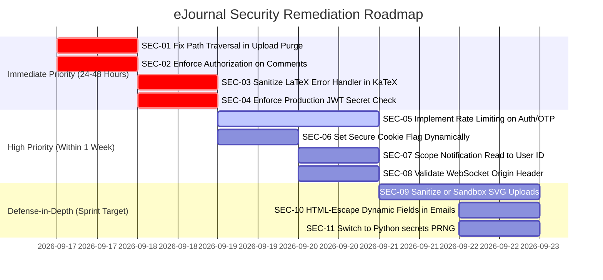

# Comprehensive Security Audit Report
## eJournal — Journal Management & Review System

**Audit Standard:** Security Audit Specification (`.agents/skills/security-audit`)  
**Target Repository:** `PDPIS` (eJournal Academic Document & Review System)  
**Date:** September 16, 2026  
**Auditor:** Antigravity AI Security Reviewer  
**Execution Policy:** Sandboxed Source-and-Local-Only Defensive Audit  
**Operating Mode:** Full Codebase Security Audit  

---

## 1. Executive Summary & Security Posture

A comprehensive security audit of the eJournal codebase was performed across all architectural tiers:
1. **API & Business Logic Layer**: FastAPI controllers, dependency injection, and service orchestrators.
2. **Data & Storage Layer**: MongoDB repository pattern, BSON schemas, local storage fallback, and Cloudinary integration.
3. **Authentication & Identity**: JWT issuance, cookie handling, OTP lifecycle, and Role-Based Access Control (RBAC).
4. **Real-Time & Protocol Layer**: WebSockets, notification streams, CORS configuration, and HTTP response headers.
5. **Client-Side & Editor Layer**: Next.js App Router, KaTeX mathematical typesetting engine, and block rendering components.

### Security Posture Overview

The application demonstrates strong architectural discipline in several areas:
- **Clean Separation of Concerns**: Strict enforcement of API → Service → Repository layering.
- **Strong Role Separation on Primary Workflows**: Students cannot directly edit submitted or approved journals; teachers cannot directly mutate student block content without formal annotations or change requests.
- **SQL/NoSQL Injection Resistance**: Extensive use of Pydantic models for request deserialization prevents arbitrary BSON operator injection through query bodies.
- **Error Sanitization**: Global exception handlers prevent MongoDB and internal Python traceback leakage to API clients.

However, the audit uncovered **11 actionable security findings**, including **1 Critical**, **3 High**, **5 Medium**, and **2 Low** severity vulnerabilities. Most notably:
- An **Arbitrary File Deletion (Path Traversal)** flaw in the recycle bin permanent destruction handler allows any authenticated user to delete arbitrary files from the server filesystem.
- **Broken Object-Level Authorization (BOLA / IDOR)** on comment and annotation endpoints allows arbitrary students to read other students' private teacher feedback, or teachers to annotate journals outside their classrooms.
- A **Cross-Site Scripting (XSS)** flaw in the KaTeX renderer fallback allows malicious LaTeX expressions to execute arbitrary JavaScript in victim browsers.
- **Missing Rate Limiting** on OTP verification and authentication enables automated brute-force attacks against 6-digit verification codes.

---

## 2. Findings Matrix

| ID | Title | Attack Class | Severity | Likelihood | Impact | Status |
|:---|:---|:---|:---:|:---:|:---:|:---:|
| **SEC-01** | Path Traversal Leading to Arbitrary Server File Deletion via Recycle Bin Permanent Purge | Access Control / Path Traversal | **CRITICAL** | High | Critical | Confirmed |
| **SEC-02** | Broken Object Level Authorization (BOLA) on Journal Annotations & Comments | Access Control & Multi-Tenancy | **HIGH** | High | High | Confirmed |
| **SEC-03** | Stored / Reflected XSS via Unescaped LaTeX Error Handling in KaTeX Renderer | Client-Side Security / Injection | **HIGH** | Medium | High | Confirmed |
| **SEC-04** | Insecure Default JWT Secret & Missing Production Startup Assertion | Authentication & Secrets | **HIGH** | Medium | Critical | Confirmed |
| **SEC-05** | Missing Rate Limiting and Brute-Force Protection on Authentication & OTP Verification | Authentication & Availability | **MEDIUM** | High | Medium | Confirmed |
| **SEC-06** | Hardcoded `secure=False` Flag on Authentication Session Cookies | Web Protocol & Cookies | **MEDIUM** | High | Medium | Confirmed |
| **SEC-07** | Broken Object Authorization on Notification Read Status & Premature TTL Purge | Access Control & Data Isolation | **MEDIUM** | High | Low | Confirmed |
| **SEC-08** | Missing Origin Verification on Real-Time WebSocket Channel (CSWSH Risk) | Protocols & Messaging | **MEDIUM** | Medium | Medium | Confirmed |
| **SEC-09** | Stored XSS via Local Fallback SVG Static File Serving on Backend Origin | Client-Side Security & Static Files | **MEDIUM** | Medium | High | Confirmed |
| **SEC-10** | HTML Injection in Outgoing Transactional Notification Emails | Injection & Phishing | **LOW** | High | Low | Confirmed |
| **SEC-11** | Weak PRNG (`random.randint`) Used for OTP and Classroom Join Code Generation | Cryptography & PRNG | **LOW** | Medium | Low | Confirmed |

---

## 3. Detailed Vulnerability Analyses

---

### SEC-01: Path Traversal Leading to Arbitrary Server File Deletion via Recycle Bin Permanent Purge

- **Vulnerability Type:** Path Traversal / Arbitrary File Deletion (CWE-22 / CWE-73)
- **Severity:** **CRITICAL** (Likelihood: High, Demonstrated Impact: Critical)
- **Affected Principal:** Any authenticated user (Student or Teacher)
- **Affected Resource:** Backend host filesystem (`uploads/`, `app/`, `.env`, database storage)

#### Root Cause
In `backend/app/api/v1/upload.py`, the `_destroy_cloud_or_local_file` function purges local files using string manipulation without path normalization or boundary verification:

```python
# backend/app/api/v1/upload.py (lines 57-67)
url = asset.get("url", "")
if url.startswith("/uploads/"):
    local_filename = url.replace("/uploads/", "")
    local_path = os.path.join("uploads", local_filename)
    if os.path.exists(local_path):
        os.remove(local_path)
```

In `backend/app/repositories/asset_repository.py`:
When an asset URL is moved to trash via `POST /api/v1/uploads/trash`, if the URL does not exist in the database (e.g. pasted external or custom URL), lines 61-76 dynamically create a new asset record assigned to the calling `user_id`:

```python
# backend/app/repositories/asset_repository.py (lines 61-76)
else:
    new_doc = {
        "userId": user_id,
        "url": url,
        ...
        "isDeleted": True,
        "deletedAt": now,
    }
    res = self.collection.insert_one(new_doc)
```

#### Attack Trace & Reproduction
1. **Entrypoint:** `POST /api/v1/uploads/trash`
   - Attacker sends payload: `{"url": "/uploads/../../app/main.py"}`.
   - `AssetRepository.move_to_trash` creates a new document owned by the attacker with `url = "/uploads/../../app/main.py"`.
   - The API returns the newly generated asset document containing its string `id`.
2. **Propagation:** `DELETE /api/v1/uploads/trash/{asset_id}/permanent`
   - Attacker calls permanent delete passing `asset_id`.
   - The ownership check `doc["userId"] == user["id"]` succeeds.
   - `_destroy_cloud_or_local_file(asset)` is invoked.
3. **Sink:** `os.remove(local_path)`
   - `local_filename = "../../app/main.py"`
   - `local_path = os.path.join("uploads", "../../app/main.py")` resolves to `app/main.py`.
   - `os.remove(local_path)` permanently deletes the server's entry point file or `.env` secrets file, inducing permanent denial of service or critical data loss.

#### Smallest Effective Fix
Enforce strict path containment using `os.path.basename` or resolving the canonical absolute path:

```python
# backend/app/api/v1/upload.py
import os
from pathlib import Path

def _destroy_cloud_or_local_file(asset: dict) -> None:
    ...
    url = asset.get("url", "")
    if url.startswith("/uploads/"):
        filename = os.path.basename(url)
        base_dir = Path("uploads").resolve()
        target_path = (base_dir / filename).resolve()
        
        # Enforce directory confinement
        if base_dir in target_path.parents and target_path.is_file():
            try:
                target_path.unlink()
                logger.info("Local upload file removed: %s", target_path)
            except Exception as e:
                logger.error("Failed to delete local upload file: %s", str(e))
```

---

### SEC-02: Broken Object Level Authorization (BOLA) on Journal Annotations & Comments

- **Vulnerability Type:** Insecure Direct Object References (IDOR / BOLA) (CWE-639 / CWE-284)
- **Severity:** **HIGH** (Likelihood: High, Demonstrated Impact: High)
- **Affected Principal:** Any authenticated user across any classroom or institution
- **Affected Resource:** Private student journals, instructor review comments, and feedback threads

#### Root Cause
In `backend/app/api/v1/comment.py` and `backend/app/api/v1/journal.py`:
- `GET /api/v1/comments/journal/{journalId}` and `GET /api/v1/journals/{journalId}/annotations`:
  Accept any `journalId` and return all associated comments without verifying whether the requesting user is the student owner of the journal or the authorized teacher of the classroom (violates `RULE-AUTH09` and `RULE-AUTH10`).
- `POST /api/v1/comments`:
  `CommentService.add_comment` only verifies that the journal exists, but never verifies classroom enrollment or role authority. An unauthorized student can post comments/suggestions to another student's document.
- `POST /api/v1/journals/{journalId}/annotations`:
  `CommentService.add_annotation` enforces `role: "teacher"`, but does not verify whether that teacher is assigned to the classroom of the journal's assignment. Any teacher can annotate, approve, or request changes on journals in any other teacher's classroom.
- `PUT /api/v1/comments/{commentId}/resolve`:
  Allows any authenticated user to resolve arbitrary comment threads.

#### Attack Trace & Reproduction
1. Attacker (Student A from College X) obtains `journalId` for Student B (College Y).
2. Attacker issues `GET /api/v1/comments/journal/{student_b_journal_id}` with their valid authentication cookie.
3. Server executes `find_journal_comments(journal_id)` and returns all teacher comments, grades, critiques, and private review feedback.

#### Smallest Effective Fix
In `CommentService`, validate journal ownership or teacher classroom authority before reading or modifying annotations:

```python
# backend/app/services/comment_service.py
async def _verify_journal_access(self, journal_id: str, user_id: str, user_role: str) -> dict:
    journal = await self.journal_repo.find_by_id(journal_id)
    if not journal:
        raise AppException(code=ErrorCode.NOT_FOUND, message="Journal not found", status_code=status.HTTP_404_NOT_FOUND)
    
    if user_role == "student":
        if journal["studentId"] != user_id:
            raise AppException(code=ErrorCode.FORBIDDEN, message="Access denied to this journal", status_code=status.HTTP_403_FORBIDDEN)
    elif user_role == "teacher":
        asg = await self.assignment_repo.find_by_id(journal.get("assignmentId", ""))
        if not asg:
            raise AppException(code=ErrorCode.NOT_FOUND, message="Assignment not found", status_code=status.HTTP_404_NOT_FOUND)
        classroom = await self.classroom_repo.find_by_id(asg.get("classroomId", ""))
        if not classroom or classroom.get("teacherId") != user_id:
            raise AppException(code=ErrorCode.FORBIDDEN, message="Unauthorized for this classroom", status_code=status.HTTP_403_FORBIDDEN)
    return journal
```

---

### SEC-03: Stored / Reflected XSS via Unescaped LaTeX Error Handling in KaTeX Renderer

- **Vulnerability Type:** Cross-Site Scripting (XSS) (CWE-79)
- **Severity:** **HIGH** (Likelihood: Medium, Demonstrated Impact: High)
- **Affected Principal:** Students and Teachers viewing document equations or grading submissions
- **Affected Resource:** Client DOM and session security context in browser

#### Root Cause
In `frontend/src/components/katex-renderer.tsx`:

```typescript
// frontend/src/components/katex-renderer.tsx (lines 230-244)
const html = useMemo(() => {
  if (!formattedLatex) return "";
  try {
    return katex.renderToString(formattedLatex, {
      displayMode,
      throwOnError: false,
      strict: "ignore",
    });
  } catch (error) {
    console.error("Failed to render math:", error);
    return `<span class="text-destructive font-mono text-xs">Error parsing formula: ${latex}</span>`;
  }
}, [formattedLatex, displayMode]);

return <span dangerouslySetInnerHTML={{ __html: html }} />;
```

When an equation expression causes KaTeX or formatting logic to throw an error, the raw `latex` string is interpolated directly into an HTML string returned to `dangerouslySetInnerHTML`. Because `latex` is not HTML-escaped, any embedded HTML markup or script payloads execute in the browser.

#### Attack Trace & Reproduction
1. An attacker inserts an equation block or LaTeX expression containing an unclosed macro and an HTML payload:
   `\invalidMacro{}`
2. When rendered in the teacher's grading view or student preview, KaTeX throws an error.
3. The catch block returns `<span class="text-destructive font-mono text-xs">Error parsing formula: \invalidMacro{}</span>`.
4. The browser evaluates `dangerouslySetInnerHTML`, executing the payload in the context of the frontend application origin.

#### Smallest Effective Fix
Escape HTML entities before formatting the error string, or render the fallback as React JSX text:

```typescript
// frontend/src/components/katex-renderer.tsx
function escapeHtml(str: string): string {
  return str
    .replace(/&/g, "&amp;")
    .replace(/</g, "&lt;")
    .replace(/>/g, "&gt;")
    .replace(/"/g, "&quot;")
    .replace(/'/g, "&#039;");
}

// In catch block:
return `<span class="text-destructive font-mono text-xs">Error parsing formula: ${escapeHtml(latex)}</span>`;
```

---

### SEC-04: Insecure Default JWT Secret & Missing Production Startup Assertion

- **Vulnerability Type:** Cryptographic Weakness / Hardcoded Secret (CWE-798 / CWE-321)
- **Severity:** **HIGH** (Likelihood: Medium, Demonstrated Impact: Critical)
- **Affected Principal:** All system users and authentication boundaries
- **Affected Resource:** JWT token integrity and user session generation

#### Root Cause
In `backend/app/core/config.py`:

```python
# backend/app/core/config.py (lines 45-48)
JWT_SECRET_KEY: str = Field(
    default="change-this-to-a-secure-random-string",
    description="JWT signing secret",
)
```

If deployed in a staging or production environment without an explicitly set `JWT_SECRET_KEY` environment variable, the system falls back to the well-known repository default string. Any attacker can forge valid HMAC-SHA256 JWT tokens containing `{"sub": "target@college.edu", "role": "teacher"}` and impersonate any user.

#### Smallest Effective Fix
Add a Pydantic model validator ensuring that in production, the secret is not the default and meets minimum entropy standards:

```python
# backend/app/core/config.py
from pydantic import model_validator

class Settings(BaseSettings):
    ...
    @model_validator(mode="after")
    def validate_production_secrets(self) -> "Settings":
        if self.ENVIRONMENT == "production":
            if self.JWT_SECRET_KEY == "change-this-to-a-secure-random-string" or len(self.JWT_SECRET_KEY) < 32:
                raise ValueError("JWT_SECRET_KEY must be a secure, random string with at least 32 characters in production.")
        return self
```

---

### SEC-05: Missing Rate Limiting and Brute-Force Protection on Authentication & OTP Verification

- **Vulnerability Type:** Unrestricted Resource Consumption / Lack of Rate Limiting (CWE-307 / CWE-799)
- **Severity:** **MEDIUM** (Likelihood: High, Demonstrated Impact: Medium)
- **Affected Principal:** Registered unverified accounts and external email quotas
- **Affected Resource:** `/api/v1/auth/verify-otp`, `/api/v1/auth/resend-otp`, `/api/v1/auth/login`

#### Root Cause
- `RULE-SEC07` mandates rate limiting on authentication endpoints.
- `POST /api/v1/auth/verify-otp` validates a 6-digit numeric OTP code (`100000` to `999999`, 900,000 combinations) valid for 10 minutes. The endpoint implements no attempt counter, no exponential backoff, and no IP throttling. An automated attacker can brute-force the code within the validity window.
- `POST /api/v1/auth/resend-otp` implements no cooldown period, allowing an attacker to exhaust third-party transactional email quotas (Resend/Brevo) and flood victim inboxes.

#### Smallest Effective Fix
1. Track failed OTP attempts in `user_doc` or Redis, locking the OTP after 5 consecutive failures.
2. Integrate `slowapi` or Redis token-bucket rate limiting on `/api/v1/auth/*` endpoints (e.g. 5 requests/minute for OTP actions).

---

### SEC-06: Hardcoded `secure=False` Flag on Authentication Session Cookies

- **Vulnerability Type:** Sensitive Cookie in HTTPS Session Without 'Secure' Attribute (CWE-614)
- **Severity:** **MEDIUM** (Likelihood: High, Demonstrated Impact: Medium)
- **Affected Principal:** Authenticated users on HTTPS deployments
- **Affected Resource:** `access_token` session cookie

#### Root Cause
In `backend/app/api/v1/auth.py` (lines 61, 97, 118), `backend/app/api/v1/profile.py` (line 53), and `backend/app/dependencies/auth.py` (lines 43, 58, 74):
The `secure` cookie flag is hardcoded to `False`:

```python
response.set_cookie(
    key="access_token",
    value=access_token,
    httponly=True,
    max_age=30 * 60,
    samesite="lax",
    secure=False,  # <--- Hardcoded False
    path="/",
)
```

In a production HTTPS deployment, omitting the `Secure` flag permits the browser to transmit the authentication cookie over cleartext HTTP if an insecure link or network downgrade is triggered.

#### Smallest Effective Fix
Set `secure=settings.ENVIRONMENT == "production"` or `secure=settings.COOKIE_SECURE`.

---

### SEC-07: Broken Object Authorization on Notification Read Status & Premature TTL Purge

- **Vulnerability Type:** Insecure Direct Object References (IDOR / BOLA) (CWE-639)
- **Severity:** **MEDIUM** (Likelihood: High, Demonstrated Impact: Low)
- **Affected Principal:** Any authenticated user
- **Affected Resource:** In-app notification documents and 7-day TTL expiration lifecycle

#### Root Cause
In `backend/app/api/v1/notification.py`:

```python
# backend/app/api/v1/notification.py (lines 83-91)
@router.put("/{notificationId}/read", response_model=ApiResponse[bool])
async def mark_as_read(
    notificationId: str,
    user: dict = Depends(get_active_user),
    notification_repo: NotificationRepository = Depends(),
):
    success = await notification_repo.mark_as_read(notificationId)
    return success_response(success)
```

`notification_repo.mark_as_read(notificationId)` updates the notification without scoping the query to `userId: user["id"]`. Any user can mark another user's notifications as read. Furthermore, `mark_as_read` sets `readAt: now`, which immediately starts MongoDB's 7-day TTL index timer, prematurely purging unread notifications from other users' accounts.

#### Smallest Effective Fix
Scope the update query to include the authenticated user's ID:

```python
# backend/app/repositories/notification_repository.py
async def mark_as_read(self, notification_id: str, user_id: str) -> bool:
    if not ObjectId.is_valid(notification_id):
        return False
    now = datetime.now(timezone.utc)
    res = self.collection.update_one(
        {"_id": ObjectId(notification_id), "userId": user_id},
        {"$set": {"isRead": True, "readAt": now, "updatedAt": now}},
    )
    return res.matched_count > 0
```

---

### SEC-08: Missing Origin Verification on Real-Time WebSocket Channel (CSWSH Risk)

- **Vulnerability Type:** Cross-Site WebSocket Hijacking (CSWSH) (CWE-1385)
- **Severity:** **MEDIUM** (Likelihood: Medium, Demonstrated Impact: Medium)
- **Affected Principal:** Logged-in users streaming real-time notifications
- **Affected Resource:** WebSocket notification stream (`/api/v1/notifications/ws`)

#### Root Cause
In `backend/app/api/v1/notification.py`:
The WebSocket handshake accepts incoming connections from any origin without validating the `Origin` header against `settings.BACKEND_CORS_ORIGINS`. Because WebSockets are not restricted by browser Same-Origin Policy, an external malicious webpage visited by a logged-in user can connect to `ws://api.ejournal...` and eavesdrop on private notifications containing student names, experiment marks, and teacher critique snippets.

#### Smallest Effective Fix
Inspect the `Origin` header during handshake and reject unapproved cross-origin requests:

```python
# backend/app/api/v1/notification.py
origin = websocket.headers.get("origin")
if origin and origin not in settings.BACKEND_CORS_ORIGINS:
    logger.warning("WebSocket handshake rejected: Disallowed origin %s", origin)
    await websocket.close(code=status.WS_1008_POLICY_VIOLATION, reason="Disallowed origin")
    return
```

---

### SEC-09: Stored XSS via Local Fallback SVG Static File Serving on Backend Origin

- **Vulnerability Type:** Stored Cross-Site Scripting (XSS) via File Upload (CWE-434 / CWE-79)
- **Severity:** **MEDIUM** (Likelihood: Medium, Demonstrated Impact: High)
- **Affected Principal:** Users opening raw attachment URLs
- **Affected Resource:** Backend origin DOM context (`/uploads/`)

#### Root Cause
In `backend/app/api/v1/upload.py`:
`.svg` is listed in `ALLOWED_EXTENSIONS = {".jpg", ".jpeg", ".png", ".webp", ".svg"}`.
When Cloudinary credentials are not configured, files are stored locally in `uploads/` and served via `StaticFiles(directory="uploads")` in `main.py`. Starlette serves SVG files with `Content-Type: image/svg+xml`. If an authenticated user uploads an SVG containing embedded `<script>` or event handlers (`<svg onload="alert(1)">`), viewing the image URL in the browser triggers script execution on the backend origin.

#### Smallest Effective Fix
Enforce `Content-Disposition: attachment` or `Content-Security-Policy: default-src 'none'` headers on static uploads, or remove `.svg` from allowed upload extensions in local fallback mode.

---

### SEC-10: HTML Injection in Outgoing Transactional Notification Emails

- **Vulnerability Type:** Improper Neutralization of Input in HTML Emails (CWE-80)
- **Severity:** **LOW** (Likelihood: High, Demonstrated Impact: Low)
- **Affected Principal:** Instructors and students receiving system email notifications
- **Affected Resource:** Outgoing email HTML content

#### Root Cause
In `journal_service.py` (lines 543-559) and `assignment_service.py` (lines 149-165):
Dynamic user-provided strings (`student_name`, `request.title`, `request.aim`, `classroom['name']`) are directly interpolated into multi-line f-strings forming HTML email bodies without `html.escape()`. A student can set their profile `name` to include arbitrary HTML markup, which renders unescaped in teacher email clients.

#### Smallest Effective Fix
Wrap all dynamic values in `html.escape(...)` before assembling HTML email bodies.

---

### SEC-11: Weak PRNG (`random.randint`) Used for OTP and Classroom Join Code Generation

- **Vulnerability Type:** Use of Cryptographically Weak Pseudo-Random Number Generator (PRNG) (CWE-338)
- **Severity:** **LOW** (Likelihood: Medium, Demonstrated Impact: Low)
- **Affected Principal:** User authentication and classroom enrollment codes
- **Affected Resource:** OTP generation (`auth_service.py`) and join code generation (`classroom_service.py`)

#### Root Cause
The codebase relies on Python's standard `random.randint` and `random.choices` for generating 6-digit OTP verification codes and classroom join codes. Python's `random` module uses the Mersenne Twister algorithm (MT19937), which is not cryptographically secure and can theoretically be predicted if its state is observed.

#### Smallest Effective Fix
Replace `random` with Python's standard `secrets` module:

```python
import secrets
import string

def _generate_otp() -> str:
    return f"{secrets.randbelow(900000) + 100000}"

def _generate_join_code(subject_code: str) -> str:
    prefix = "".join(c for c in subject_code if c.isalnum()).upper()[:5]
    suffix = "".join(secrets.choice(string.ascii_uppercase + string.digits) for _ in range(4))
    return f"{prefix}-{suffix}"
```

---

## 4. Remediation Plan & Prioritization



---

## 5. Verification Checklist

Before considering security remediation complete, verify each test case:
- [ ] **SEC-01**: Calling `DELETE /api/v1/uploads/trash/{id}/permanent` with traversed paths (e.g. `/uploads/../../app/main.py`) returns 400/404 and does not delete host files outside `uploads/`.
- [ ] **SEC-02**: Calling `GET /api/v1/comments/journal/{id}` as a non-enrolled student returns `403 Forbidden`.
- [ ] **SEC-03**: Rendering an invalid formula containing `` in `KatexRenderer` displays sanitized text without executing script.
- [ ] **SEC-04**: Starting backend with `ENVIRONMENT=production` and default JWT secret terminates with a descriptive configuration validation error.
- [ ] **SEC-05**: Sending >5 incorrect OTP guesses locks the verification flow and returns `429 Too Many Requests`.
- [ ] **SEC-06**: Inspecting `Set-Cookie` header in production shows `Secure; HttpOnly; SameSite=Lax`.
- [ ] **SEC-07**: Calling `PUT /api/v1/notifications/{id}/read` for another user's notification returns `404 Not Found` or `403 Forbidden`.
- [ ] **SEC-08**: Connecting to `/api/v1/notifications/ws` with `Origin: http://evil.com` closes with `WS_1008_POLICY_VIOLATION`.
- [ ] **SEC-10**: Registered student name `<script>alert(1)</script>` in submission email renders escaped `&lt;script&gt;` in HTML email body.
- [ ] **SEC-11**: OTP codes and classroom join codes use `secrets.randbelow` and `secrets.choice`.
